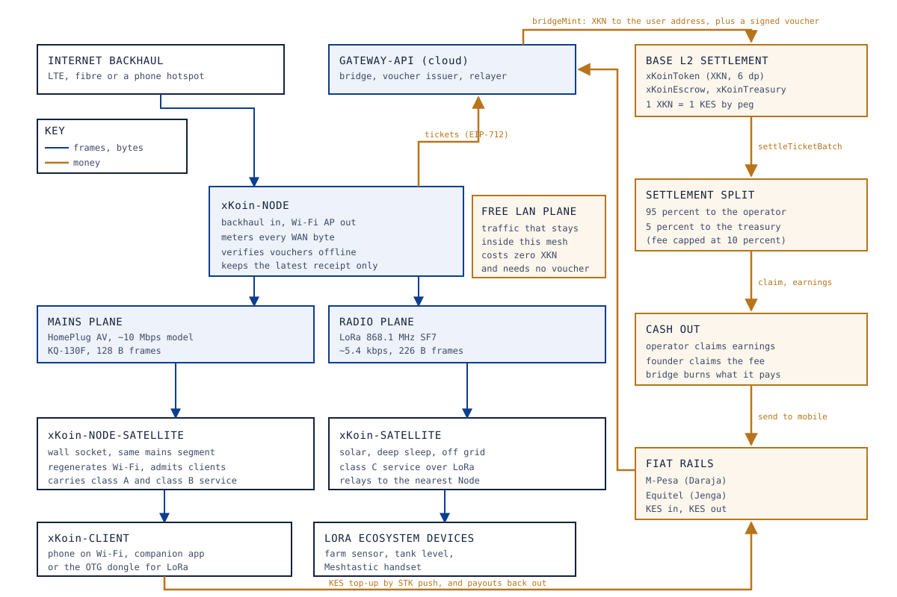

# 00. The xKoin concept

Abstract: xKoin is a hybrid power-line and radio mesh in which access to the
wide-area internet is sold per cryptographically verified byte and access to the
local mesh is free. A gateway device terminates a backhaul link, injects
broadband data into a building's mains wiring, carries control traffic and
payment receipts on a narrowband carrier over the same wiring, and keeps a LoRa
plane alive when the mains is not. Payment uses a KES-pegged ERC-20 on the Base
L2 chain, bought with M-Pesa or Equitel, escrowed once and spendable at any node.
Nodes hold signed cumulative receipts and settle them in batches, so no chain
transaction is needed per packet and no node needs to trust another. This paper
states the field, the deficiencies the invention addresses in Kenya, how it
differs from four named prior systems, the invention in one figure, the economic
duality that separates free local traffic from paid transit, the state-channel
mechanism in one page, the eight invariants that carry the threat model, the
trusted parties that remain, and a condensed draft claim set.

Keywords: power-line communication, LoRa mesh, state channels, micro-settlement,
KES-pegged token, community networks, Kenya

## 1. Field of the invention

The invention is in the field of last-mile data networks that combine two or
more physical mediums under one frame format, and in the adjacent field of
off-chain payment channels settled on a public ledger. Specifically it concerns a
network in which the medium used to carry a byte and the mechanism used to charge
for that byte are independent, so that a mesh can degrade from a broadband
power-line carrier to a narrowband carrier to a long-range radio without losing
either its addressing or its ability to be paid.

## 2. Background: what is deficient in Kenya today

Three facts set the problem, and each of them has a source and a date.

**Retail data is expensive per gigabyte at the sizes people actually buy.** The
design suite records Safaricom's Tunukiwa daily pass at KES 20 for 250 MB, which
is KES 80 per GB, and an Airtel daily pack at KES 20 for 500 MB, which is KES 40
per GB. Fixed fibre is far cheaper per byte and far more expensive to enter:
Safaricom Home Fiber at 10 Mbps is recorded at KES 2,999 a month, roughly KES 10
per GB at the stated fair-use volume. These figures are as stated in the design
suite on 2026-09-12 and must be re-verified before being quoted publicly, because
operator tariffs in Kenya change several times a year.

The gap is structural rather than accidental. A household that can pay KES 3,000
once a month gets a rate eight times better than a household that pays KES 20 at
a time. The daily-pass buyer is paying for the operator's billing granularity,
not for the bytes.

**The grid is not continuous.** A network that sells internet over mains wiring
has to answer what happens when the mains stops, and in much of Kenya the honest
answer is that it stops regularly. This is why the radio plane in this design is
not an accessory. The failure path is measured rather than asserted: in the
discrete-event simulation of the protocol, a grid cut moves traffic to LoRa in
about 0.8 seconds.

**The fixed cost of covering one building is paid twice.** An operator that wants
to reach twelve flats in Roysambu must either run cable to each flat or install a
radio per floor. The copper that reaches every socket in the building has already
been paid for by the landlord, and it is the only medium in the building that is
guaranteed to be present in every room. Nothing in the current market uses it to
carry paid transit.

<!-- TODO: verify. The patent draft (Drive doc 01) section 3 is the intended
     source for this background section, and that document is not present in the
     repository's docs/_drive export (only docs 02 to 05 and the README were
     exported). Section 2 above is reconstructed from Drive doc 04, the CA
     guidelines cited in docs/ops/regulatory-brief.md and the repo's own measured
     simulation results. Re-export Drive doc 01 and reconcile. -->

## 3. Prior art, and how this differs

Four systems bracket the design. Two are crypto-incentivised networks, one is a
mesh protocol with no economics, and one is the incumbent use of Kenyan mains
wiring for data.

| System | What it does | What it pays for | Mediums | Why xKoin is not it |
|---|---|---|---|---|
| Helium | Incentivised wireless coverage, originally LoRaWAN | Coverage and, later, data transfer | LoRa, and cellular in later programmes | Rewarding presence invites Sybil coverage. xKoin pays strictly per signed byte and a beacon earns nothing |
| Althea | Pay-per-forward routing between neighbours, price discovery per hop | Forwarded packets, billed per hop | IP over Wi-Fi and fibre | Per-hop pricing needs an IP path end to end. xKoin bills the serving node against one global deposit and works with no IP at all in class C |
| Meshtastic | Open mesh messaging over LoRa | Nothing; volunteers run it | LoRa only | Carries messages, not transit; no second medium; no way to pay whoever runs the node in the place that needs one |
| KPLC AMR | Automated meter reading over the Kenyan distribution network | Nothing; internal utility telemetry | Narrowband power-line carrier and cellular | A closed, single-purpose telemetry path owned by the utility, not a service anyone can buy or sell capacity on |

Helium and Althea are the closest economically. Helium's difficulty is that
"coverage" is cheap to fake and expensive to verify, so the reward has to be
defended by proof mechanisms layered on top of it. xKoin removes the problem by
never paying for presence: the only thing that earns is a byte the client has
signed for, and the signature is checked in the firmware and again on chain.
Althea's difficulty is the opposite: per-hop pricing is honest but requires each
hop to be an IP router with a price and a balance, which does not survive a
9,600-baud carrier or a duty-cycled radio. xKoin collapses the chain of hops to
one relationship, between the client and the node that served it, and lets relay
topology vary underneath without changing who is owed what.

Meshtastic is the reference for what a volunteer LoRa mesh reaches and for the
vocabulary users already know, and the protocol keeps beacon framing compatible
with it for discovery only. The gap it leaves is the one the invention occupies:
Meshtastic moves messages, it has no medium other than radio, and nobody is paid
to put a node where a node is needed.

<!-- TODO: verify. The Helium, Althea and KPLC AMR rows are written from general
     knowledge of those systems, not from a cited primary source in this repo.
     Before publication, cite the Helium HIP defining data-transfer rewards, the
     Althea whitepaper on per-hop billing, and a KPLC or ERC source on AMR
     deployment in Kenya. The Meshtastic row is sourced: see reference 6. -->

## 4. The invention in one figure

Figure 1 places the whole system on one page: the backhaul and the settlement
layer at the top, the gateway node in the middle, the two lower planes carrying
traffic down to the relay and the off-grid remote, and the clients and sensors at
the bottom. Money moves along the paths drawn in the accent colour and never
touches the mesh itself.

*Figure 1. The xKoin system in one schematic: backhaul and Base L2 settlement
above, the Node in the middle, the mains and radio planes below it, clients and
LoRa ecosystem devices at the bottom, with money flows drawn separately from
frame flows.*

Read it as four statements. A Node is the only device that touches the internet.
Two planes leave it: the mains plane, which is HomePlug AV for bulk and a
narrowband carrier for control and receipts, and the radio plane, which is LoRa.
Devices at the bottom attach over Wi-Fi to whichever node is nearest, or speak
LoRa directly. The money path is separate from all of it, runs through the cloud
and the chain, and would still resolve correctly if every frame in the mesh were
observed by a hostile party, because nothing in the mesh is a claim about money
that is not also a signature.

## 5. The economic duality: free LAN, paid WAN

Conventional access networks charge for all packets. xKoin separates routing from
rent.

Traffic that stays inside the mesh costs zero XKN and requires no voucher. This
covers local messaging, a mirrored encyclopaedia or school material held on the
node, local cameras, sensor telemetry from a farm, and anything else two devices
on the same mesh want to say to each other. The packet classifier in the node
firmware decides this by destination: local subnet, `.local` names, and anything
addressed inside the mesh identifier is forwarded without metering.

Traffic that leaves the mesh for the public internet is metered. The user's
escrow deposit is debited, in arrears, against receipts the user signed as the
bytes flowed.

The design intent of the free plane is adoption before revenue. A household with
no airtime at all still has a reason to attach, which means the mesh has users on
the day it is switched on and the operator has a reason to keep it running before
anyone has bought anything. The design cost is that the node must classify every
packet, which is a firmware responsibility rather than a contract one, and a
misclassification gives away transit rather than stealing from anyone.

## 6. The state-channel mechanism, in one page

The chain cannot be asked about a packet. A settlement transaction on Base costs
0.35 KES measured for a one-ticket batch at the gas price recorded on 2026-09-09,
and a megabyte of transit is worth 0.05 KES at the placeholder price, so a
per-session chain transaction would cost seven times the session. The mechanism
that resolves this is a payment channel with no channel state on chain until it
closes.

**Funding.** The user buys XKN with KES through an STK push. On the bank's
confirmation, the bridge mints XKN to the user's own address and the kiosk root
key signs a voucher naming that address, the amount and an expiry. The user then
deposits XKN into `xKoinEscrow`, usually through a gasless EIP-2612 permit
relayed by the kiosk, so the user never holds ETH. The escrow keeps one number
per address for the whole network, with no notion of which node the deposit is
for.

**Admission.** The client presents the voucher at JOIN_REQ. The node verifies the
Ed25519 signature against the 32-byte public key compiled into its firmware, with
no network access at all, in under 4.5 ms on the ESP32-S3. Admission therefore
does not depend on the internet the node is selling.

**Metering.** Every RECEIPT_INTERVAL of acknowledged bytes, the client signs a
receipt over eight canonical fields: client id, node id, session nonce,
cumulative bytes and sequence. The receipt is 108 bytes, which was chosen so that
it fits inside the 128-byte payload of one narrowband power-line frame. The node
keeps only the latest receipt per client and discards the rest, because the
counter is cumulative.

**Settlement.** The node maps its latest receipt to a Ticket signed by the
client's secp256k1 key under EIP-712, naming the client, the node operator's
address, a sequence number, cumulative units of 10 KB and an expiry epoch. A
relayer batches tickets from many clients into one `settleTicketBatch` call. The
escrow pays the delta between the ticket's cumulative units and what it has
already settled for that pair, moves 95 percent of the value to the node
operator's earnings and 5 percent to the treasury, and caps the whole operation
at the deposit that actually exists.

Three properties fall out of this and are worth stating separately. Losing an
intermediate receipt or an intermediate ticket costs nothing, because only the
latest matters. Replaying an old ticket pays nothing, because sequences are
monotonic and the delta is zero. And the node is paid for signed bytes and for
nothing else, which is what makes spam, beacon flooding and Sybil node identities
economically worthless rather than merely discouraged.

## 7. The eight Laws

The threat model is written as invariants rather than as a list of attacks. Each
one names the mechanism that enforces it and the artifact that proves it holds.
Breaking a Law must cost more than honest participation earns.

| # | Law | Mechanism | Proof artifact |
|---|---|---|---|
| 1 | Identity is the key | node id = `SHA-256(Ed25519 pk)[:8]`; no accounts anywhere | `proofs.py`, `test_receipt_roundtrip_and_tamper` |
| 2 | No admission without a fiat-backed voucher | kiosk root key signature verified offline at the edge | `test_join_voucher`; gateway-api voucher tests |
| 3 | Only signed bytes are owed | node extends at most twice the receipt interval of unproven credit | S1 bounded `max_unproven_bytes` |
| 4 | A forged counter is a broken signature | Ed25519 over canonical receipt bytes | fuzz and tamper tests, zero forgeries accepted |
| 5 | Replay pays nothing | dedupe by `(src, seq)`; on-chain monotonic sequence and cumulative delta | `test_revert_staleSequence`, `test_revert_noNewUnits` |
| 6 | Nobody is owed more than they escrowed | settlement caps at the deposit | `testFuzz_settleNeverExceedsDeposit`, 256 runs |
| 7 | The ledger cannot go insolvent | escrow balance equals deposits plus earnings, fee-exact transfer | `test_solvencyInvariant` plus an end-to-end chain assertion |
| 8 | Corruption dies at the frame | magic, length and CRC16-CCITT under the cryptography | S5: 0 of 20,000 garbage frames accepted |

The economic reading of the table is one sentence: an attacker must break Ed25519
or secp256k1 to create value, and everything cheaper than that earns zero.

## 8. Trusted parties, stated plainly

"Zero-trust" is accurate for the peer relay layer, where Laws 1 to 8 mean that no
peer must trust any other peer. It is not accurate for the fiat boundary, which
has named custodians. Anyone reviewing this project should find that here rather
than discover it.

| Key | Holder | Power | Blast radius if compromised |
|---|---|---|---|
| Kiosk root key (Ed25519) | Founder | Signs admission vouchers | Free network admission; no fund theft, because funds move only under on-chain ECDSA |
| Bridge hot wallet | gateway-api service | `bridgeMint`, self-only `bridgeBurn` | Unbacked XKN up to the on-chain daily cap, 50,000 KES by default; third-party balances cannot be burned by construction |
| Owner key, three contracts | Founder | Fee capped at 10 percent, price banded 1 to 50,000 micro-KES with a one-day cooldown, bridge allow-list | Bounded griefing; cannot halt settlement, cannot touch deposits, cannot redirect fees |
| Settlement relayer | Anyone | None | None: signatures and monotonic counters gate everything |

Four properties bound the founder's own risk and are implemented and tested:
the treasury's `claim` is callable by anyone and takes no destination parameter,
so it can only ever pay the beneficiary; changing the beneficiary takes a
seven-day public timelock with a veto held by the current beneficiary;
`bridgeBurn` is self-only, so no key in the system can destroy a user's balance;
and settlement, deposits, withdrawals and claims run with no founder involvement
at all, so a founder who disappears freezes governance at its last good values
and stops nothing else. The one remaining liveness dependency is the kiosk root
key for new admissions, and its rotation path is documented.

Pricing is owner-set and therefore centralised for the MVP. The band and the
cooldown bound the harm. The price floor must clear measured backhaul cost before
it is set, by the formula in `protocol/spec.md` section 8, and every payback
figure in the design suite is conditional on that.

## 9. Claims summary (draft, not filed)

The following is a condensed claim set. It is drafting material, it has not been
filed, and it has not been reviewed by patent counsel. It is reconstructed from
the implemented system rather than transcribed, because the patent draft is not
present in this repository's Drive export.

1. A data network in which a plurality of physical mediums, comprising a
   broadband power-line carrier, a narrowband power-line carrier and a
   sub-gigahertz radio, carry a single medium-agnostic frame format bearing a
   node identifier derived from a public key.
2. The network of claim 1 wherein a sender selects among live mediums by a score
   formed from an exponentially weighted goodput estimate and an exponentially
   weighted loss estimate, and quarantines a medium after a bounded number of
   consecutive delivery failures.
3. The network of claim 1 wherein traffic whose destination lies inside the mesh
   is forwarded without metering, and traffic whose destination lies outside is
   forwarded only against a metering relationship established at admission.
4. A method of admitting a client to a metered network comprising verifying, at
   the edge and without any network access, an offline certificate signed by an
   issuer root key and naming the client's ledger address, an amount and an
   expiry.
5. The method of claim 4 wherein the client thereafter signs cumulative byte
   counters, each counter superseding the previous one, and the serving node
   retains only the most recent counter per client.
6. The method of claim 5 wherein the serving node extends a bounded quantity of
   unproven credit and degrades service when that bound is exceeded.
7. A settlement method wherein the most recent cumulative counter is transformed
   into a typed structured message signed by the client's ledger key, batched
   with counters from other clients, and settled in a single ledger transaction
   that pays the difference between the counter and the previously settled
   quantity.
8. The method of claim 7 wherein the settlement is capped at a single
   deposit held for the client that is not partitioned by serving node, so that
   one funding action is spendable at every node in the network.
9. The method of claim 7 wherein a fixed proportion of each settlement is
   transferred to a treasury contract whose disbursement function is callable by
   any party and takes no destination parameter.
10. An off-grid extension of the network of claim 1 comprising a
    solar-powered node that carries a transactional service class over the radio
    medium alone, in which no internet protocol path exists between the client
    and the gateway and the payment primitives are carried as native frames.

<!-- TODO: verify. The original ten claims live in Drive doc 01, which is not in
     docs/_drive. Reconcile the numbering and the exact wording with that
     document before any filing conversation. -->

## 10. References

1. `protocol/spec.md`, XKP: xKoin Protocol v1 (draft), sections 1 to 8, including
   the medium table, the frame format, the Laws and the trusted-party table.
2. `docs/how-it-works.md`, primitives, decisions, journeys, 2026-09-11.
3. `docs/_drive/04-tokenomics-and-fiat-roi-financial-model.md`, retail pricing
   benchmark and the dual-tier economy, exported 2026-09-12.
4. `docs/_drive/05-architecture-decisions-and-tradeoffs.md`, decision points 1 to
   4, exported 2026-09-12.
5. `docs/ops/critical-accounts/03-budget-and-sustainability.md`, measured gas
   prices and per-operation costs, 2026-09-09.
6. `docs/_plan/research/02-landing-page-design-study.md`, Meshtastic protocol
   behaviour, device catalogue and vocabulary, 2026-09-12.
7. `docs/ops/regulatory-brief.md`, CA short-range-device guidelines 2022 and the
   open regulatory questions, 2026-09-09.
8. `HANDOVER.md`, sections 0 to 3, the proof matrix, the locked decisions and the
   invariants that must not drift.
