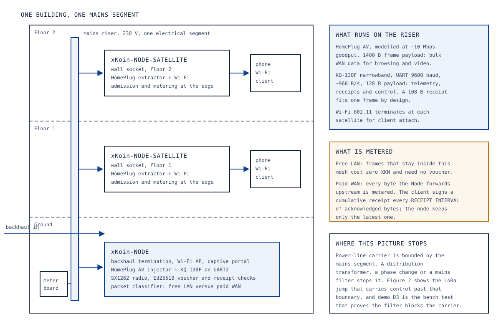
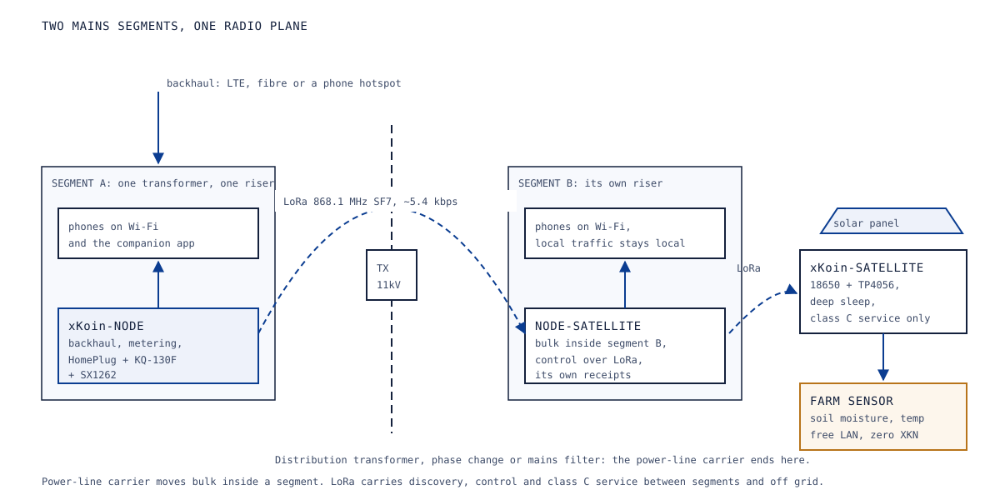

# 02. System architecture

Abstract: The xKoin network is built from five device archetypes over four physical mediums, held together by one frame format that none of the mediums can see through. A Node terminates the backhaul and owns the metering decision; a Node-Satellite extends the mains segment and enforces admission at the socket; a Satellite carries a solar-powered radio plane off grid; a Client holds the keys; and third-party LoRa devices ride the free local plane at no cost. Medium selection is a score, not a configuration: a sender picks the live medium with the highest product of estimated goodput and estimated delivery probability, and quarantines a medium after three consecutive failures, which is why a grid cut degrades the mesh to LoRa in about 0.8 seconds instead of stopping it. This paper gives the archetype table, the four mediums with their measured or modelled numbers, two topology figures, the backhaul options, the three cloud components, and what survives each of four failures.

Keywords: network architecture, power-line communication, LoRa, medium selection, failure modes, edge metering

## 1. Scope

This paper describes structure. The wire formats and phases are in [03-protocol-xkp.md](03-protocol-xkp.md); the money mechanism is in [04-settlement-and-economics.md](04-settlement-and-economics.md); each device gets a full paper from `05` to `09`. Status marks follow the legend in [00-START-HERE.md, section 6](00-START-HERE.md#6-status-legend).

## 2. Tiers and device archetypes

The network has two tiers and five archetypes. The tier distinction is about who touches the internet: exactly one archetype does, and everything else reaches it through a plane.

| Archetype | Role | Mediums it speaks | Power | Cost class | Status |
|---|---|---|---|---|---|
| xKoin-Node | Backhaul termination, packet classification, metering, voucher verification, ticket assembly | Wi-Fi AP, HomePlug AV, narrowband PLC, LoRa | Mains, continuous; the narrowband module alone draws 230 mA at 5 V on a transmit burst and an LTE module peaks near 2 A, so the supply is sized at 3 A minimum | Highest: about USD 200 of modules per unit at the field-kit BOM's indicative prices, dominated by the LTE module at about USD 95 | partial |
| xKoin-Node-Satellite | Wall-socket relay on the same mains segment; regenerates Wi-Fi, admits clients, collects its own receipts | Wi-Fi AP, HomePlug AV, narrowband PLC | Mains, continuous, low | Middle: a HomePlug extractor with Wi-Fi plus an ESP32-S3 and a narrowband module | proposed |
| xKoin-Satellite | Off-grid remote; class C service, relays to the nearest Node | LoRa only | Solar and an 18650 cell, with a design target under 40 mA average so a 10 W panel and a 3,400 mAh cell ride through two overcast days | Low: about USD 55 of modules per unit at the field-kit BOM's indicative prices | partial |
| xKoin-Client | Holds the user's keys, presents the voucher, signs receipts and tickets | Wi-Fi, or LoRa through the OTG dongle | Phone battery, or bus power for the dongle | Near zero for a phone; the dongle is an ESP32-S3 and a radio | proposed |
| LoRa ecosystem devices | Third-party sensors and handsets on the free LAN plane | LoRa | Battery or solar | Lowest: an ESP32-C3 and a radio module | proposed |

Two consequences of the table are worth stating. First, the serving device is the one that gets paid, not the device with the backhaul: a Node-Satellite that serves a client collects that client's receipts itself and names its own operator address in the tickets, and uses the Node purely as transport. Relay topology therefore never dilutes attribution. Second, the Client archetype is where the identity lives, so a lost device costs nothing as long as the seed was written down; the balance was never in the phone.

## 3. The four mediums

Three of them carry the mesh. The fourth attaches clients and does nothing else.

| Medium | Model | Goodput | Frame payload | Role |
|---|---|---|---|---|
| HomePlug AV, broadband PLC | Ethernet bridge | about 10 Mbps | 1400 B | Bulk in-building data |
| KQ-130F, narrowband PLC | UART at 9600 baud | about 960 B/s | 128 B | Telemetry, receipts, control |
| LoRa SX1262 | 868.1 MHz, SF7, BW125, CR4/5 | about 5.4 kbps | 226 B | Discovery, off-grid survival plane |
| Wi-Fi 802.11 | Client access | not applicable here | not applicable | Client attach and the captive portal |

```xk-stack
title: Three carriers under one medium-agnostic frame
HomePlug AV | plc | Broadband power line, about 10 Mbps, 1400 B payload. The bulk plane.
Narrowband PLC | nbplc | KQ-130F at 9600 baud, about 960 B/s, 128 B payload. Control and receipts.
LoRa SX1262 | lora | 868.1 MHz at SF7, about 5.4 kbps, 226 B payload. Discovery and survival.
Wi-Fi 802.11 | muted | Client attach and the captive portal only. It carries no mesh traffic.
```

The goodput figures are the models used in the protocol simulation, not field measurements; the simulation reached 9.768 Mbps on the 10 Mbps HomePlug model, which is 97.7 percent of it, and that ratio is a property of the protocol under that model rather than a claim about a real building's wiring.

Two of these numbers determined design decisions rather than describing them. The 128-byte narrowband payload is why a receipt is 108 bytes: the canonical receipt is 44 bytes of fields plus a 64-byte signature, and it was sized to fit one narrowband frame so that the payment plane survives on the slowest medium in the system. The 226-byte LoRa payload and the duty-cycle ceiling are why the transactional service class carries no internet protocol at all.

**The medium scoring rule.** Every frame is medium-agnostic, so a sender may choose. It scores each live medium as

    score = goodput_ewma * (1 - loss_ewma)

and sends on the highest. Three consecutive delivery failures quarantine a medium for two seconds and the next best takes over. There is no configured preference order and no manual failover: a grid cut simply makes the power-line mediums stop scoring, and LoRa wins by default in about 0.8 seconds. The sliding window is 16 frames by default, which is the measured knee, and 8 on LoRa-only paths, because larger windows hurt on a duty-cycled link.

**Service classes over the radio plane.** When LoRa is the only medium left, the gateway terminates the upstream connection and serves three classes.

| Class | Path | Measured in simulation | Use |
|---|---|---|---|
| C, transactional | Native frames, no IP | A 108 B receipt fits one narrowband frame | Kiosk operations, DNS, messaging, prices, balances |
| A, distilled web | A 2.5 MB page reduced to about 12 KB by text extraction and shared-dictionary compression in the cloud proxy | 21.9 s per page on SF7; 0.86 s on GFSK | Text browsing, news, email |
| B, adaptive modulation | The same SX1262 switched between LoRa and GFSK by link score | 121.9 kbps goodput at GFSK 150k | Light real internet on strong links |

Duty cycle binds class A harder than bandwidth does. At a 1 percent duty cycle, SF7 sustains about 1.5 pages an hour on one channel and 11.7 across eight channels; GFSK lifts that by roughly 27 times. The Kenyan duty-cycle position is read from the Communications Authority 2022 short-range-device guidelines, which allow 25 mW e.r.p. at 1 percent in the 868.0 to 868.6 MHz sub-band where the current firmware sits, or 500 mW at 10 percent at 869.4 to 869.65 MHz. Whether those guidelines survived the 2025 and 2026 regulations is unconfirmed until counsel answers, and the firmware's present +22 dBm setting is about six times the sub-band ceiling before antenna gain, so it does not qualify for the exemption as shipped. Both are firmware settings.

## 4. Topology

Figure 1 is the in-building case, which is the one that carries bulk traffic. It shows what a mains segment actually is: a riser that reaches every socket, one Node near the meter board, relays plugged into sockets on the floors above, and phones attaching over Wi-Fi to whichever relay is nearest.



*Figure 1. Building cutaway: the mains riser as the medium, one Node at the meter board, two Node-Satellites in wall sockets on the floors above, and phones attaching over Wi-Fi.*

The picture stops where the electrical segment stops. A distribution transformer, a phase change or a mains filter ends the power-line carrier, and no amount of transmit power changes that. Figure 2 is the wide-area case, where the radio plane does the work the wiring cannot: a LoRa hop carries control and class C service across the transformer boundary to a second segment that keeps its own bulk traffic local, and a second hop reaches a solar Satellite with a farm sensor on the free plane.



*Figure 2. Wide-area view: two mains segments separated by a distribution transformer, joined by a LoRa hop, with a solar Satellite and a farm sensor on the free LAN plane.*

Demo D3 in the proof-of-concept plan is the bench form of Figure 2: a mains filter stands in for the transformer, and the acceptance test is that the power-line carrier does not cross it while LoRa carries control between the two segments and each segment keeps serving its own local bulk traffic.

## 5. Backhaul options

The Node needs one upstream link, and the choice is an operating-cost decision rather than an architectural one, because everything above the backhaul is unchanged by which one is used.

| Option | Cost basis | Suits | Cost note |
|---|---|---|---|
| Cellular, LTE module in the Node | Per GB on an operator bulk bundle | Rural sites and any site without fibre | The single most expensive module in the BOM at about USD 95 for a SIM7600E-H HAT; the design suite models KES 2,500 a month of cellular backhaul at a rural trading post |
| Shared fibre or an existing router | A share of an existing monthly subscription | Urban buildings that already have one line | The design suite models KES 3,500 a month for an urban site |
| Phone hotspot | Whatever the operator's bundle costs | Bench work and the first demos | Used for the proof of concept so the LTE module can be deferred |

For the proof of concept the LTE module is deliberately deferred and backhaul comes from an existing router or a phone hotspot, which removes both the most expensive part and its type-approval question from the first build.

Whichever link is used, a caching proxy sits between it and the internet, because the cost per byte is the thing being resold. The plan is a WireGuard tunnel from each Node to a VPS running a caching proxy, with the cache hit rate feeding directly into the price floor formula: the floor is backhaul KES per MB, scaled to the 10 KB billing unit, divided by the 0.95 the operator retains, adjusted by the measured hit rate.

## 6. The cloud side

**gateway-api.** A FastAPI service that owns every interaction with the outside world that a node cannot do for itself. It receives the buy request, fires the STK push through Daraja or the merchant payment through Jenga, handles the bank's callback, mints XKN through the bridge, signs and issues the voucher, answers a node's question about a client's current escrow deposit, and relays ticket batches to the chain. It holds no privilege in the settlement path: the relayer role is gated entirely by signatures and monotonic counters, so anyone could run one. Status: built for the fiat and voucher paths, with the relayer loop's batching thresholds pending.

**The chain.** Three contracts on Base: `xKoinToken`, an ERC-20 with 6 decimals and EIP-2612 permit, where one base unit is a micro-KES; `xKoinEscrow`, which holds one deposit per user address and settles ticket batches; and `xKoinTreasury`, which receives the protocol fee and can pay only its beneficiary. Base was chosen because a settlement costs a fraction of a cent and there is nothing to operate; an own chain would cost more to run than the network earns. Status: built, 28 Foundry tests including a 256-run solvency fuzz and a stolen-owner-key drill.

**The bridge.** Not a separate service but a role: an allow-listed hot key inside gateway-api that may mint XKN against a confirmed fiat receipt, up to a rolling daily cap, and may burn only from its own balance. Those two limits are the whole trust surface of the fiat boundary and both are enforced on chain rather than by policy, so a fully compromised bridge leaks at most one day's cap and can destroy nothing belonging to anyone else. Status: built, with the payout worker that completes the off-ramp implemented on 2026-09-09.

## 7. Failure modes, and what survives

The design question for each failure is not whether service degrades but what degrades and what is still true afterwards.

```xk-anim degrade
The two power line lanes go dark when the mains is cut, their scores fall to zero, and the LoRa lane takes the traffic in about 0.8 seconds.
```

| Failure | What stops | What survives | Mechanism |
|---|---|---|---|
| Grid down | HomePlug AV and the narrowband carrier; bulk WAN traffic | LoRa control and class C service in about 0.8 s; solar Satellites unaffected; cumulative receipts keep their value | Medium scoring, quarantine after three failures |
| Backhaul down | New WAN traffic and any balance lookup | Free LAN traffic entirely; admission, because vouchers verify offline; receipts accumulate and tickets settle when the link returns | Law 2, offline voucher verification; cumulative counters |
| Node operator disappears | That node, if nobody maintains it | Every user's deposit, because it lives in the escrow and is withdrawable; every other node, because deposits are global rather than per node; the operator's own unclaimed earnings, which stay claimable to their address | Escrow deposits are per user, not per node; earnings accrue to an address, not a device |
| Founder disappears | Governance changes: price, fee, bridge allow-list freeze at their last values. New admissions eventually stop when vouchers cannot be signed | Settlement, deposits, withdrawals and claims, all of which need no founder involvement; the treasury keeps paying its beneficiary because `claim` is callable by anyone | Law 6 and Law 7 on chain; anyone-callable claim with no destination parameter; kiosk root key rotation is the one documented liveness dependency |

When the backhaul is down, a node cannot ask gateway-api for a client's deposit, so it serves against the voucher alone up to a smaller offline cap. The recommended values for the MVP are a 20 KES per-node session credit limit online and 5 KES offline, to be tuned from pilot data. This bound matters because a user attached to several nodes at once could otherwise run all of them against one deposit; the contract pays each node only up to what remains, so nothing goes insolvent, but the last node to settle would be underpaid. The cap turns that worst case into one cap of bytes, which the unproven-credit bound in Law 3 narrows further. Status: proposed, in the node session manager and one gateway-api route, with no contract change.

## 8. References

1. `protocol/spec.md` sections 1 to 7, the medium table, scoring rule, phases, service classes and the Laws.
2. `HANDOVER.md` sections 1 to 3, the proof matrix, the headline measured numbers and the invariants including the fixed pin map and window defaults.
3. `docs/how-it-works.md` sections 2, 5 and 6, the primitives, the session credit limit rule and the failure journeys J9 and J11.
4. `hardware/bom.md`, module prices, power sizing, the satellite average-current target and the Kenyan import and spectrum flags.
5. `docs/_drive/05-architecture-decisions-and-tradeoffs.md`, decision point 1 on narrowband versus broadband PLC and decision point 2 on split compute.
6. `docs/_drive/02-mvp-end-to-end-project-plan.md`, phase 4 on the WireGuard and caching proxy tier.
7. `docs/ops/regulatory-brief.md` section 2, the CA short-range-device table and the transmit-power flag.
8. `docs/_plan/revamp-plan.md`, the demo matrix, in particular D3 and D4.
