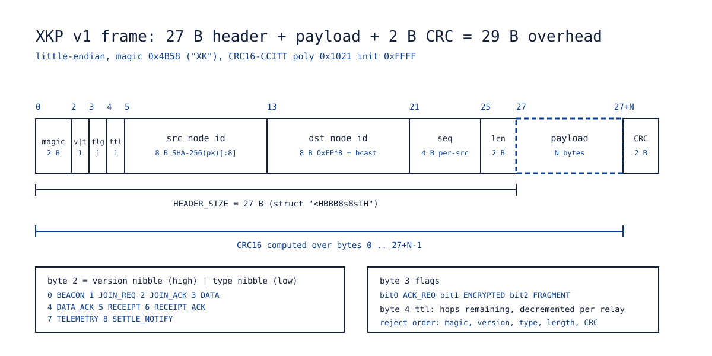
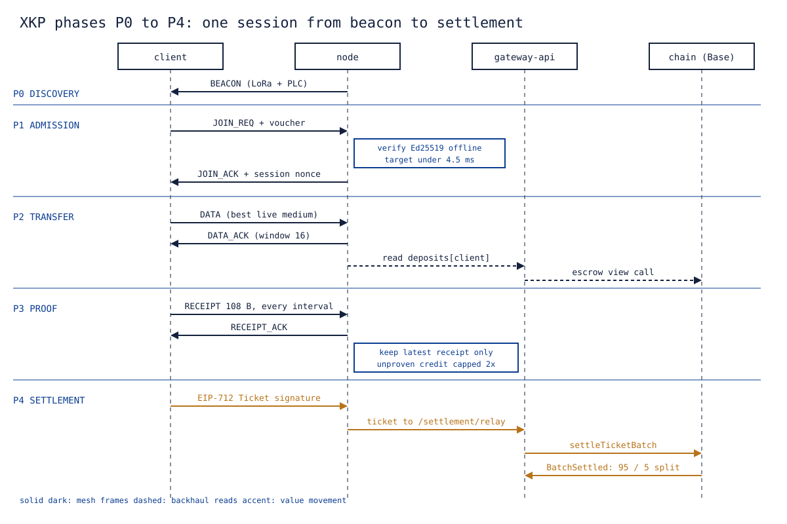

# 3. The xKoin Protocol

Abstract: XKP is a medium-agnostic transport that carries the same 29-byte frame over broadband power-line carrier, narrowband power-line carrier and LoRa, and carries a cryptographic proof of delivery over whichever of them is alive. The finding is that a proof layer sized to the slowest medium costs almost nothing on the fastest: a 108-byte signed receipt fits one 128-byte narrowband frame, and the same receipt discipline yields 9.768 Mbps of goodput on a 10 Mbps broadband PLC model, 97.7 percent of the medium. A discrete-event simulation over six scenarios measured about 0.8 s of failover from a simulated grid cut to the LoRa survival plane, zero of 20,000 corrupted or random frames accepted by the codec, and a transmit-window knee at 16. Eight invariants, called the Laws, each name an enforcing mechanism and a named test rather than a policy. The wire formats are implemented three times, in Python, in C and in Solidity, against shared vectors, so a codec change that breaks one implementation fails the others.

Keywords: mesh protocol, power-line carrier, LoRa, state channel, micro-payment, Ed25519, EIP-712, discrete-event simulation

## 1. Scope

This paper specifies XKP v1: the frame, the four phases plus settlement, the proof and reward layers, the service classes offered over a constrained radio, and the eight invariants that make cheating unprofitable. It is the transport and proof half of xKoin. The value half, meaning the token, the escrow, the tickets and the economics, is [04-settlement-and-economics.md](04-settlement-and-economics.md). The threat model in its security form, with keys and blast radii, is [10-security-and-trust.md](10-security-and-trust.md).

The reference implementation is `protocol/xkp/` (Python). The firmware port target is the ESP32-S3 in C, and the settlement side is Solidity. Where this paper states a number, it states where the number was measured.

One boundary is worth setting first. XKP moves frames and collects signatures. It does not decide what a byte is worth, does not hold a balance, and cannot pay anyone. Every claim about money leaves the mesh as a signature and is checked against a counter, on the node and again on the chain. That separation is what lets the mesh degrade from 10 Mbps to 5.4 kbps without the money layer noticing.

## 2. Mediums

Four link types carry xKoin traffic, three of them as XKP frames and the fourth as ordinary client attach.

| Medium | Model | Goodput | Frame payload | Role |
|---|---|---|---|---|
| HomePlug AV (broadband PLC) | Ethernet bridge | about 10 Mbps | 1400 B | Bulk in-building data |
| KQ-130F (narrowband PLC) | UART at 9600 baud | about 960 B/s | 128 B | Telemetry, receipts, control |
| LoRa SX1262 | 868.1 MHz, SF7, BW125, CR4/5 | about 5.4 kbps | 226 B | Discovery, off-grid survival plane |
| Wi-Fi 802.11 | client access | not applicable here | not applicable | Client attach through the captive portal |

The three XKP mediums differ by more than three orders of magnitude in throughput, which is the design pressure that shaped the frame. A format tuned to HomePlug would not fit a narrowband receipt into one transmission; a format tuned to the narrowband modem would waste most of a HomePlug frame on overhead. The resolution is a small fixed header with a 16-bit length field, so the same header rides a 128-byte frame and a 1400-byte frame without change.

The 868.1 MHz centre frequency sits inside the 868.0 to 868.6 MHz short-range sub-band of the Communications Authority of Kenya 2022 guidelines, where the ceiling is 25 mW e.r.p. with a 1 percent duty cycle or listen-before-talk with adaptive frequency agility. The current firmware configures the SX1262 power amplifier for +22 dBm, which is about 158 mW, and that is a decision pending rather than a setting to defend. The regulatory treatment is [11-regulatory-and-safety.md](11-regulatory-and-safety.md), section 2.

## 3. The frame

Every XKP frame is a 27-byte header, a payload of up to 65,535 bytes, and a two-byte CRC, for 29 bytes of overhead. Figure 1 draws the header as labelled boxes with their offsets.



*Figure 1. The XKP v1 frame header drawn to its byte offsets: 27 bytes of header, a variable payload, and a two-byte CRC16-CCITT computed over everything before it.*

The byte layout, little-endian throughout:

```
offset size  field
0      2     magic 0x4B58 ("XK")
2      1     version (high nibble) | type (low nibble)
3      1     flags: bit0 ACK_REQ, bit1 ENCRYPTED, bit2 FRAGMENT
4      1     ttl (hops remaining, decremented per relay)
5      8     src node id  (first 8 bytes of SHA-256 of the Ed25519 pubkey)
13     8     dst node id  (0xFF * 8 = broadcast)
21     4     seq (per-src monotonic)
25     2     payload length N
27     N     payload
27+N   2     CRC16-CCITT (poly 0x1021, init 0xFFFF) over bytes 0 .. 27+N-1
```

The Python reference packs this with the struct format `<HBBB8s8sIH`, which is the same field order and the same widths the C port compiles to. The CRC is written in bitwise form on purpose, so the C translation is line for line rather than table-driven and subtly different.

Four choices in that layout are worth their reasoning.

**An 8-byte node id, not a full public key.** The id is the first 8 bytes of the SHA-256 of the Ed25519 public key. A 32-byte key in both the source and destination fields would cost 64 bytes of every frame, half the narrowband MTU. Truncation to 8 bytes gives a 2^-64 collision target for an attacker who wants two keys to share an id, and a collision buys nothing on its own, because the receipt that carries value is verified against the full public key (section 6).

**A version nibble and a type nibble in one byte.** Sixteen versions and sixteen frame types is more than v1 needs, and one byte is what a narrowband frame can spare.

**A 4-byte per-source sequence.** It is the dedupe key at the receiver and the replay defence at the frame layer. It is not the settlement sequence; that one lives in the receipt and the ticket, and is checked again on chain.

**A CRC before any cryptography.** Corruption is common on both a power line and a radio, and signature verification is the expensive operation. Rejecting a damaged frame on magic, version, type, length and CRC, in that order, costs microseconds and keeps the verification budget for frames that could be genuine. Law 8 covers what that does and does not buy.

### 3.1 Frame types

| Value | Type | Direction | Carries |
|---|---|---|---|
| 0 | BEACON | node to broadcast | presence, medium hints |
| 1 | JOIN_REQ | client to node | the kiosk-signed admission voucher |
| 2 | JOIN_ACK | node to client | admission and the 16-byte session nonce |
| 3 | DATA | either | payload on the best live medium |
| 4 | DATA_ACK | either | window acknowledgement |
| 5 | RECEIPT | client to node | the signed cumulative receipt |
| 6 | RECEIPT_ACK | node to client | receipt accepted |
| 7 | TELEMETRY | either | heartbeats, sensor traffic, free LAN payloads |
| 8 | SETTLE_NOTIFY | node to client | a ticket has been relayed |

BEACON on LoRa keeps Meshtastic framing compatibility for discovery only. That compatibility is deliberately narrow: a Meshtastic device can find an xKoin node and be found by one, and nothing in the paid path depends on a foreign implementation getting anything else right.

## 4. Phases

A session runs through four phases and then leaves the mesh for a fifth. Figure 2 draws the whole sequence across four lifelines: the client, the node, the gateway-api backend and the chain.



*Figure 2. One session end to end: beacon, admission against an offline-verified voucher, transfer with windowed acknowledgements, a signed receipt every interval, and settlement of a single EIP-712 ticket on chain.*

```xk-timeline
title: One session, five phases
P0 DISCOVERY | Beacons on LoRa and on the narrowband line. Free, and it earns nothing, so a flood of them buys an attacker nothing.
P1 ADMISSION | JOIN_REQ carries the voucher. The node verifies the Ed25519 signature against a key compiled into its own firmware, with no network of any kind.
P2 TRANSFER | DATA and DATA_ACK on the best live medium, 16 frames in flight, 8 on a LoRa-only path.
P3 PROOF | Every receipt interval the client signs the cumulative byte count, and the node replaces whatever it held for that client.
P4 SETTLEMENT | The latest receipt becomes one EIP-712 ticket on chain. This is the only phase that leaves the mesh.
```

**P0 DISCOVERY.** Gateways and satellites emit BEACONs on LoRa and on the narrowband PLC line. Discovery is free and earns nothing, which is the point: a flood of beacons costs the attacker airtime and produces no settlement path.

**P1 ADMISSION.** The client sends JOIN_REQ carrying the admission voucher, which the kiosk root key signed when the fiat payment confirmed. The node verifies the Ed25519 signature with the 32-byte public key held in its firmware, with no network access of any kind. The target is under 4.5 ms per verification on the ESP32-S3, which comes from plan doc 02 milestone 1. On success the node replies JOIN_ACK with a 16-byte session nonce that binds every receipt in the session to this admission.

The simulator uses a voucher-lite of 96 bytes, being the client public key plus the kiosk signature over it, to model the signature cost at the wire level. Production uses the full voucher JSON issued by gateway-api, which adds the paying address, the amount, the fiat reference, the rail and a 24-hour expiry.

Admission is offline by requirement, not by optimisation. A node whose backhaul is down must still admit a user who paid five minutes ago, because the thing being sold is the backhaul. Asking the chain at every join would make the mesh depend on the internet it exists to provide.

**P2 TRANSFER.** DATA and DATA_ACK on the best live medium, with the MTU of whichever medium is chosen. The default transmit window is 16 frames, which is the measured knee (section 10); LoRa-only paths run at 8.

**P3 PROOF.** Every RECEIPT_INTERVAL of acknowledged bytes the client signs a cumulative receipt and sends it as a RECEIPT frame. The node verifies it, replaces whatever it held for that client, and replies RECEIPT_ACK.

**P4 SETTLEMENT.** The node maps its latest receipt onto an EIP-712 Ticket signed by the client's EVM key and relays it to the escrow through gateway-api. This is the only phase that leaves the mesh, and it is the only phase that can fail without the user noticing, because the bytes were already delivered and the counters already say how many.

## 5. The proof layer

The receipt is 44 canonical bytes plus a 64-byte Ed25519 signature, 108 bytes on the wire:

```
<8s client_id><8s node_id><16s session_nonce><Q cumulative_bytes><I seq>
```

That size is not a coincidence. The KQ-130F narrowband modem carries 128 bytes of payload per frame, so a receipt fits one frame on the slowest medium in the system. Proofs must flow when nothing else can, because a node that delivered bytes and cannot collect the proof has worked for free. The 108-byte figure is an invariant the repository defends: HANDOVER section 3 names it explicitly, and any change to the canonical struct has to keep it.

```xk-flow
title: The receipt path, sized to survive the slowest medium
Client -> Node : RECEIPT, 108 B, one narrowband frame
Client <- Node : RECEIPT_ACK, and the node keeps only the latest
note: Four lost receipts in a row cost the node nothing, because the fifth already says everything the earlier four said.
```

**Why cumulative counters.** The receipt reports total bytes in the session, not bytes since the last receipt. Three properties follow, and each removes a class of failure rather than mitigating it.

Losing an intermediate receipt loses nothing. Only the latest matters, because it already contains everything the earlier ones said. A narrowband link that drops four receipts in a row costs the node nothing as long as the fifth arrives, which is why the receipt path can ride the worst medium in the system.

Replay pays nothing. Sequences are monotonic, and the settlement contract pays the delta over what it has already settled for that channel. Re-presenting an old receipt yields a delta of zero, and the contract reverts rather than silently paying nothing, so the relayer's bug is loud.

The node stores one receipt per client, not a log. That matters on a microcontroller with 8 MB of PSRAM serving a few dozen clients. It also means there is no receipt history to protect, corrupt or subpoena at the edge.

**The 2x interval credit rule.** A node extends at most twice the receipt interval of unproven credit. Past that, the client is throttled, and then dropped. This is the tit-for-tat that makes the whole arrangement work without either party trusting the other: the node risks a bounded quantity of bytes, the client risks nothing, and a client that stops signing has bought itself at most two intervals of free service before the node stops serving. Scenario S1 measures the bound directly and asserts it holds.

Note the asymmetry this creates, because it is deliberate. The client can always walk away; the node cannot always collect. The bound on unproven credit is the node's entire exposure to a dishonest client, and it is set in bytes, not in trust.

**Forgery is a signature failure, not a detection problem.** A node that inflates a counter produces bytes whose Ed25519 signature does not verify against the client's public key. There is no heuristic, no anomaly threshold and no dispute process. The receipt either verifies or it does not, and the client id in the receipt must equal the first 8 bytes of the SHA-256 of the verifying key, which closes the substitution route.

## 6. The reward layer

The serving node is the `nodeAdmin` in the on-chain channel. The rule that makes this survive a mesh topology is simple: a satellite that serves a client collects that client's receipts itself and uses the gateway purely as backhaul. Relay topology therefore never dilutes attribution. A frame that passes through three devices does not split the payment three ways; the device that held the session with the client is the device that is owed.

That choice keeps the settlement layer free of routing. The escrow has no idea there is a mesh. It sees a client address, a node admin address, a monotonic sequence and a cumulative unit count, and it moves value between two numbers. An alternative design, paying every relay in the path, would require the chain to verify a path, and a path is exactly the thing an attacker can fabricate cheaply.

The operator is an address, not a device. A device can be re-flashed, replaced or stolen; the earnings go to whoever holds the operator key. Scenario S3 exercises the case that tests this: a client reaches the gateway only through a satellite over LoRa, and the satellite is the party that earns.

The on-chain unit is 10 KB, and the price per unit is owner-set within a band. Both belong to [04-settlement-and-economics.md](04-settlement-and-economics.md), section 5.

## 7. WAN service classes over LoRa

When the broadband path is gone, the question is not whether the network survives but what it can still sell. The gateway terminates TCP and TLS upstream and serves clients in three classes. The measured column is from the simulation, scenario S6 and the medium models in section 2.

| Class | Path | Measured in simulation | Use | Condition |
|---|---|---|---|---|
| C: Transactional | Native XKP frames, no IP | a 108 B receipt fits one narrowband frame | kiosk operations, DNS, messaging, prices | none beyond link availability |
| A: Distilled web | 2.5 MB page reduced to about 12 KB by text extraction and shared-dictionary zstd in the cloud proxy | 21.9 s per page on SF7; 0.86 s on GFSK | text browsing, news, email | the distillation ratio holds only for text-dominated pages |
| B: Adaptive modulation | the same SX1262 switched between LoRa and GFSK by link score | 121.9 kbps goodput at GFSK 150k | light real internet on strong links | GFSK needs a strong link; it trades sensitivity for rate |

Class A is the one that needs its condition stated loudly. The 12 KB figure is a distillation of a text-dominated page, produced in the cloud proxy, not a compression of arbitrary bytes. A page that is mostly images does not distil to 12 KB and will not be served in 21.9 s. The class exists to make news, email and text browsing possible on a survival link, not to claim that the web fits down a 5.4 kbps pipe.

Duty cycle is the binding constraint on sustained SF7 service, not bandwidth. At 1 percent the model yields about 1.5 pages per hour per channel, and 11.7 pages per hour across 8 channels. GFSK lifts this by roughly 27 times because the airtime per page collapses. Two things follow. Class B is what makes the radio plane useful for more than transactions, and the duty-cycle rule is an engineering input, not a formality.

The Kenyan position is unresolved and this paper does not resolve it. The CA 2022 short-range device table gives 1 percent for 868.0 to 868.6 MHz and 10 percent for 869.4 to 869.65 MHz, both with listen-before-talk plus adaptive frequency agility as the alternative. Whether the 2022 guidelines remain the operative instrument after the 2025 and 2026 regulations, and whether the CA reading of listen-before-talk matches the ETSI EN 300 220 definition, are questions for counsel. Treat every duty-cycle-derived number in this section as unverified for Kenya until that answer exists.

## 8. Medium scoring and quarantine

Senders pick the live medium with the highest score:

```
score = goodput_ewma * (1 - loss_ewma)
```

The loss estimate is an exponentially weighted moving average updated on every delivery outcome with a weight of 0.15 on the new observation. Three consecutive delivery failures quarantine a medium for 2 seconds and the next-best medium takes over. The counter resets on the first success.

Three failures rather than one, and 2 seconds rather than 30, are both deliberate. One failure is noise on a power line. Thirty seconds of quarantine on a medium that recovered in one is a self-inflicted outage. The pair of constants is what produced the measured failover time in scenario S2: when the grid is cut at t = 2 s and both power-line mediums die at once, LoRa carries the first delivered application bytes about 0.8 s later.

The grid failure case is the reason the rule exists. HomePlug AV and the KQ-130F both ride the mains. They fail together, and they fail without warning. A design that treated them as independent would score both as healthy for as long as its timeout allowed. Three failures on each, quarantine on each, and the only live medium left is the radio.

## 9. The eight Laws

The threat model is stated as invariants rather than as a list of attacks. Each Law names the mechanism that enforces it and the artifact that proves the mechanism works. An attack that is not covered by a Law is a gap in the model, and a pull request that weakens a Law's test is a design change rather than a refactor.

| # | Law | Mechanism | Proof artifact |
|---|---|---|---|
| 1 | Identity is the key | node id = SHA-256(Ed25519 pk)[:8]; no account table | `proofs.py`, `test_receipt_roundtrip_and_tamper` |
| 2 | No admission without a fiat-backed voucher | kiosk root key signature verified offline at the edge | `test_join_voucher`; gateway-api voucher tests |
| 3 | Only signed bytes are owed | the node extends at most 2x the receipt interval of unproven credit | S1 bounds `max_unproven_bytes` |
| 4 | A forged counter is a broken signature | Ed25519 over the canonical receipt bytes | fuzz and tamper tests, zero forgeries accepted |
| 5 | Replay pays nothing | receiver dedupe by (src, seq); on-chain monotonic sequence and cumulative delta | `test_revert_staleSequence`, `test_revert_noNewUnits` |
| 6 | Nobody is owed more than they escrowed | settlement caps at the deposit | `testFuzz_settleNeverExceedsDeposit`, 256 runs |
| 7 | The ledger cannot go insolvent | escrow balance equals deposits plus earnings, fee-exact transfers | `test_solvencyInvariant` plus the end-to-end chain assertion |
| 8 | Corruption dies at the frame | magic, length and CRC16 checked before any cryptography | S5: 0 of 20,000 garbage frames accepted |

Law 8 needs its limit stated. A CRC16 has a residual collision probability, so a corrupted frame can in principle pass the frame check. What it cannot do is carry value, because the receipt inside it still has to verify under Law 4. The CRC is a cheap filter that protects the expensive check, not a security boundary on its own.

The economic reading of the set is one sentence: an attacker must break Ed25519 or secp256k1 to mint value, and everything cheaper than that, meaning spam, replay, corruption and Sybil beacons, earns exactly zero, because pay is strictly per verified signed byte and never for presence.

## 10. What the simulation proved

The simulator in `protocol/xkp/sim.py` is a discrete-event engine. Each medium carries a bandwidth, a base per-frame loss probability, a latency, an MTU and half-duplex occupancy. Time is virtual and the engine is deterministic per seed, so every number below is reproducible by re-running `run_sim.py`.

Determinism is the property that makes the numbers usable. A stochastic simulation that reports a different figure on every run cannot be cited in a specification. Each scenario fixes its seed, and a change in a reported number means a change in the protocol, not in the weather.

**S1, speed.** 25 MB over HomePlug, the KQ-130F and LoRa together, with a receipt every 1 MB and a window of 16. Result: 9.768 Mbps of goodput against the 10 Mbps HomePlug model, which is 97.7 percent of the medium. The scenario also asserts that every receipt sent was verified and that the maximum unproven byte count stayed inside the Law 3 bound.

**S2, blackout.** The grid is cut at t = 2 s, which takes HomePlug AV and the narrowband PLC down together. LoRa carries the transfer to completion, and the measured failover from the cut to the first delivered application bytes on the radio is about 0.8 s. A 30-second heartbeat runs across the cut and is acknowledged throughout. Nothing is lost, because the counters are cumulative: the receipt that arrives after the blackout already accounts for the bytes delivered before it.

**S3, satellite relay.** A client reaches the gateway only through a satellite over LoRa, with HomePlug as the satellite's backhaul. The satellite collects the receipts and is the party credited. This is the reward-layer rule of section 6 exercised rather than asserted.

**S4, loss sweep.** LoRa-only completion across frame-loss rates from 2 percent to 40 percent. The retry ceiling is 30, which is set by how acknowledgement loss compounds: at 40 percent frame loss the probability that a send-and-acknowledge exchange survives is about 0.64 per attempt.

**S5, fuzz.** Corrupted and random frames presented to the codec. Result: 0 of 20,000 accepted. This is the Law 8 artifact.

**S6, internet over LoRa.** Distilled pages served over SF7 and over GFSK 150k, producing the class A and class B figures in section 7.

**The window knee.** Window 16 is the protocol default because it is the measured knee; 32 and above hurt LoRa, where a large window means a long occupancy on a half-duplex link and a longer recovery from any loss inside it. LoRa-only paths therefore run at 8. This is one of the locked decisions in HANDOVER section 2.

One modelling lesson is worth recording because it changes results rather than performance. Acknowledgements must be priority traffic and must never queue behind the sender's own data window. On a half-duplex medium, letting them queue produces spurious timeout storms that look like link failure and are purely an artifact of the queueing discipline.

## 11. The triple implementation invariant

Every wire format in xKoin exists three times: the Python reference in `protocol/xkp/`, the C firmware core for the ESP32-S3, and the Solidity and EIP-712 side on chain. They share test vectors, and the shared vectors are the contract between them.

The workflow is fixed. A codec change edits `protocol/xkp` first, then regenerates vectors with `protocol/gen_vectors.py`, then has to make the C host suite pass again. The C suite runs 75 host checks, including a receipt signed in Python and verified in C, a byte-exact codec round trip in both directions, and a full one-byte corruption sweep. The end-to-end chain proof closes the third side by comparing the locally computed EIP-712 digest with the contract's own `hashTicket` before it settles anything.

The reason for the discipline is that a protocol with one implementation has no way to notice that its specification drifted from its behaviour. With three, drift is a failing test in whichever one was not updated.

## 12. Open items

Stated as they stand, so no reader has to infer them.

1. The Kenyan duty-cycle position for 868 MHz is unverified. Every pages-per-hour figure in section 7 inherits that condition.
2. Transmit power in firmware is +22 dBm at 868.1 MHz, which is above the 25 mW ceiling of that sub-band. The decision between capping power, implementing listen-before-talk with adaptive frequency agility, and moving bulk traffic to 869.4 to 869.65 MHz is pending.
3. The session credit limit described in [04-settlement-and-economics.md](04-settlement-and-economics.md), section 8 is a node-side rule that is specified and not yet in firmware.
4. The C firmware port of the full phase machine is scoped; the portable core and codec are host-proven today.
5. The price per unit is a placeholder until it clears measured backhaul cost.

## 13. References

1. `protocol/spec.md`, XKP v1 draft: mediums, frames, phases, Laws, trusted parties.
2. `protocol/xkp/frames.py`, the byte-exact frame codec reference.
3. `protocol/xkp/proofs.py`, the receipt canonical form and admission verification.
4. `protocol/xkp/settle.py`, the EIP-712 Ticket types and the escrow ABI used by the end-to-end proof.
5. `protocol/xkp/sim.py` and `protocol/run_sim.py`, the discrete-event simulator and scenarios S1 to S6.
6. `HANDOVER.md`, sections 1 to 3: the proof matrix, locked decisions and the invariants that must not drift.
7. `docs/how-it-works.md`, sections 2 and 4: the primitives and the reasoning behind each decision.
8. Communications Authority of Kenya, Guidelines on the Use of Radiofrequency Spectrum by Short Range Devices, 2022 (Version B Rev 0), Annex I.
9. `contracts/src/xKoinEscrow.sol`, the `Ticket` struct and `settleTicketBatch`.
10. `docs/papers/04-settlement-and-economics.md` and `docs/papers/10-security-and-trust.md`, the value and security halves of this specification.
