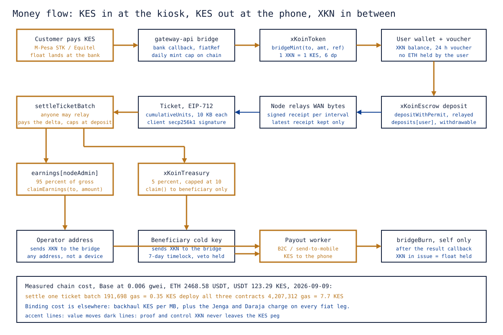

# 4. Settlement and Economics

Abstract: xKoin settles per verified byte on a public chain without asking a user to hold a chain-native asset or an exchange rate. XKN is an ERC-20 with 6 decimals on Base, pegged to the Kenyan shilling by construction rather than by market: it is minted only against a confirmed fiat receipt, burned only by a bridge from its own balance, and capped per rolling day per bridge. The escrow is the network's shared prepaid meter, one deposit per address readable by every node, and tickets are cumulative promises against it that the contract caps at what is actually deposited. At the 2026-09-09 Base gas price of 0.006 gwei, ETH at 2468.58 USDT and USDT at 123.29 KES, a one-ticket batch settles for 0.24 KES and all three contracts deploy for 8.25 KES. Chain gas is therefore not the binding cost. Backhaul price per megabyte and the mobile money charge on every fiat leg are, and the per-unit price remains a placeholder until it clears both.

Keywords: ERC-20, state channel, EIP-712, escrow, micro-payment, KES peg, mobile money bridge, unit economics

## 1. Scope

This paper covers the value layer: the token, the fiat bridge, the admission voucher, the escrow, tickets, the treasury, the relayer, the operator cash-out path, the measured cost of running all of it, and what can and cannot be said about unit economics today. The transport that produces the receipts is [03-protocol-xkp.md](03-protocol-xkp.md). The keys and their blast radii are [10-security-and-trust.md](10-security-and-trust.md).

Figure 1 is the whole money path on one page, and the rest of this paper is that figure with its conditions attached.



*Figure 1. The money path: Kenyan shillings in at the kiosk, minted as XKN, deposited into the escrow, spent as signed receipts, settled as a ticket, split 95 to the operator and 5 to the treasury, and paid back out as shillings with a matching burn.*

```xk-anim free-lan-paid-wan
Local traffic passes inside the mesh without ever reaching the meter, while every byte that crosses the gateway is counted in 10 KB units.
```

## 2. XKN

XKN is an ERC-20 on Base with EIP-2612 permit, 6 decimals, and the rule that 1 XKN equals 1 KES. The base unit is one micro-KES.

The peg is by construction, not by market making. There is no liquidity pool and no exchange listing. Every XKN in existence was minted by an allow-listed bridge against a confirmed bank callback, and the bridge burns on every payout, so circulating XKN equals the shilling float held at the bank. A user sees the currency they already think in, and the product has no exchange rate to get wrong.

Two design choices carry their reasons.

**Six decimals, not two.** The billing unit is 10 KB. At the placeholder price of 0.05 KES per MB, one unit is 0.0005 KES, which two decimals cannot express. The decimal count was rescaled for exactly this reason and is a locked decision.

**Base rather than an own chain.** A settlement layer already exists whose gas costs a fraction of a Kenyan cent per settlement and has no validators to run. An own chain would cost more to operate than the network earns. The value of xKoin is in the mesh and the bridge, not in consensus.

## 3. The bridge

gateway-api holds a hot key that the token contract lists as a bridge with a daily mint cap. The bridge record on chain is a struct: allowed, the daily cap, the amount minted in the current rolling window, and the window start.

On-ramp. `/buy-gas` sends an M-Pesa STK push through Daraja, or a merchant payment or M-Pesa push through Jenga. The bank posts a callback. The handler finds the pending order by its reference, calls `bridgeMint(to, amount, fiatRef)` with the bank reference hashed into the event for audit, and issues the admission voucher.

```xk-flow
title: The on-ramp, one shilling at a time
Kiosk -> M-Pesa -> gateway-api : the bank posts a callback
gateway-api -> bridgeMint -> Escrow deposit : XKN minted against that reference
note: Nothing is minted before the bank confirms, the mint is capped per rolling day, and the bridge can burn only its own balance.
```

Off-ramp. XKN sent to the bridge address triggers a send-to-mobile payout, and only then does the bridge call `bridgeBurn(amount, fiatRef)` against its own balance. The burn waits for the bank's result callback, so a failed payout never destroys XKN, and retries are bounded.

Two properties are enforced on chain rather than by policy, and they are the whole trust surface of the fiat boundary.

`bridgeMint` is capped per rolling day per bridge. A fully compromised bridge key leaks at most one day's cap of unbacked XKN before the owner revokes it with `setBridge`. The default cap is 50,000 KES; the operating plan sets it to what the kiosk actually collects in a day and reviews it monthly.

`bridgeBurn` is self-only. It burns from the bridge's own balance and takes no account parameter. No key in the system, including the owner's, can destroy a user's balance. The proof artifact is `test_bridgeMintBurn_selfOnly`, and the cap is covered by `test_mintCap_rollingDay`.

## 4. The voucher

On a confirmed purchase the kiosk root key, an Ed25519 key held server side, signs a small JSON voucher carrying the user's address, the amount, the fiat reference, the rail, the issue time and a 24-hour expiry. Node firmware holds only the 32-byte public key and verifies the voucher with no network access.

The voucher proves that this address paid recently. It does not carry a balance, and it is not money. The balance lives on chain, and the node reads it when it can. Separating the two is what lets a node with a dead backhaul still admit a paying user.

Voucher expiry is enforced and tested (`test_voucher_expiry_enforced`), and tamper is tested alongside the round trip (`test_voucher_roundtrip_and_tamper`).

## 5. The escrow as a prepaid meter

The escrow keeps `deposits[user]`, one number per address, with no notion of which node the deposit is for. The user funds it through the gasless permit path: they sign an EIP-2612 permit, the kiosk relays `depositWithPermit`, and the user never needs ETH. The permit call is wrapped in try and catch on purpose, because a front-run permit must grief the relayer rather than brick the deposit.

A deposit rather than direct payment from the wallet is the only workable shape. A node carrying a client's traffic cannot wait for a chain transaction per packet, and it needs a guarantee that money exists before the bytes flow. The deposit is that guarantee, tickets are promises against it, and the contract caps every settlement at what is actually there.

One global deposit rather than one per node is what makes "buy once, use anywhere" true by construction. A ticket names the node admin who served the bytes, so any node can settle against the same deposit, and the user does not choose a node when they pay.

The user can withdraw any unspent deposit at any time (`test_depositAndWithdraw`). That is a deliberate constraint on node behaviour: off-chain tickets are only redeemable against remaining deposit, so nodes must settle promptly rather than accumulating claims.

Two relayed functions let a client who holds no ETH move deposit without paying gas. `withdrawWithSig(client, to, amount, deadline, signature)` is the gasless exit: the client signs an EIP-712 `Withdraw(address client,address to,uint256 amount,uint256 nonce,uint256 deadline)`, anyone relays it, and because the destination is signed the relayer cannot redirect the funds. `transferDeposit(from, to, amount, deadline, signature)` moves credit from one deposit entry to another under an EIP-712 `TransferDeposit(address from,address to,uint256 amount,uint256 nonce,uint256 deadline)`; no token moves, so solvency holds by construction, and the contract emits `DepositTransferred(from, to, amount)`. Both share one per-client nonce, `authNonces`, read on chain rather than passed in, and revert with `AuthorizationExpired`, `BadAuthorization` or `ZeroAddress`. The tests are `test_withdrawWithSig_relayedClientPaysNoGas`, `test_withdrawWithSig_destinationIsSigned`, `test_withdrawWithSig_replayExpiryAndWrongKey`, `test_withdrawWithSig_zeroInputs`, `test_transferDeposit_movesCreditNotTokens`, `test_transferDeposit_signaturesAreNotInterchangeable`, and the 256-run `testFuzz_transferDepositPreservesSolvency`.

## 6. Tickets

For settlement the node maps its latest receipt onto a Ticket and has the client sign it under EIP-712, domain `xKoinEscrow` version `1`:

```solidity
struct Ticket {
    address client;
    address nodeAdmin;
    uint64  sequenceNumber;
    uint128 cumulativeUnits;
    uint256 epochExpiry;
}
```

Field order is fixed by plan doc 02 and baked into `TICKET_TYPEHASH`, so it is not a refactoring target.

One unit is 10 KB of relayed WAN traffic. `cumulativeUnits` is the total for the channel, not the increment, mirroring the receipt discipline in [03-protocol-xkp.md](03-protocol-xkp.md), section 5. Channel state is keyed by `keccak256(client, nodeAdmin)` and holds the last sequence and the settled unit count.

Settlement is delta settlement. For each ticket the contract checks expiry, checks that the sequence is strictly greater than the channel's last, computes `deltaUnits = cumulativeUnits - settledUnits`, and reverts if that delta is zero. It then owes `deltaUnits * pricePerUnit`, capped at the client's remaining deposit. Partial payment when the deposit is short is deliberate: it protects the node from losing the whole ticket rather than protecting the client from paying.

```xk-anim settlement
Twelve signed receipts accumulate at the edge and collapse into one EIP-712 ticket, which is the only thing that reaches the chain.
```

An invalid ticket reverts the entire batch. The relayer pre-checks off chain, so an invalid ticket arriving on chain means a bug or an attack, and it must be loud rather than silently skipped.

The properties that matter each have a test: `test_settle_cumulativeDeltaAcrossBatches`, `test_settle_skippedIntermediateTicketLosesNothing`, `test_settle_partialWhenDepositShort`, `test_revert_staleSequence`, `test_revert_noNewUnits`, `test_revert_expiredTicket`, `test_revert_forgedSignature`, and the 256-run `testFuzz_settleNeverExceedsDeposit`.

`settleTicketBatch` takes an array of tickets and an array of signatures and moves value from client deposits to node admin earnings and to the treasury. Anyone may call it.

## 7. The treasury

Every settlement transfers a fee to the treasury: 5 percent by default, hard-capped at 10 percent on chain. The fee transferred is the exact sum of the per-ticket amounts, never a percentage recomputed on the gross, which is what keeps the solvency invariant exact.

Three properties define the treasury, and each exists to protect the founder from the founder's own keys as much as from anyone else's.

`claim(token)` is callable by anyone and sweeps the full balance to the beneficiary. The destination is not a parameter. There is no withdraw-to-address anywhere in the contract. A stolen owner key cannot redirect a single micro-KES, which is asserted directly by `test_stolenOwnerKeyCannotRedirectFees` and by `test_claim_anyoneCanPayOnlyTheFounder`.

Changing the beneficiary takes a 7-day public timelock, and the current beneficiary, which is the founder's cold key, can veto inside that window, as can the owner. Key theft becomes a seven-day fire alarm rather than a loss. The happy path is `test_beneficiaryChange_happyPath`.

The fee ceiling is enforced by the contract, not by governance (`test_revert_feeAboveCeiling`). The fee lever can hurt margins and can never confiscate or halt settlement.

## 8. The relayer, the operator, and the session credit rule

The relayer is whatever submits batches. Today that is gateway-api. It holds no privilege: signatures and monotonic counters gate everything, so anyone could run one and the contracts would not notice the difference.

The node operator is the `nodeAdmin` address in every ticket the node collects. They call `claimEarnings(to, amount)` to move earnings to any address they choose, send XKN to the bridge, and receive KES by send-to-mobile while the bridge burns the same amount. The operator is an address rather than a device, because a device can be replaced, re-flashed or stolen.

**The session credit rule.** A single global deposit readable by every node creates one operational hazard: a user attached to several nodes at once can run all of them against one deposit. Nothing goes insolvent, because the contract caps every settlement at the remaining deposit, but the last node to settle is the one that is underpaid.

The rule that closes it lives in the node's session manager and in gateway-api's balance endpoint, and needs no contract change. A node grants each session a credit limit equal to the smaller of the last known deposit and a per-node cap, and settles when the limit is half used. The recommended cap for the MVP is 20 KES online. When the backhaul is down the node cannot read the deposit at all, so it serves against the voucher alone up to a smaller offline cap, recommended at 5 KES. Both numbers are to be tuned from pilot data, and both are pending a decision.

With the rule in place, the worst case for a node is one cap of bytes, which the 2x receipt interval bound narrows further.

**Relayed transfer between users.** XKN is an ordinary ERC-20, so a wallet-to-wallet transfer already works and costs about 0.1 KES of gas. The catch is that users hold no ETH by design. Three options were assessed in [docs/how-it-works.md](../how-it-works.md), section 5.1, and the recommended one, an escrow-internal relayed transfer, is now built: `transferDeposit(from, to, amount, deadline, sig)`, where the sender signs an EIP-712 authorisation, the kiosk relays it and pays the gas, and the contract moves value between two deposit entries. The nonce is not an argument; the contract reads it from `authNonces`. It keeps value at 1:1, costs the user nothing, and the recipient can spend at any node immediately. It measures 83,050 gas (0.15 KES), paid by the relayer, which is small against the 5 percent fee. The gateway route and the app screen are not yet built. Its twin, `withdrawWithSig` at 93,358 gas (0.17 KES), closes the exit gap: clients hold no ETH, so before it the only exit, `withdrawDeposit`, needed the client to be funded with gas first.

## 9. What it costs to run

Measured on 2026-09-09 with `cast gas-price` against the public Base RPC and the Binance ticker; the shilling rate is implied by a real P2P trade of 900 KES for 7.30001286 USDT.

| Input | Value | Source |
|---|---|---|
| Base L2 gas price | 0.006 gwei | `cast gas-price --rpc-url https://mainnet.base.org` |
| Ethereum L1 gas price | 0.062 gwei | sets the L1 data fee Base adds |
| ETH price | 2,468.58 USDT | Binance ticker |
| USDT to KES | 123.29 | 900 / 7.30001286 |
| Settle a one-ticket batch | 131,391 gas | measured by a forge probe on 2026-09-25 |

| Operation | Gas | KES | Status |
|---|---|---|---|
| Settle a batch, one ticket | 131,391 | 0.24 | measured |
| Settle a batch, two tickets | 191,698 | 0.35 | measured |
| Each additional ticket in a batch | about 59,924 | 0.11 | derived from probes |
| `bridgeMint` for one top-up | about 70,000 | 0.13 | estimate |
| `depositWithPermit` relayed for the client | about 95,000 | 0.17 | estimate |
| `withdrawWithSig` relayed for the client, first use | 93,358 | 0.17 | measured |
| `transferDeposit` relayed between clients, first use | 83,050 | 0.15 | measured |
| `claim` on the treasury | about 55,000 | 0.10 | estimate |
| Deploy all three contracts plus `setBridge` | 4,518,529 | 8.25 | measured with forge on 2026-09-26 after `withdrawWithSig` and `transferDeposit` were added |

Every figure in the shilling column is conditional on that gas price, that ETH price and that exchange rate, all of 2026-09-09. The L1 data fee Base adds is under 5 percent of these at that day's L1 price and is folded into the estimates.

**The binding cost is elsewhere.** Two costs dominate chain gas by two orders of magnitude, and both are per transaction rather than per byte.

Backhaul. The network resells data bought on a mobile bundle. The price per megabyte of that bundle, adjusted by the measured cache hit rate of the gateway's proxy, is the real floor under the per-unit price.

Mobile money charges. Every shilling that enters through Jenga carries a Finserve charge, and every payout through send-to-mobile carries another. The documented sample shows 1 KES on a 2 KES payment. These charges are tens to hundreds of times the chain gas per operation.

What the measured gas figures remove is the worry that chain gas is a cost centre. It is not. What they do not do is decide whether the network is viable, which is decided by backhaul and fiat charges against the price.

**The self-funding loop, precisely.** The treasury earns XKN, which is KES. Gas is paid in ETH. Nothing on chain converts one into the other, and XKN has no liquidity pool by design. So the loop has a person in it. The relayer only settles when the fee it will earn exceeds the gas it will spend by a margin, which makes every settlement net positive in shilling terms. Fee income is claimed, paid out to shillings, and a fraction of it buys ETH for the gas reserve. At pilot volume that step is a few minutes a month.

At the placeholder price and that day's gas the break-even is arithmetic:

```
fee per batch    = 5% x gross
gas per batch    = 0.24 KES + 0.11 KES x (tickets - 1)
break-even gross = gas / 5% = 4.8 KES for a one-ticket batch
at 0.05 KES/MB   = 96 MB of relayed traffic per batch
```

The relayer therefore batches until the pending fee is at least twice the estimated gas, with the 2x margin absorbing a gas spike between estimate and inclusion, and never waits longer than a cadence that keeps operators paid promptly. Both become configuration values when the relayer loop is written.

## 10. Unit economics, with every condition attached

The per-unit price is not set. The placeholder is 500 micro-KES per 10 KB unit, which is 0.05 KES per MB. It is a placeholder because the decision was deferred until it can clear measured backhaul cost, and the floor is a formula, not a judgement:

```
price_floor = (backhaul KES/MB from the bulk bundle) x (10 KB / 1 MB) / 0.95
              adjusted by the measured proxy cache hit rate
```

The 0.95 divisor is fee retention: the operator keeps 95 percent of gross, so the gross price has to clear cost divided by that share. The cache hit rate moves the effective backhaul cost per delivered megabyte, and it is measured, not assumed.

The price is bounded on chain regardless of who sets it. `PRICE_MIN` is 1 micro-KES per unit and `PRICE_MAX` is 50,000, which is 500 KES per MB, with a one-day cooldown between changes (`test_setPricePerUnit_bandAndCooldown`). The worst case for owner abuse is expensive within the band, once a day, and never halted. Pricing is owner-set and therefore centralised for the MVP, and this paper says so rather than implying otherwise. Non-owner pricing is deferred.

**The Drive tokenomics figures, quoted with their condition.** The project's tokenomics document models two operator scenarios and reports a payback period of 5.1 months and 233.4 percent annual return for an urban apartment hub with a stated capital expenditure of KES 29,050 and monthly operating cost of KES 3,850, and 3.1 months and 384.9 percent for a rural trading post with KES 23,300 of capital expenditure. Those figures assume a retail rate of KES 10 per GB, a tenant spend of about KES 1,000 per month across 10 active tenants, and a backhaul cost that has not been measured. They are conditional on the per-unit price clearing the floor above, and they are not to be quoted without that condition. Until the backhaul measurement exists, the honest statement is a range whose lower bound is unknown, not a payback period.

What can be stated without conditions today is narrower and true:

| Statement | Basis |
|---|---|
| A one-ticket batch settles for 0.24 KES of chain gas | measured gas, 2026-09-09 prices |
| 25 MB of relayed traffic is 2,500 units | the unit is 10 KB by definition |
| At the placeholder price that is 1.25 KES gross | arithmetic on the placeholder |
| Of that, 5 percent goes to the treasury and 95 percent to the operator | contract constant, default fee |
| A one-ticket batch needs about 4.8 KES of gross to break even on gas | the arithmetic in section 9 |

The gap between 1.25 KES of gross on a 25 MB session and a 4.8 KES break-even is the reason batching exists, and it is why the relayer threshold is a protocol-level concern rather than an implementation detail.

## 11. Open items

1. The per-unit price. Blocked on measuring the bulk bundle cost per megabyte and the proxy cache hit rate, then applying the floor formula.
2. The session credit rule caps, 20 KES online and 5 KES offline recommended, pending a decision and pilot tuning.
3. The escrow-internal relayed transfer: `transferDeposit` and `withdrawWithSig` are built and tested in the contract; the gateway route and the app screen are not built.
4. The user off-ramp. Only the founder and operator paths are wired today; the user path reuses the same payout worker with a per-user MSISDN.
5. Non-owner pricing, deferred. It sits above the money layer and changes no contract when it lands.

## 12. References

1. `contracts/src/xKoinToken.sol`, the ERC-20, the bridge struct, the mint cap and the self-only burn.
2. `contracts/src/xKoinEscrow.sol`, the `Ticket` struct, `settleTicketBatch`, the relayed `withdrawWithSig` and `transferDeposit`, the price band and the deposit cap.
3. `contracts/src/xKoinTreasury.sol`, the fee ceiling, the anyone-callable claim and the beneficiary timelock.
4. `protocol/xkp/settle.py`, the EIP-712 domain and types used by the end-to-end chain proof.
5. `docs/ops/critical-accounts/03-budget-and-sustainability.md`, the measured gas figures of 2026-09-09 and the self-funding loop.
6. `docs/how-it-works.md`, sections 2, 4 and 5: the primitives, the decisions, the session credit rule and the relayed transfer options.
7. `docs/_drive/04-tokenomics-and-fiat-roi-financial-model.md`, the operator scenarios whose payback figures are quoted conditionally in section 10.
8. `protocol/spec.md`, section 8: trusted parties, the price floor formula and the regulatory posture.
9. `HANDOVER.md`, section 2: the locked decisions on the 10 KB unit, the 6-decimal rescale and the deferred price.
10. `docs/papers/03-protocol-xkp.md`, the receipt and ticket mapping this paper settles.
