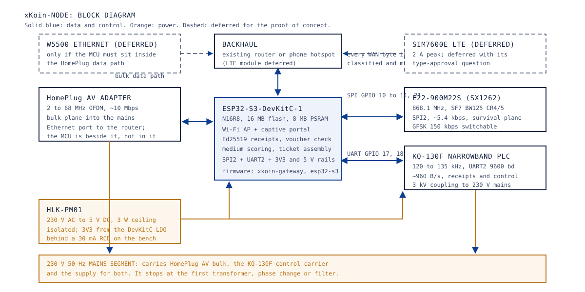
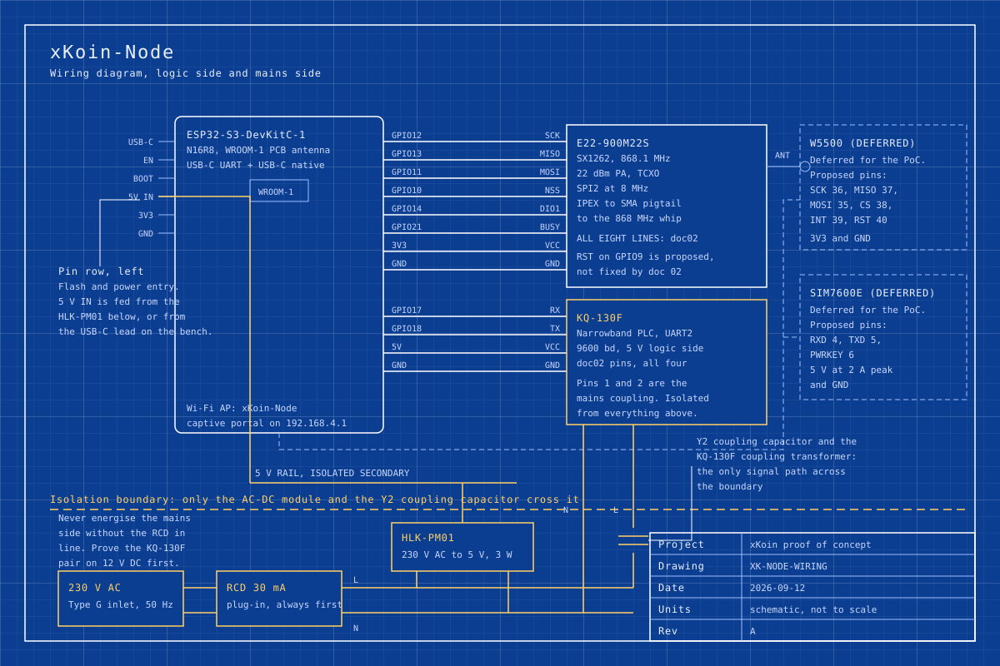

# 05. Hardware: xKoin-Node

Abstract: The xKoin-Node is the only device in the network that touches the internet, and it is built from five commodity modules and one AC-DC brick with no custom board. An ESP32-S3-DevKitC-1 N16R8 runs admission, metering and receipt signing; an E22-900M22S carries the 868.1 MHz survival plane on the pin map fixed by doc 02; a KQ-130F carries receipts and control over the mains at 9600 baud; a stock HomePlug AV adapter carries bulk data and is never opened; an HLK-PM01 supplies 5 V. The measured design finding is that this set fits a 3 W supply with about 7 percent of headroom in the worst simultaneous case, which is enough for the proof of concept and not enough for any build that adds the LTE module. This paper gives the photo strip, the block diagram, the wiring blueprint, the pin map with its provenance, the priced BOM slice, the power budget, the enclosure and safety notes, the bring-up procedure and the three acceptance tests the Node must pass.

Keywords: ESP32-S3, SX1262, KQ-130F, power-line communication, gateway hardware, power budget, mains isolation

## 1. Role in the network

The Node terminates the backhaul and owns the metering decision. Everything else in the network reaches the internet through it, and nothing else in the network has to be trusted for the accounting to be correct, because a receipt is an Ed25519 signature over a cumulative counter and the Node can only ever claim what it can show a signature for. The archetype table in [02-system-architecture.md, section 2](02-system-architecture.md#2-tiers-and-device-archetypes) marks the Node **partial**: the portable core is host-proven by 75 checks in `test/host`, and the ESP-IDF glue is written to this pin map and compile-untested until a `pio run` on a dev machine.

Four jobs sit in one box. It classifies every packet as free LAN traffic or WAN traffic and meters only the second. It verifies the kiosk voucher offline, so a dead backhaul does not stop admission. It collects receipts and assembles them into EIP-712 tickets for `settleTicketBatch`. And it relays frames on whichever medium scores highest, which is the mechanism that makes a grid cut degrade the mesh to LoRa in about 0.8 seconds rather than stop it.

For the proof of concept the LTE module is deliberately absent. Backhaul comes from an existing router or a phone hotspot, which removes the single most expensive module in the field-kit BOM at about USD 95 and removes its type-approval question at the same time. The Node is therefore the gateway minus its modem, and the W5500 Ethernet bridge is absent for the same reason: decision point 2 of the Drive architecture document recommends the dual-tier design, in which the stock HomePlug adapter carries bulk data and the ESP32-S3 sits beside that path rather than inside it.

## 2. The parts

Every part below is a real listing scouted on 2026-09-12 and recorded under `hardware/shopping/parts/`. The radio is an E22-900M22S rather than a Heltec WiFi LoRa 32 V3: the Node and the Node-Satellite keep the DevKitC N16R8 with a separate SX1262 module on the doc 02 pins, so the proven firmware pin map does not move, and the Heltec boards go to the Satellite, the Client dongle and the farm node where the OLED and the integrated radio are worth the different pinout.

|  |  |
|---|---|
| ESP32-S3-DevKitC-1 N16R8 | E22-900M22S, SX1262, 22 dBm |

|  |  |
|---|---|
| KQ-130F, 120 to 135 kHz, 9600 bd | 868 MHz SMA antenna, 3 dBi |

<!-- photo: homeplug-av-wifi-kit -->
<!-- photo: hlk-pm01 -->

The HomePlug AV adapter and the HLK-PM01 have no scouted listing yet, so no photograph is shown for them and no URL is invented. The markers above name the part ids the scout should file.

## 3. How the blocks fit together

Figure 1 shows the five blocks and the two planes they serve. Read it as two paths that share one mains segment and never share a wire: bulk data goes through the HomePlug adapter at about 10 Mbps modelled goodput, and receipts and control go through the KQ-130F at about 960 B/s. The MCU sits beside the bulk path, not inside it, which is why the W5500 is drawn dashed.

*Figure 1. xKoin-Node block diagram: the ESP32-S3 carries admission, metering and the control plane while the stock HomePlug adapter carries bulk data, with the LTE module and the W5500 bridge deferred.*

The consequence worth stating is that the bulk plane needs no firmware from us. A HomePlug AV pair bridges Ethernet over the wiring whether or not the xKoin firmware is running, so the bytes move even while the admission logic is being developed, and the metering is a separate concern that can be verified on its own. The wrong approach here is to put the ESP32-S3 in the data path over a W5500 at SPI speeds, which would cap the bulk plane at a fraction of what the adapter already delivers; the right one is to let the adapter carry the bytes and let the MCU decide who may use it.

## 4. Wiring

Figure 2 is the wiring drawing. Every GPIO number on it comes from the doc 02 rows of `hardware/pinmap.md` and none of them may move. The mains side sits behind a dashed isolation boundary, and only two things cross it: the AC-DC module and the KQ-130F coupling network, which is a Y2 class capacitor and the module's own transformer.

*Figure 2. xKoin-Node wiring blueprint: the DevKitC pin rows, the E22-900M22S on the doc 02 SPI pins, the KQ-130F on UART2, the HLK-PM01 and the mains side behind the isolation boundary, with the W5500 and the SIM7600E drawn dashed as deferred.*

Three details in the drawing are easy to get wrong on a bench. The E22-900M22S carries an IPEX connector and most 868 MHz whips are SMA, so the pigtail is not optional. The KQ-130F logic side takes 5 V and the SX1262 takes 3.3 V, so the two modules are fed from different rails on the same DevKitC. And the SX1262 reset line is on GPIO9 in `src/main.c`, which the source marks as proposed and not fixed by doc 02, so it is the one radio line that may be moved without breaking the invariant.

## 5. Pin map

Provenance follows `hardware/pinmap.md`: **doc02** pins are fixed by the MVP plan and must not move, **proposed** pins are this repository's allocation pending sign-off.

| ESP32-S3 pin | Peripheral | Signal | Bus | Provenance |
|---|---|---|---|---|
| GPIO12 | E22-900M22S (SX1262) | SCK | SPI | doc02 |
| GPIO13 | E22-900M22S (SX1262) | MISO | SPI | doc02 |
| GPIO11 | E22-900M22S (SX1262) | MOSI | SPI | doc02 |
| GPIO10 | E22-900M22S (SX1262) | NSS/CS | SPI | doc02 |
| GPIO14 | E22-900M22S (SX1262) | DIO1 (IRQ) | CTRL | doc02 |
| GPIO21 | E22-900M22S (SX1262) | BUSY | CTRL | doc02 |
| 3V3 | E22-900M22S (SX1262) | VCC | PWR | doc02 |
| GND | E22-900M22S (SX1262) | GND | GND | doc02 |
| GPIO9 | E22-900M22S (SX1262) | RESET | CTRL | proposed, set in `src/main.c` |
| GPIO17 | KQ-130F narrowband PLC | RX (ESP TX2) | UART | doc02 |
| GPIO18 | KQ-130F narrowband PLC | TX (ESP RX2) | UART | doc02 |
| 5V | KQ-130F narrowband PLC | VCC, isolated side | PWR | doc02 |
| GND | KQ-130F narrowband PLC | GND, isolated side | GND | doc02 |
| GPIO39 | W5500 Ethernet, deferred | SCK | SPI | signed off 2026-09-15 (moved off the PSRAM bus) |
| GPIO41 | W5500 Ethernet, deferred | MISO | SPI | signed off 2026-09-15 |
| GPIO40 | W5500 Ethernet, deferred | MOSI | SPI | signed off 2026-09-15 |
| GPIO42 | W5500 Ethernet, deferred | CS | SPI | signed off 2026-09-15 (GPIO38 drives the DevKitC RGB LED) |
| GPIO2 | W5500 Ethernet, deferred | INT | CTRL | signed off 2026-09-15 |
| GPIO15 | W5500 Ethernet, deferred | RST | CTRL | signed off 2026-09-15 |
| GPIO4 | SIM7600E LTE, deferred | RXD (ESP TX1) | UART | proposed |
| GPIO5 | SIM7600E LTE, deferred | TXD (ESP RX1) | UART | proposed |
| GPIO6 | SIM7600E LTE, deferred | PWRKEY | CTRL | proposed |

The two deferred blocks keep their rows here so that a later build does not have to re-derive them, and so that nobody allocates GPIO39 to GPIO42, GPIO2, GPIO15 or GPIO4 to GPIO6 for something else in the meantime. The W5500 rows first sat on GPIO35 to GPIO40; on the N16R8 module GPIO33 to GPIO37 are the octal PSRAM bus and GPIO38 is the on-board RGB LED, so the rows moved on 2026-09-13 and Martin signed the move off on 2026-09-15. `hardware/pinmap.md` is the authority for this table.

## 6. BOM slice, one Node

Prices are the scouted KES figures for the chosen candidate on 2026-09-12, as AliExpress displayed them to a Kenyan visitor without a login. They are per listing, not per piece, where the listing is a multipack, and the note says which.

| Part | Qty per Node | Scouted KES | Note |
|---|---|---|---|
| ESP32-S3-DevKitC-1 N16R8 | 1 | 572 | Board-only variant; the listing also sells dearer IPEX-antenna and extension-board variants |
| E22-900M22S SX1262 module, 868 MHz | 1 | 556 | Free shipping confirmed, so 556 is the landed cost per module |
| 868 MHz SMA antenna, 3 dBi | 1 | 22 | Entry variant of a 2-piece listing; the SMA male straight variant may sit at the top of a 22 to 30 range |
| IPEX to SMA pigtail | 1 | 380 | 5-piece pack as displayed; a single piece sits near the 76 low end of the range |
| KQ-130F narrowband PLC module | 1 | 1,029 | Scouted 2026-09-13; the listing carries KQ-130F, KQ130F, KQ330 and KQ-330 variants and the 1,029 figure is most likely the cheapest variant rather than the KQ-130F one, so the per-variant price is unverified. Nairobi retail was KES 1,800 at Pixel Electric in the older field-kit BOM |
| HomePlug AV adapter, injector half of a kit | 1 | price pending scout | Bought as a pair; the extractor half goes to the Node-Satellite |
| HLK-PM01 5 V mains module | 1 | price pending scout | 3 W ceiling, see section 7 |
| USB to TTL CH340 adapter | shared, bench | 81 | One per bench station for the KQ-130F loopback |

Two lines carry no price because no scout file exists for them yet. The total is therefore not quoted: a subtotal of the priced lines alone would read as a kit price and it is not one.

## 7. Power budget

None of the figures below is measured. All of them are datasheet-derived, which is the honest state before bring-up, so every row says so and the plug-in energy meter in section 9 is what replaces them.

| Rail | Load | Current | Source of the figure |
|---|---|---|---|
| 3.3 V | ESP32-S3, Wi-Fi AP active | about 240 mA | datasheet-derived |
| 3.3 V | SX1262 transmitting at +22 dBm | about 118 mA | datasheet-derived |
| 3.3 V | SX1262 receiving | about 5 mA | datasheet-derived |
| 5 V | KQ-130F transmit burst | about 200 mA | datasheet-derived, per its datasheet class |
| 5 V | KQ-130F receive or idle | TODO: verify against the datasheet | not yet sourced |
| 5 V | HLK-PM01 ceiling | 600 mA, 3 W | datasheet-derived |

`hardware/bom.md` records the KQ-130F transmit burst as 230 mA rather than 200 mA. The two figures come from different datasheet revisions for the same module class, so the sizing below is given at both and the conservative one governs.

**The worst simultaneous case.** Both radios transmitting while the Wi-Fi AP is active puts 240 plus 118 equals 358 mA on the 3.3 V rail. The DevKitC feeds that rail from 5 V through a linear regulator, which passes the same current, so the 5 V draw is 358 mA for the logic plus 200 mA for the KQ-130F transmit burst, which is 558 mA, or 2.79 W. Against the HLK-PM01's 3 W ceiling that leaves 0.21 W, which is about 7 percent of headroom. At the 230 mA KQ-130F figure the sum is 588 mA, or 2.94 W, and the headroom falls to about 2 percent.

That is the finding of this section. The HLK-PM01 is adequate for the proof-of-concept Node only because the two radios rarely transmit at the same instant and because the LTE module is deferred; it is not adequate for any build that adds the SIM7600E, whose 2 A peak alone exceeds the module more than three times over. `hardware/bom.md` states the same conclusion for the full gateway and specifies a 5 V 3 A supply there. A build that keeps the LTE module deferred and wants margin rather than 7 percent should fit a 5 V 2 A supply instead, which costs a few hundred shillings more and removes the question.

**Continuous draw and daily energy.** With the Wi-Fi AP active, the SX1262 receiving and the KQ-130F not transmitting, the 3.3 V rail carries 245 mA, which is 1.225 W taken from the 5 V rail through the linear regulator. Over 24 hours that is 29.4 Wh at the DC side. At an assumed 75 percent conversion efficiency for the AC-DC module, which is a typical figure for its class and not a measurement, the wall draw is about 39 Wh a day. The KQ-130F receive current is missing from that sum and is marked TODO above; it is the one term that could move the daily figure materially, because it is continuous rather than bursty.

## 8. Enclosure and mounting

The Node lives near the consumer unit, because that is where the mains segment begins and where the shortest coupling path to the wiring is. Two forms suit it.

A **plug-top box** is the simpler one: a sealed ABS enclosure with a moulded type G plug, the HLK-PM01 and the KQ-130F coupling on one side of an internal barrier and the DevKitC and the E22 on the other, and an SMA bulkhead for the antenna. It installs without an electrician and it moves with the tenant.

A **DIN rail box**, two or three modules wide, mounted in or beside the consumer unit, is the form a landlord deployment wants: it puts the coupling at the origin of the riser rather than at the end of a spur, it keeps the device out of reach, and it makes the installation a job an electrician signs off on. It needs an electrician, which is a cost and a scheduling constraint rather than a technical one.

Either way the antenna is outside the metal. A consumer unit is a steel box and an 868 MHz whip inside one radiates into a short circuit; the SMA bulkhead and a short pigtail put the whip in air. Keep at least 20 mm between the mains coupling track and any logic track, and keep the creepage across the barrier at the value the enclosure's own rating assumes.

## 9. Bench safety

The KQ-130F couples directly onto 230 V. The rule from `docs/_plan/revamp-plan.md` governs the bench and is not negotiable: prove each KQ-130F pair on a 12 V DC line, which the module supports, and only then move it to a mains strip behind a 30 mA plug-in RCD. No isolation transformer is bought for the proof of concept, which means the mains side is live and referenced to earth at all times and there is no safe touching of it while it is plugged in.

Four practices follow. Unplug before touching any jumper on the mains side, every time, with no exception for a quick change. Keep the logic side and the mains side on physically separate halves of the bench so a stray lead cannot bridge them. Use the plug-in energy meter to confirm the actual draw against the specified transmit burst before trusting any current figure the module reports about itself. And treat the HomePlug adapter and the extender as sealed appliances: they are mains-rated, they are never opened, and nothing is soldered to them.

## 10. Bring-up

The firmware target is `esp32-s3` in `firmware/xkoin-gateway/platformio.ini`, board id `esp32-s3-devkitc-1`, monitor speed 115200. The host-side core is proven before any of this: `cd test/host && make run` runs 75 checks including Ed25519 receipts signed by the Python reference, and it is the thing to run first when a bring-up result is ambiguous.

    cd firmware/xkoin-gateway
    pio run -e esp32-s3
    pio run -e esp32-s3 -t upload
    pio device monitor -b 115200

A first boot with the radio and the PLC module attached prints three lines from the `xkoin-gw` tag, in this order:

    I (xxx) xkoin-gw: SX1262 up: LoRa SF7 868.1 MHz (GFSK 150k switchable)
    I (xxx) xkoin-gw: xKoin gateway skeleton up
    I (xxx) xkoin-gw: PLC frame type=<n> len=<n> from=<xx><xx>..

The first line means the SPI bus came up and the SX1262 accepted its mode configuration; if it is absent or the boot hangs before it, the fault is on the doc 02 SPI pins or on the BUSY line at GPIO21. The second line means the captive portal and the PLC task started. The third line appears only when a frame arrives over the narrowband carrier, so its absence during a single-node test is expected and its appearance is the proof that the KQ-130F pair is talking. Dispatch into the router and the receipt store is marked `TODO(phase 1.3)` in `src/main.c` and is not part of this bring-up.

Two things gate the first successful `pio run`. The ESP-IDF glue is compile-untested because the build sandbox that wrote it could not reach Espressif's hosts, so the first build on a dev machine is where compile errors surface. And the SX1262 register values marked VERIFY in `firmware/xkoin-gateway/lib/sx1262/sx1262.h`, which are the GFSK RX bandwidth code and the packet parameters, are confirmed against the datasheet tables with a logic analyser on the SPI bus during this step and not before.

## 11. Acceptance tests

The Node must pass three of the six demos in [12-proof-of-concept-plan.md](12-proof-of-concept-plan.md), where the full procedure, the observables and the risks are written out. The summary here is what this device is responsible for.

| Demo | What the Node must do | Pass criterion |
|---|---|---|
| D1, local LAN over PLC | Serve a phone through a Node-Satellite on the same strip: portal, purchase, browsing, and receipts arriving | The Node's receipt counter for that client is monotonic and ends within two receipt intervals of the client's own counter, which is the bound Law 3 allows |
| D4, last network standing | Keep the free LAN plane and class C service alive with the backhaul unplugged, accumulate receipts, and settle them when it returns | Zero receipts lost across the outage, and the batch settles on chain within 5 minutes of the backhaul returning |
| D5, high-speed internet | Carry 720p video and a live session over the HomePlug path while metering every WAN byte | Sustained downstream above 6 Mbps at the phone over 60 seconds, conditional on the backhaul itself measuring above 6 Mbps at the router first |

## 12. References

1. `hardware/pinmap.md`, the xKoin-Gateway table, doc02 and proposed rows.
2. `hardware/bom.md`, gateway module list, the 5 V supply sizing note and the Kenyan import and spectrum flags.
3. `hardware/shopping/parts/*.json`, scouted listings and prices recorded 2026-09-12.
4. `firmware/xkoin-gateway/README.md`, the status split between the host-proven core and the compile-untested ESP-IDF glue.
5. `firmware/xkoin-gateway/platformio.ini` and `src/main.c`, the build target, the pin constants and the boot log lines.
6. `firmware/xkoin-gateway/lib/sx1262/sx1262.h`, 868.1 MHz, SF7 BW125 CR4/5, GFSK 150 kbps and the VERIFY register flags.
7. `docs/_drive/03-hardware-bom-and-sourcing-guide.md` section 2, the beginner wiring guide and its electrical safety protocol.
8. `docs/_drive/05-architecture-decisions-and-tradeoffs.md`, decision point 2 on split compute versus putting the MCU in the data path.
9. `docs/_plan/revamp-plan.md`, the device lineup, the radio decision and the bench safety rule.
10. `hardware/xkoin-gateway.svg`, the existing signal-name schematic this drawing agrees with.
