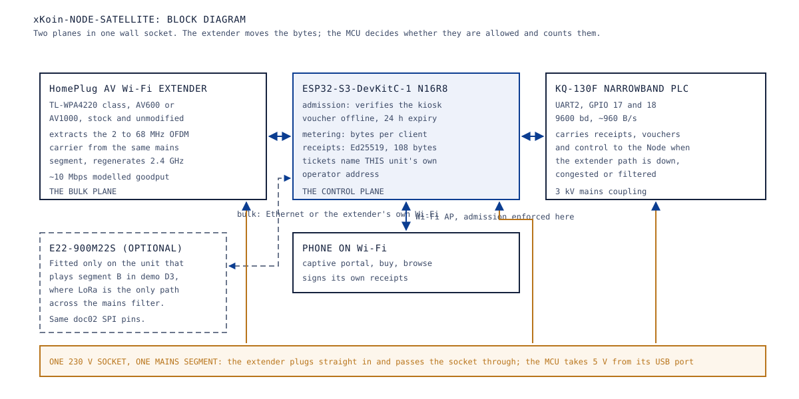
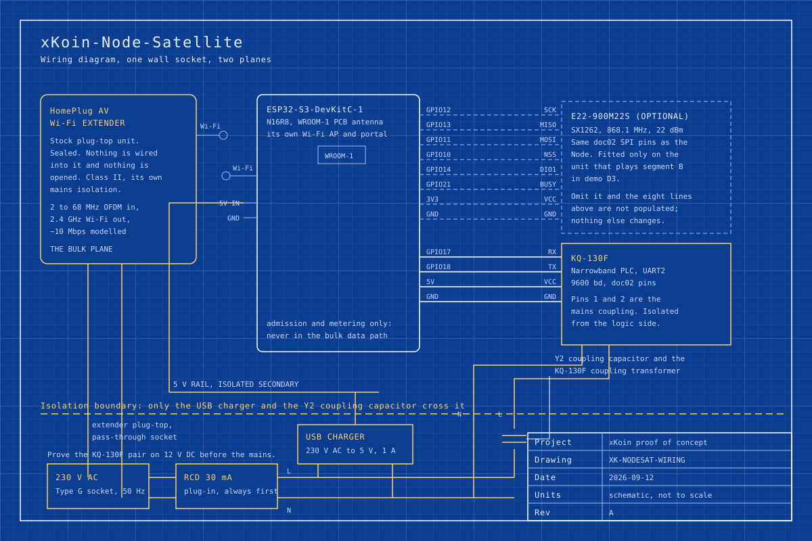

# 06. Hardware: xKoin-Node-Satellite

Abstract: The xKoin-Node-Satellite is a wall-socket relay that regenerates Wi-Fi from the same mains segment the Node injects into, and it is deliberately two devices in one socket rather than one integrated device. A stock HomePlug AV Wi-Fi extender carries the bulk plane, unopened and unmodified; an ESP32-S3-DevKitC-1 N16R8 beside it runs admission, metering and receipt signing and drives a KQ-130F for the control plane; an E22-900M22S is fitted only on the unit that plays segment B in demo D3. The design finding is that separating the planes costs one extra module and buys three things: the bulk path works before any xKoin firmware exists, the serving device collects its own receipts and names its own operator address, and the whole unit fits inside a 5 W USB charger with about 44 percent of headroom. This paper gives the photo strip, the block diagram, the wiring blueprint, the pin map, the BOM slice, the power budget, the enclosure and safety notes, the bring-up and the three acceptance tests.

Keywords: HomePlug AV, ESP32-S3, KQ-130F, wall-socket relay, admission control, receipt attribution

## 1. Role in the network

A mains segment reaches every socket in a building, but a Node at the consumer unit reaches every socket only as a carrier, not as a Wi-Fi access point. The Node-Satellite closes that gap: it plugs into a socket on a floor above, pulls the HomePlug AV carrier off the wiring, regenerates it as 2.4 GHz Wi-Fi for the phones in that flat, and enforces admission at the socket rather than at the gateway.

The consequence that matters commercially is attribution. The serving device is the one that gets paid, not the device with the backhaul. A Node-Satellite that serves a client collects that client's receipts itself and names its own operator address in the tickets it assembles, using the Node purely as transport, so relay topology never dilutes who earned what. That rule is stated in [02-system-architecture.md, section 2](02-system-architecture.md#2-tiers-and-device-archetypes) and it is the reason this device carries a full admission and metering stack rather than being a dumb repeater.

The archetype is marked **proposed** in the same table: it is designed and specified, and no unit has been built. Its firmware is the gateway firmware with the backhaul path unused, which is why this paper's bring-up section points at the same `pio` target as [05-hardware-node.md](05-hardware-node.md).

## 2. The parts

The bulk plane is a stock appliance. Buying the Wi-Fi extender variant of a HomePlug AV kit rather than a plain adapter pair is what makes this device possible without designing a radio front end: the extender already holds the power-line modem, the Ethernet switch and the 2.4 GHz access point in a mains-rated sealed box, and the ESP32-S3 sits beside it.

|  |  |
|---|---|
| ESP32-S3-DevKitC-1 N16R8 | KQ-130F, 120 to 135 kHz, 9600 bd |

|  |  |
|---|---|
| E22-900M22S, fitted only for demo D3 | 868 MHz SMA antenna, with the E22 only |

<!-- photo: homeplug-av-wifi-kit -->
<!-- photo: usb-charger-5v -->

The HomePlug AV Wi-Fi extender and the 5 V USB charger have no scouted listing yet, so no photograph is shown and no URL is invented.

## 3. How the blocks fit together

Figure 1 shows the split. The left column is the bulk plane and it is bought, not built. The right column is the control plane and it is the whole of what xKoin contributes to this device.

*Figure 1. xKoin-Node-Satellite block diagram: a stock HomePlug AV Wi-Fi extender carries the bulk plane while an ESP32-S3 runs admission and metering and drives the KQ-130F control plane, with the LoRa module fitted only for demo D3.*

Two access points exist in this box and that is intentional. The extender's own access point carries bytes at the rate the power-line modem can sustain, about 10 Mbps in the model used by the protocol simulation. The ESP32-S3's access point carries the captive portal, the purchase flow and the receipt exchange, which are small and latency-tolerant. Merging them would put the MCU in the bulk path and cap the bulk path at what an ESP32-S3 can forward, which is the mistake decision point 2 of the Drive architecture document rejects.

The narrowband carrier is not a backup for the bulk plane; it cannot be, at about 960 B/s. It is the path the receipts and the vouchers take when the broadband carrier is congested, down or filtered, and a 108-byte receipt was sized deliberately to fit one narrowband frame precisely so that the payment plane survives on the slowest medium in the system.

## 4. Wiring

Figure 2 is the wiring drawing. It is the Node's drawing with the AC-DC brick replaced by a USB charger, the LoRa module redrawn dashed as optional, and the extender drawn as a sealed plug-top unit with nothing wired into it.

*Figure 2. xKoin-Node-Satellite wiring blueprint: the sealed extender, the DevKitC pin rows, the KQ-130F on UART2, the optional E22-900M22S on the doc 02 SPI pins, and the mains side behind the isolation boundary.*

The extender is drawn with its plug crossing the isolation boundary and no signal wire leaving it. That is the whole interface: it plugs into the socket, it passes the socket through, and the xKoin side of the device never touches it electrically. The two devices coordinate over the air and over the mains, not over a cable.

When the E22 is omitted, the eight SPI and power lines drawn dashed in Figure 2 are simply not populated, and nothing else in the build changes. The firmware handles the missing radio the same way it handles a quarantined medium: it scores zero, so the sender picks the next best.

## 5. Pin map

Provenance follows `hardware/pinmap.md`. The Node-Satellite reuses the gateway rows unchanged, which is the point: one firmware pin map serves both mains-powered devices, and only the populated rows differ.

| ESP32-S3 pin | Peripheral | Signal | Bus | Provenance |
|---|---|---|---|---|
| GPIO17 | KQ-130F narrowband PLC | RX (ESP TX2) | UART | doc02 |
| GPIO18 | KQ-130F narrowband PLC | TX (ESP RX2) | UART | doc02 |
| 5V | KQ-130F narrowband PLC | VCC, isolated side | PWR | doc02 |
| GND | KQ-130F narrowband PLC | GND, isolated side | GND | doc02 |
| GPIO12 | E22-900M22S, optional | SCK | SPI | doc02 |
| GPIO13 | E22-900M22S, optional | MISO | SPI | doc02 |
| GPIO11 | E22-900M22S, optional | MOSI | SPI | doc02 |
| GPIO10 | E22-900M22S, optional | NSS/CS | SPI | doc02 |
| GPIO14 | E22-900M22S, optional | DIO1 (IRQ) | CTRL | doc02 |
| GPIO21 | E22-900M22S, optional | BUSY | CTRL | doc02 |
| 3V3 | E22-900M22S, optional | VCC | PWR | doc02 |
| GND | E22-900M22S, optional | GND | GND | doc02 |
| GPIO9 | E22-900M22S, optional | RESET | CTRL | proposed, set in `src/main.c` |

There is no W5500 row and no SIM7600E row here. This device has no backhaul by definition, and it is never in the bulk data path, so neither block has a reason to exist on it even as a deferred option.

## 6. BOM slice, one Node-Satellite

Prices are the scouted KES figures for the chosen candidate on 2026-09-12, as displayed to a Kenyan visitor without a login, per listing rather than per piece where the listing is a multipack.

| Part | Qty per unit | Scouted KES | Note |
|---|---|---|---|
| HomePlug AV Wi-Fi extender | 1 | price pending scout | The extender half of an AV600 or AV1000 kit, TL-WPA4220 class; the kit's plain adapter goes to the Node |
| ESP32-S3-DevKitC-1 N16R8 | 1 | 572 | Board-only variant of the same listing the Node uses |
| KQ-130F narrowband PLC module | 1 | 1,029 | Scouted 2026-09-13; the listing mixes KQ-130F and KQ-330 variants, so the per-variant price is unverified until the item page is opened |
| E22-900M22S SX1262 module | 0 or 1 | 556 | Fitted only on the segment B unit for demo D3 |
| 868 MHz SMA antenna, 3 dBi | 0 or 1 | 22 | With the E22 only; entry variant of a 2-piece listing |
| IPEX to SMA pigtail | 0 or 1 | 380 | With the E22 only; 5-piece pack as displayed |
| 5 V USB charger, 1 A | 1 | price pending scout | Or the extender's own USB port where the model has one |

The proof-of-concept kit builds two of these units: one without LoRa for demos D1, D4 and D5, and one with LoRa for demo D3. As in [05-hardware-node.md](05-hardware-node.md) no subtotal is quoted while two lines are unpriced.

## 7. Power budget

None of these figures is measured. All are datasheet-derived and marked as such.

| Rail | Load | Current or power | Source of the figure |
|---|---|---|---|
| 230 V | HomePlug AV Wi-Fi extender, whole unit | TODO: verify against the chosen model's datasheet; units in this class are typically a few watts | not yet sourced |
| 3.3 V | ESP32-S3, Wi-Fi AP active | about 240 mA | datasheet-derived |
| 3.3 V | SX1262 transmitting at +22 dBm, when fitted | about 118 mA | datasheet-derived |
| 3.3 V | SX1262 receiving, when fitted | about 5 mA | datasheet-derived |
| 5 V | KQ-130F transmit burst | about 200 mA | datasheet-derived, per its datasheet class |
| 5 V | KQ-130F receive or idle | TODO: verify against the datasheet | not yet sourced |
| 5 V | USB charger ceiling | 1 A, 5 W | datasheet-derived |

**The worst simultaneous case, LoRa fitted.** The Wi-Fi AP active plus the SX1262 transmitting puts 240 plus 118 equals 358 mA on the 3.3 V rail, which the DevKitC feeds through a linear regulator from 5 V, so the same 358 mA is drawn from the 5 V rail. Adding the KQ-130F transmit burst of 200 mA gives 558 mA, or 2.79 W. Against a 5 W charger that leaves 2.21 W, which is about 44 percent of headroom.

**Without LoRa**, the same sum is 240 plus 200 equals 440 mA, or 2.20 W, and the headroom rises to 2.80 W. Either way the xKoin side of this device fits a commodity phone charger comfortably, which is the contrast with the Node: the Node runs a 3 W brick at about 7 percent of headroom because it must also carry the mains-coupling supply in one sealed box, and this device does not.

**Continuous draw and daily energy.** With the Wi-Fi AP active, the SX1262 receiving and the KQ-130F not transmitting, the 5 V rail carries 245 mA, which is 1.225 W, or 29.4 Wh a day at the DC side. At an assumed 75 percent charger efficiency, which is typical for the class and not a measurement, that is about 39 Wh a day at the wall for the xKoin side alone. The extender's own consumption is the larger term and it is the one marked TODO above; until the chosen model is scouted, the unit's total daily energy is not stated, because stating the small half of a sum as if it were the sum would be wrong.

## 8. Enclosure and mounting

This device occupies one socket and it should look like it. The extender is already a plug-top appliance with a pass-through socket on most models in the class, so the xKoin half goes in a small ABS box that plugs into that pass-through: a USB charger, the DevKitC, the KQ-130F and its coupling, with an SMA bulkhead only on the unit that carries LoRa.

Two placement rules follow from the physics rather than from taste. Keep the unit on the same mains segment as the Node, because a distribution transformer, a phase change or a filter ends the power-line carrier and no transmit power changes that. And keep it out of a metal back box or a deep recess: the 2.4 GHz access point inside the extender is what the phones in the room actually attach to, and a socket behind a wardrobe serves a room badly for reasons that have nothing to do with the protocol.

## 9. Bench safety

The same rule governs as in [05-hardware-node.md, section 9](05-hardware-node.md#9-bench-safety): each KQ-130F pair is proven on a 12 V DC line first, then moved to a mains strip behind a 30 mA plug-in RCD, and no isolation transformer is bought for the proof of concept.

One rule is specific to this device. The extender is a sealed mains appliance carrying a modem and an access point, and it is never opened, never soldered to and never powered from anything but a wall socket. Every temptation to tap its Ethernet port or its internal 3.3 V rail should be answered by the observation that the design does not need either: the two halves coordinate over the air and over the wiring.

## 10. Bring-up

The firmware is the gateway firmware with the backhaul path unused, so the build is the same one:

    cd firmware/xkoin-gateway
    pio run -e esp32-s3
    pio run -e esp32-s3 -t upload
    pio device monitor -b 115200

On a unit with no E22 fitted, the first log line from the `xkoin-gw` tag is still attempted and the SX1262 initialisation runs against an absent device, so a build for this variant should have the radio init compiled out or the medium left quarantined rather than relying on the driver timing out; that is a firmware task, marked here so it is not discovered on the bench. The lines to expect on a fully populated unit are the same three as the Node's:

    I (xxx) xkoin-gw: SX1262 up: LoRa SF7 868.1 MHz (GFSK 150k switchable)
    I (xxx) xkoin-gw: xKoin gateway skeleton up
    I (xxx) xkoin-gw: PLC frame type=<n> len=<n> from=<xx><xx>..

The third line is the one that matters most here, because it is the proof that this unit and the Node are on the same mains segment and that the narrowband pair is talking. Bring the extender up first and confirm its own link light and its access point, then bring the xKoin half up, so that a failure is attributable to one half or the other rather than to both.

## 11. Acceptance tests

The Node-Satellite must pass three of the six demos in [12-proof-of-concept-plan.md](12-proof-of-concept-plan.md), where the full procedure and the risks are written out.

| Demo | What the Node-Satellite must do | Pass criterion |
|---|---|---|
| D1, local LAN over PLC | Serve a phone on its own Wi-Fi: captive portal, purchase, browsing, with receipts collected under its own operator address | The portal loads and the purchase completes, and the receipt counter for that client is monotonic and ends within two receipt intervals of the client's own counter |
| D3, transformer node jump | Play segment B behind the mains filter: keep local bulk traffic inside segment B while the LoRa link carries control to the Node in segment A | Zero HomePlug AV association and zero narrowband frames across the filter over a 10 minute window, while class C traffic over LoRa continues |
| D5, high-speed internet | Carry 720p video and a live session over the HomePlug path to a phone on its own Wi-Fi | Sustained downstream above 6 Mbps at the phone over 60 seconds, conditional on the backhaul measuring above 6 Mbps at the router first |

## 12. References

1. `hardware/pinmap.md`, the xKoin-Gateway doc02 rows, reused unchanged here.
2. `hardware/bom.md`, the HomePlug AV kit line and the type G plug warning.
3. `hardware/shopping/parts/*.json`, scouted listings and prices recorded 2026-09-12.
4. `firmware/xkoin-gateway/README.md` and `platformio.ini`, the shared build target and the status split.
5. `firmware/xkoin-gateway/src/main.c`, the pin constants and the boot log lines.
6. `docs/_drive/05-architecture-decisions-and-tradeoffs.md`, decision point 2 on split compute.
7. `docs/_drive/03-hardware-bom-and-sourcing-guide.md` section 2, the wiring guide and the electrical safety protocol.
8. `docs/_plan/revamp-plan.md`, the device lineup, the demo matrix and the bench safety rule.
9. [02-system-architecture.md](02-system-architecture.md), sections 2, 3 and 7 for the archetype table, the medium table and the failure modes.
