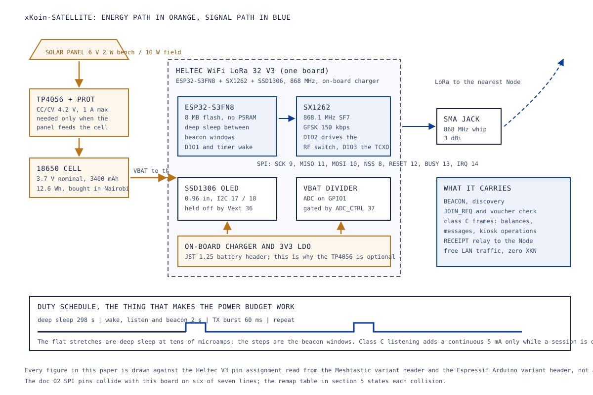
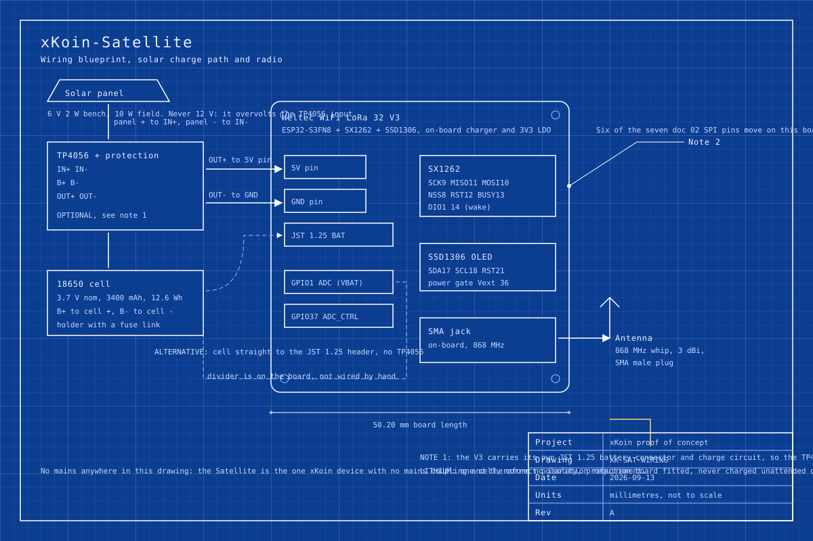

# 07. Hardware: xKoin-Satellite, the off-grid solar LoRa remote

Abstract: The xKoin-Satellite is the one device in the set that has no mains
connection, no power-line carrier and no wide-area link of its own. It is a
Heltec WiFi LoRa 32 V3 board, an 18650 cell, a small photovoltaic panel and a
weatherproof box, and its job is to keep the radio plane alive where the wiring
ends. Moving the design onto the Heltec V3 removes the hand-wired SPI bus that
the earlier ESP32-S3-DevKitC build needed, and costs one thing in exchange: six
of the seven doc 02 SPI pin assignments collide with pins the V3 has already
committed, so the firmware pin map has to move. We state each collision, the one
pin that survives unchanged, and the happy accident that the repository's
proposed battery-sense pin is the pin Heltec already wired a divider to. The
power budget shows the device idling near 0.54 mA on a five-minute beacon
schedule against a 40 mA design ceiling, which means the panel is sized for the
worst case rather than the working point.

Keywords: LoRa, SX1262, ESP32-S3, solar power, deep sleep, off-grid node,
Heltec V3, power budget

## 1. Role in the network

A Node terminates the backhaul. A Node-Satellite extends the mains segment. The
Satellite does neither. It sits where there is no socket to plug into and no
mains segment to ride, and it carries the radio plane out to that place: it
beacons, it admits clients against a kiosk-signed voucher verified entirely
offline, it serves class C transactional traffic, and it relays receipts back to
the nearest Node. See
[02-system-architecture.md, section 2](02-system-architecture.md#2-tiers-and-device-archetypes)
for its row in the archetype table and
[03-protocol-xkp.md](03-protocol-xkp.md) for the frames it speaks.

Two properties follow from having no mains connection, and both are the point of
the device rather than a limitation of it.

It survives the grid. When a building loses power, the HomePlug carrier and the
narrowband carrier both stop scoring and the mesh degrades to LoRa in about 0.8
seconds. The Satellite does not notice, because it was never on the grid. This is
the device that makes demo D4, last network standing, mean anything.

It cannot carry bulk. LoRa at SF7 delivers about 5.4 kbps with a 226-byte frame
payload, under a duty-cycle ceiling. That is enough for balances, messages,
kiosk operations and telemetry, and it is not enough for a web page at normal
size. The Satellite therefore offers class C only; class A distilled web and
class B adaptive modulation belong to a Node with backhaul behind it.

Status: partial. The board choice, the pin map and the power budget in this paper
are settled; the satellite firmware is HANDOVER backlog item 6 and has not been
written, and no unit has been soaked on a bench.

## 2. The parts, as bought

Figure 1 and Figure 2 below draw the device. The photographs are the listings the
sourcing scouts actually priced, recorded in `hardware/shopping/parts/`. Four
lines have no scouted listing yet and carry a marker instead of a photograph.

|  | <!-- photo: tp4056-solar-charger --> | <!-- photo: 18650-cell-and-holder --> | <!-- photo: solar-panel-6v-2w --> |  |
|---|---|---|---|---|
| Heltec WiFi LoRa 32 V3, 868 MHz | TP4056 solar charge board with protection, photo pending scout | 18650 cell 3400 mAh and holder, photo pending scout | Solar panel 6 V 2 W bench, 10 W field, photo pending scout | 868 MHz whip, 3 dBi, SMA male |

The Heltec V3 is an ESP32-S3FN8 and an SX1262 on one board with a 0.96 inch
SSD1306 OLED, and it is standard Meshtastic hardware, which matters for
paper 09's interoperation demonstration and for the bench: a board that many
thousands of people have already flashed fails in documented ways.

## 3. Block diagram

Figure 1 separates the energy path from the signal path, because on this device
they are designed against different constraints: the energy path is sized for a
worst case that the firmware is meant never to reach, and the signal path is
sized for a duty cycle the regulator sets.

*Figure 1. Block diagram of the xKoin-Satellite: solar panel and cell on the
energy path, Heltec V3 with its integrated SX1262 and OLED on the signal path,
and the beacon duty schedule that makes the power budget work.*

The block worth noticing is the one marked optional. The Heltec V3 carries its
own JST 1.25 battery connector and charge circuit, so a cell plugged straight
into that header charges from USB with no external board at all. The TP4056
earns its place only in the configuration where a photovoltaic panel feeds the
cell directly and there is no USB supply to charge from, which is every field
deployment and no bench session.

## 4. Wiring

Figure 2 is the wiring blueprint. It draws both configurations: the panel through
the TP4056 into the board's 5 V pin, and the cell straight into the JST header
with no TP4056 in the path.

*Figure 2. Wiring blueprint: panel to TP4056 IN, cell to BAT, OUT to the Heltec
5 V pin, the on-board VBAT divider and its enable pin, the OLED bus, and the
antenna to the SMA jack.*

Four connections carry a condition.

**Panel to TP4056 IN.** The panel must be 5 V or 6 V nominal. A 12 V panel
overvolts the TP4056 charge input and needs a buck stage ahead of it, which is
the explicit warning attached to the `5V-IN` row in `hardware/pinmap.md` and
repeated in `hardware/bom.md`.

**TP4056 OUT to the board.** OUT+ goes to the 5 V pin and OUT- to GND, so the
board's own regulator and charge circuit see the cell through the TP4056's
protection. Wiring OUT+ to the JST battery header instead puts two charge
circuits on one cell, and the board's charger would then try to charge through
the TP4056's protection FETs. Pick one path.

**The VBAT sense.** Nothing is hand-wired here. The V3 already has a divider on
GPIO1, gated by an enable pin on GPIO37 that is active low, so the divider draws
nothing while the device sleeps. Section 5 gives the numbers.

**The antenna.** The SMA jack is on the board. The antenna is an SMA male plug,
3 dBi, and it must be fitted before the radio is keyed: transmitting into an open
jack reflects the power back into the power amplifier.

## 5. Pin map

The Heltec V3 fixes its own LoRa pins in copper. The values below were read on
2026-09-13 from two upstream sources rather than from memory: the Meshtastic
firmware variant header for the board, and the Espressif Arduino core variant
header that defines the board's named pins.

| Signal | Heltec V3 GPIO | Source | Provenance |
|---|---|---|---|
| LoRa SCK | 9 | `LORA_SCK 9` | fixed by the board |
| LoRa MISO | 11 | `LORA_MISO 11` | fixed by the board |
| LoRa MOSI | 10 | `LORA_MOSI 10` | fixed by the board |
| LoRa NSS / CS | 8 | `LORA_CS 8`, `SX126X_CS LORA_CS` | fixed by the board |
| LoRa RESET | 12 | `LORA_RESET 12`, also `RST_LoRa = 12` | fixed by the board |
| LoRa BUSY | 13 | `LORA_DIO2 13`, `SX126X_BUSY LORA_DIO2`, also `BUSY_LoRa = 13` | fixed by the board |
| LoRa DIO1 (IRQ) | 14 | `LORA_DIO1 14`, `SX126X_DIO1 LORA_DIO1` | fixed by the board |
| RF switch | SX1262 DIO2 | `SX126X_DIO2_AS_RF_SWITCH` | fixed by the board |
| TCXO supply | SX1262 DIO3 at 1.8 V | `SX126X_DIO3_TCXO_VOLTAGE 1.8` | fixed by the board |
| VBAT sense (ADC) | 1 | `BATTERY_PIN 1`, `ADC_CHANNEL ADC_CHANNEL_0` | fixed by the board |
| VBAT divider enable | 37, active low | `ADC_CTRL 37`, `ADC_CTRL_ENABLED LOW` | fixed by the board |
| OLED SDA | 17 | `SDA_OLED = 17` | fixed by the board |
| OLED SCL | 18 | `SCL_OLED = 18` | fixed by the board |
| OLED reset | 21 | `RST_OLED = 21` | fixed by the board |
| Peripheral power gate | 36, active low | `Vext = 36` | fixed by the board |
| User button | 0 | `BUTTON_PIN 0` | fixed by the board |
| Status LED | 35 | `LED = 35` | fixed by the board |
| Secondary I2C | SDA 41, SCL 42 | `SDA = 41`, `SCL = 42` | fixed by the board |

Two settings that are not pins travel with this table and belong in the firmware
at the same time. The ADC attenuation is 2.5 dB, because the divider is high
impedance, and the voltage multiplier is 4.9 multiplied by 1.045. Both come from
the same variant header.

### 5.1 The remap against doc 02

`hardware/pinmap.md` fixes the Satellite's SX1262 pins to the same map as the
gateway so the two share a driver, and `HANDOVER.md` section 3 lists that map as
an invariant. On the Heltec V3 that map does not survive. Six of the seven
assignments land on a pin the board has already committed to something else, and
three of those are outright shorts between two functions.

| Signal | doc 02 fixed pin | Heltec V3 pin | What the doc 02 pin is on the V3 | Result |
|---|---|---|---|---|
| SCK | 12 | 9 | LoRa RESET | collision |
| MISO | 13 | 11 | LoRa BUSY | collision |
| MOSI | 11 | 10 | LoRa MISO | collision |
| NSS / CS | 10 | 8 | LoRa MOSI | collision |
| DIO1 (IRQ) | 14 | 14 | LoRa DIO1 | matches |
| BUSY | 21 | 13 | OLED reset | collision |
| RESET | 9 (proposed, in `src/main.c`) | 12 | LoRa SCK | collision |

DIO1 on GPIO14 is the only assignment that comes through unchanged. Everything
else moves.

The change this forces is smaller than the table makes it look, because the pin
numbers in `firmware/xkoin-gateway/src/main.c` are seven preprocessor defines
above the hardware abstraction functions, and the SX1262 driver in
`lib/sx1262/` takes them as parameters. The correct change is to lift those
defines into a per-board header, one for the DevKitC gateway and one for the
Heltec V3 Satellite, and to leave the driver alone. The invariant in HANDOVER
section 3 is then stated more precisely: the doc 02 map is fixed for the
DevKitC-based Node and Node-Satellite, and the Satellite carries a board-specific
map because its board does.

This needs Martin's sign-off, because it edits a line in the locked invariants.
TODO: verify the decision is recorded before the satellite firmware is written.

### 5.2 The battery-sense pin, which did not need to move

`hardware/pinmap.md` proposes GPIO1 for the Satellite's VBAT divider, marked
`proposed`, ADC1 channel 0. The Heltec V3 has a divider on GPIO1 on channel 0.
The proposed row needs no change at all; what it gains is two facts it did not
carry, the enable pin on GPIO37 and the multiplier, and one saving, because the
divider and its resistors are already on the board and nothing is wired by hand.

## 6. BOM slice

Prices are the scouted AliExpress listings in `hardware/shopping/parts/`,
recorded on 2026-09-12, in KES, before Kenyan duty, VAT, the 2.25 percent import
declaration fee and the 1.5 percent railway development levy. Lines with no
scouted listing say so.

| Line | Qty per Satellite | Unit price KES | Note |
|---|---|---|---|
| Heltec WiFi LoRa 32 V3, 868 MHz | 1 | 2,553 | Per unit inside a two-pack at KES 5,106; the lowest per-unit V3 price the scout found |
| 868 MHz antenna, 3 dBi, SMA male | 1 | 22 | Entry variant of a two-pack; the listing runs KES 22 to KES 30 across variants, so the 868/915 straight variant may sit at the top of that range |
| TP4056 solar charge board with protection | 0 or 1 | price pending scout | Needed only in the panel-fed configuration of section 3 |
| 18650 cell, 3400 mAh, with holder | 1 | price pending scout | Bought in Nairobi: most couriers refuse loose lithium cells into Kenya under UN3480 |
| Solar panel, 6 V 2 W bench or 10 W field | 1 | price pending scout | Never 12 V |
| IP65 enclosure, gland and pole bracket | 1 | price pending scout | Section 9 |

Scouted lines total KES 2,575 per Satellite. Four lines are unpriced, so no
device total is claimed here. For comparison, `hardware/bom.md` prices the older
DevKitC-based Satellite at USD 55 of modules per unit at its indicative prices,
which included a separate Waveshare Core1262 radio and an antenna pigtail that
the V3 makes unnecessary.

## 7. Power budget

Every current below is an assumption until it is measured on a bench, and each
one is labelled with where it came from. The whole budget exists to answer one
question: does a small panel and one cell carry this device through a Nairobi
week, including overcast days.

### 7.1 Assumptions

| Quantity | Value used | Where it comes from | Confidence |
|---|---|---|---|
| SX1262 receive current | 5 mA | Semtech SX1261/2 datasheet class figure, as stated in the brief for this paper | assumption, TODO: verify against DS.SX1261-2 at bring-up |
| SX1262 transmit current at +22 dBm | 118 mA | Same datasheet class figure | assumption, TODO: verify |
| SX1262 transmit current at the CA 25 mW e.r.p. cap | 40 mA | Scaled from the same table at +14 dBm | assumption, TODO: verify |
| ESP32-S3 deep sleep | about 10 uA | Espressif figure for the SoC alone | assumption; the board adds its regulators |
| Heltec V3 board quiescent in deep sleep | 0.2 mA assumed | The V3 carries a 3V3 LDO, a charge controller and a USB bridge that the SoC figure excludes | assumption, TODO: measure; this is the single largest uncertainty in the budget |
| ESP32-S3 active, radio on, Wi-Fi off | 40 mA | Espressif figure for the SoC running from flash with the radio subsystem idle | assumption |
| ESP32-S3 light sleep with DIO1 wake armed | about 1 mA | Espressif figure | assumption |
| OLED | 0 mA | Held off through the Vext gate on GPIO36 | design decision |
| Cell | 3,400 mAh at 3.7 V nominal, 12.6 Wh | `hardware/bom.md` | sourced part |
| Nairobi insolation | 5.5 peak sun hours a day | Working assumption for a site near the equator at about 1,700 m | assumption, TODO: replace with a sourced irradiance figure for the pilot site |
| Panel to cell efficiency | 0.5 | Covers panel angle, dust, cell temperature and the TP4056's linear charge loss | assumption, deliberately pessimistic |
| Design ceiling | under 40 mA average | `hardware/pinmap.md` doc 03 note, repeated in `hardware/bom.md` | fixed requirement |

### 7.2 The three states

| State | SX1262 | ESP32-S3 | OLED | Board total at 3.7 V |
|---|---|---|---|---|
| Deep sleep between beacon windows | off | 10 uA | off | about 0.21 mA, nearly all of it the board's regulators |
| Listening at class C, MCU in light sleep, DIO1 armed | RX 5 mA | 1 mA | off | about 6.2 mA |
| Beacon window, MCU active | RX 5 mA | 40 mA | off | about 45 mA |
| Transmit burst at the 25 mW cap | TX 40 mA | 40 mA | off | about 80 mA |

### 7.3 Two days

The firmware schedule is a 2 second wake every 300 seconds, carrying one listen
period and one beacon transmission of 60 ms, with class C listening added only
while a session is open.

An idle day, with no client attached, is 288 windows:

    active   288 x 2 s x 45 mA        = 25,920 mA.s = 7.20 mAh
    transmit 288 x 0.06 s x 80 mA     =  1,382 mA.s = 0.38 mAh
    sleep    23.84 h x 0.21 mA                      = 5.01 mAh
    total                                           = 12.6 mAh/day
    average                                         = 0.53 mA

A serving day, with four hours of continuous class C listening on top:

    listening 4 h x 6.2 mA                          = 24.8 mAh
    idle remainder, 20 h of the schedule above      = 10.5 mAh
    total                                           = 35.3 mAh/day
    average                                         = 1.47 mA

Both sit two orders of magnitude below the 40 mA ceiling. The ceiling is not the
working point; it is the number the energy system must survive if the firmware is
forced into continuous MCU-active operation by a fault or by a service class this
device is not supposed to offer. At the ceiling the device draws 960 mAh a day,
which is 3.55 Wh at 3.7 V.

### 7.4 What the panel delivers

At 5.5 peak sun hours and the 0.5 derate:

| Panel | Nominal Wh/day | Delivered Wh/day | Against the 3.55 Wh/day ceiling | Against the 0.13 Wh/day serving schedule |
|---|---|---|---|---|
| 6 V 2 W, the bench part | 11.0 | 5.5 | 1.5 times | 42 times |
| 10 W, the field part in `hardware/bom.md` | 55.0 | 27.5 | 7.7 times | 212 times |

Two overcast days at 20 percent of clear-sky output give the 10 W panel
2 x 5.5 = 11.0 Wh against a 7.1 Wh worst-case draw, so the panel alone carries
the ceiling through them and the cell is never called on. On the serving
schedule the 12.6 Wh cell alone runs the device for about 96 days with no sun at
all. This reproduces the claim in the doc 03 note that a 10 W panel and a
3,400 mAh cell ride through two overcast days, and shows the margin is large
because the ceiling, not the schedule, sized the system.

The 2 W bench panel clears the ceiling on a clear day and does not clear two
overcast days at the ceiling. It is adequate for demo D2 and demo D6 on a bench
and it is not the field part.

## 8. Enclosure and mounting

| Item | Specification | Reason |
|---|---|---|
| Box | IP65 or better ABS or polycarbonate, minimum 150 by 110 by 70 mm, light grey | Holds the board, the cell holder and the charge board with room for the SMA bulkhead; light grey runs cooler in direct sun than black, and cell life falls sharply above 45 C |
| Antenna | SMA bulkhead through the top face, gasket fitted, antenna outside | An antenna inside a plastic box detunes against the wall and loses several dB |
| Gland | One M12 cable gland for the panel lead, on the underside | Water enters through the top and through unsealed holes; the underside is the only safe face to pierce |
| Panel mount | Separate bracket, tilted about 1 degree from horizontal per degree of latitude, facing north in Nairobi | Nairobi sits at about 1.3 degrees south, so a nearly flat panel is optimal for annual yield; a 10 to 15 degree tilt is used anyway so that rain washes dust off |
| Pole mount | Two stainless hose clamps through moulded lugs, 50 mm pole | Cheap, reversible, and it does not need the box drilled |
| Cell | Holder with a fuse link, cell retained against vibration, vent path not blocked | A cell that moves in a holder arcs at the contacts |

The box is not drilled on the top face for anything but the antenna bulkhead, and
the bulkhead carries its own gasket.

## 9. Bench safety

No mains is involved anywhere in this device. The KQ-130F mains coupling that
dominates the Node's safety section does not exist here, and there is no
isolation transformer requirement. The safety surface is the lithium cell alone.

- Use a protected cell or a protection board. A bare 18650 has no over-discharge
  cut-off and a cell taken below about 2.5 V can vent when it is next charged.
- Check polarity before the holder is closed. Reversed, the TP4056 protection
  will not save the cell.
- Charge on a non-flammable surface and do not leave a first charge unattended.
- Do not charge a cell that is swollen, dented or above 45 C, and do not charge
  below 0 C.
- Buy cells in Nairobi. Loose lithium cells ship under UN3480 and most couriers
  refuse them into Kenya, which is recorded in `hardware/bom.md`.
- Transport the assembled device with the cell removed or the device powered
  down; a switch in the cell lead is worth the five minutes it takes to fit.

## 10. Bring-up

The satellite firmware does not exist yet, so steps 4 onward describe what the
bring-up must produce rather than what has been observed. Steps 1 to 3 are
routine for this board.

1. **Board alone, no cell, no panel.** Connect USB-C. The V3 enumerates through
   its UART bridge. Confirm the board is a V3 and not a V2 by reading the silk
   screen, because the V2 has a different radio pin map and the whole of section
   5 is wrong for it.
2. **Flash a known-good image first.** Flash stock Meshtastic for the Heltec V3
   before any xKoin firmware. This proves the radio, the OLED, the antenna and
   the USB path in one step with software that is known to work on this board,
   and it separates a bad board from a bad port. The OLED should show a node
   screen within a few seconds of boot.
3. **Fit the antenna.** Before any transmission. The SMA plug is finger-tight
   plus a light quarter turn.
4. **Flash the xKoin satellite image.** The expected first-boot log is the node
   id derived as `SHA-256(Ed25519 pubkey)[:8]` per Law 1, the SX1262 register
   dump, the configured frequency of 868.1 MHz, the configured power amplifier
   setting, and the first BEACON transmission with its airtime in milliseconds.
5. **Confirm the radio at the register level.** The SX1262 register values in
   `firmware/xkoin-gateway/lib/sx1262/sx1262.h` carry VERIFY tags for the GFSK
   receive bandwidth code and the packet parameters, which is HANDOVER backlog
   item 4. Bring-up is where that check is done, against the Semtech datasheet,
   with a logic analyser on the SPI bus.
6. **Confirm the power amplifier setting against the regulator.** The firmware
   ships at +22 dBm, which is about 158 mW and roughly six times the 25 mW
   e.r.p. ceiling in the Communications Authority 2022 short-range-device table
   for the 868.0 to 868.6 MHz sub-band before antenna gain. The Satellite does
   not leave the bench at +22 dBm. See
   [11-regulatory-and-safety.md](11-regulatory-and-safety.md).
7. **Battery sense.** Enable ADC_CTRL on GPIO37 by driving it low, read GPIO1 at
   2.5 dB attenuation, multiply by 4.9 times 1.045, and compare against a
   multimeter on the cell. Disable the enable pin again and confirm the sleep
   current drops.
8. **Sleep current.** Put a multimeter in series with the cell and read the deep
   sleep current directly. This is the measurement that replaces the 0.2 mA
   assumption in section 7.1, and it is the one number in this paper most likely
   to be wrong.
9. **Soak.** Seventy-two hours on the cell alone with the panel disconnected,
   logging the VBAT reading each window, against the predicted discharge. A
   measured curve that matches the predicted one closes the power budget.

## 11. Acceptance

Three demos from the proof-of-concept plan require this device. See
[12-proof-of-concept-plan.md](12-proof-of-concept-plan.md) for the full matrix.

**D2, air-gapped LoRa over simulated distance.** A Node and a Satellite with two
30 dB SMA attenuators in line, so the path carries 60 dB of loss. The Satellite
passes when class C traffic completes at SF7 through that loss: a balance query,
a chat message and a voucher check, with the received signal strength displayed.
The attenuators sit between the board's SMA jack and the antenna, one at each
end. The observable that makes this convincing on camera is the OLED, which is
the reason the V3 was chosen over a bare module.

**D4, last network standing.** The D1 bench with the wide-area link unplugged.
The Satellite's part is to keep serving while everything mains-powered is either
dark or cut off from the internet: admission continues, because vouchers verify
offline; class C traffic continues; cumulative receipts accumulate and settle
when the link returns. The Satellite passes when nothing about its behaviour
changes at the moment the link is pulled.

**D6, farm IoT on the free plane.** The Satellite relays a farm sensor node's
telemetry to the Node dashboard, and the acceptance condition is that zero XKN is
spent doing it. Paper 09 covers the sensor node; the Satellite's part is to
forward a TELEMETRY frame without opening a session, without asking for a
voucher and without collecting a receipt. See
[09-lora-ecosystem-devices.md](09-lora-ecosystem-devices.md).

## 12. Open items

1. The per-board pin map split in section 5.1 edits a HANDOVER section 3
   invariant and needs Martin's sign-off. TODO: verify recorded.
2. The board quiescent current in section 7.1 is assumed at 0.2 mA and drives
   40 percent of the idle-day energy. Measure it at bring-up.
3. The SX1262 current figures are datasheet class values, not measurements.
   TODO: verify against DS.SX1261-2.
4. Nairobi insolation is assumed at 5.5 peak sun hours. TODO: replace with a
   sourced figure for the pilot site before any field claim.
5. Four BOM lines have no scouted price.
6. The transmit power setting is outside the short-range-device exemption as the
   firmware ships. This is a firmware change and a counsel question, both open.

## 13. References

1. Meshtastic firmware, board variant header for the Heltec V3,
   `variants/esp32s3/heltec_v3/variant.h`, GitHub repository
   `meshtastic/firmware`, default branch, retrieved 2026-09-13. Source of the
   SX1262 pin assignments, the battery pin and multiplier, the ADC control pin
   and the DIO2 and DIO3 configuration.
2. Espressif Arduino core, board variant header
   `variants/heltec_wifi_lora_32_V3/pins_arduino.h`, GitHub repository
   `espressif/arduino-esp32`, default branch, retrieved 2026-09-13. Source of the
   named OLED pins, `Vext`, `LED`, `SS`, `MOSI`, `MISO`, `SCK`, `RST_LoRa` and
   `BUSY_LoRa`.
3. `hardware/pinmap.md`, xKoin-Satellite section, the doc 02 SX1262 map, the
   doc 03 power rows and the proposed GPIO1 battery sense.
4. `hardware/bom.md`, Satellite section: cell, panel, charge board and regulator
   choices, the under 40 mA target and the Kenya import notes.
5. `hardware/shopping/parts/heltec-lora32-v3-868.json` and
   `hardware/shopping/parts/antenna-868-sma.json`, scouted listings and prices,
   recorded 2026-09-12.
6. `protocol/spec.md` sections 1, 2, 3 and 6: the medium table, the frame format,
   the phases and the service classes.
7. `HANDOVER.md` section 3, the pin invariant, and section 4 items 4 and 6, the
   SX1262 register VERIFY tags and the satellite firmware backlog entry.
8. `docs/ops/regulatory-brief.md` section 2, the Communications Authority 2022
   short-range-device table and the transmit power flag.
9. `docs/_plan/revamp-plan.md`, the device lineup, the Heltec V3 decision and the
   demo matrix.
10. `docs/_plan/research/02-landing-page-design-study.md` section 3, Meshtastic
    hardware facts and the ESP32-S3 against nRF52840 comparison.
