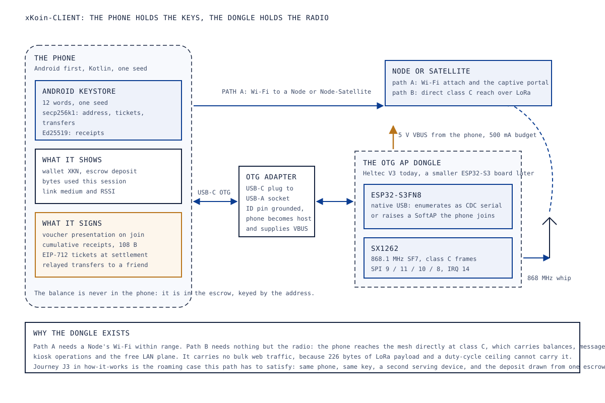
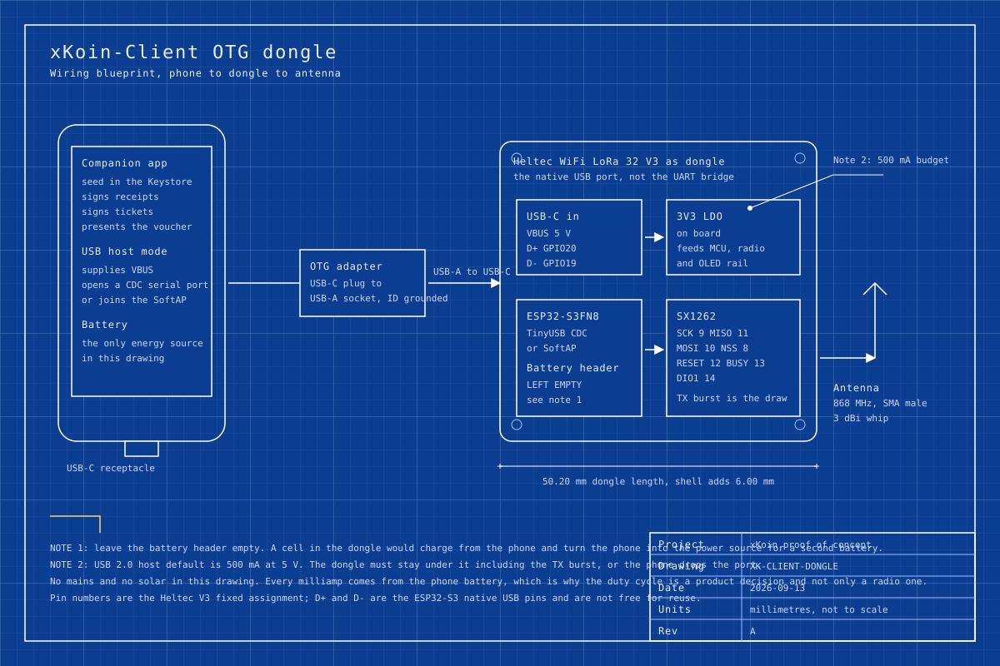

# 08. Hardware: xKoin-Client, the phone and the OTG dongle

Abstract: The xKoin-Client is the only archetype in the set where the hardware is almost incidental. What makes a client a client is a seed phrase, and the purchase, the balance and the roaming behaviour all follow from where that seed lives. This paper covers the client in two halves. The first is the phone with the companion app: one seed in the Android Keystore deriving both a secp256k1 key for tickets and transfers and an Ed25519 key for receipts, which is what turns a browser-generated throwaway key into an identity that survives a cleared cache and roams between nodes. The second is the OTG dongle, a Heltec WiFi LoRa 32 V3 on a USB-C OTG lead, powered entirely from the phone and giving it direct class C reach over LoRa when no node Wi-Fi is in range. The dongle draws about 50 mA while listening against a 500 mA USB host budget, which costs a 4,000 mAh phone roughly 2 percent of its battery an hour.

Keywords: companion app, Android Keystore, USB OTG, LoRa, class C service, key custody, roaming

## 1. Scope and role

Every other device in this set relays frames or sells bytes. The Client buys them. It holds the user's keys, presents the voucher on admission, signs the cumulative receipts that prove how many bytes were delivered, and signs the EIP-712 ticket that settles them on chain. See [03-protocol-xkp.md](03-protocol-xkp.md) for the frames and [04-settlement-and-economics.md](04-settlement-and-economics.md) for the money.

The two halves answer two different failures.

The phone half answers the key custody failure. Today a client key is generated in a captive-portal page in the browser, which works for one session in one place and then dies with cleared site data. That key cannot roam and it cannot be backed up. The companion app is what fixes it.

The dongle half answers a coverage failure. Path A, the phone on a Node's Wi-Fi, needs a Node within Wi-Fi range. Where there is no Node's Wi-Fi and a Satellite or a Node is within LoRa range instead, the phone needs its own radio. The dongle is that radio, and it is powered by the phone, so it adds no battery to manage.

Status: proposed on both halves. The app is specified in [docs/how-it-works.md section 5.2](../how-it-works.md) and has not been built; the dongle has a board, a pin map and a power budget and has not been assembled.

## 2. The parts, as bought

|  |  |  | <!-- photo: usb-a-to-usb-c-data-lead --> | <!-- photo: android-phone --> |
|---|---|---|---|---|
| Heltec WiFi LoRa 32 V3, 868 MHz, as the dongle | USB-C male to USB-A female OTG adapter | 868 MHz whip, 3 dBi, SMA male | USB-A to USB-C data lead, photo pending scout | Any Android phone with USB host support, no scouted listing |

The phone is not a purchased part and never appears in the BOM. Any Android device that supports USB host mode will do, and the app targets Android first because that is where the users are.

## 3. The phone half: what it holds, signs and shows

The app is the xKoin wallet. Its minimum is small and its shape is fixed by [docs/how-it-works.md section 5.2](../how-it-works.md), which also records the build decision: Kotlin with the Android Keystore for the first version, over React Native with a native keystore module, because the app is thin and the key handling is the part that matters.

| What | Detail | Why it is in the minimum |
|---|---|---|
| Holds | One seed in the Android Keystore, backed up as 12 words; derives the secp256k1 key for the address, tickets and transfers, and the Ed25519 key for receipts | Law 1 says identity is the key. Two curves because tickets settle on chain as EIP-712 and receipts verify at the edge where Ed25519 is 4.5 ms |
| Shows | Wallet XKN, escrow deposit, bytes used this session, the link medium and its signal strength | A user who cannot see the meter does not trust the meter |
| Signs, on join | The kiosk-signed voucher presented to the serving device | Law 2. The node verifies it offline, so this works with the backhaul down |
| Signs, during a session | A cumulative 108-byte receipt every receipt interval, in the background, with no prompt | Law 3 and Law 4. Prompting per receipt would make the product unusable |
| Signs, at settlement | The EIP-712 ticket that the serving node relays to the escrow | The chain half of the same counter |
| Buys | Amount and phone number, an STK push, the mint landing, one tap to deposit into the escrow through a relayed permit | Journey J2 |
| Sends | Scan a QR of a friend's address, confirm an amount, a relayed escrow transfer with gas paid by the operator | Journey J5, option A in how-it-works section 5.1 |
| Withdraws | A signed request, paid out by the bridge and burned | Journey J6 |

Three properties fall out of that table and they are the reason the app is MVP scope rather than a later nicety.

**Roaming works because the identity travels.** Journey J3 is the test: attach to a second access point, same phone, same key; the node verifies the voucher offline and admits; on the first wide-area request it asks gateway-api for the deposit and grants a session credit limit. Nothing about the second node needs to know the first one existed, because the deposit is per user in one escrow rather than per node.

**A lost phone costs nothing.** Journey J10: restore the 12 words on a new phone and the address, the deposit and the voucher validity all come back, because the balance was never in the phone.

**The background signature is the product.** A receipt every interval, signed without a prompt while the app is attached, is what makes per-byte billing invisible to the user. It is also the reason the seed must sit in the Keystore rather than in application storage: a key that can sign unattended has to be a key the operating system protects.

The later layers that Martin listed, community chat over the local LAN signed by the same key, a directory of the node's free local resources, and the phone offering itself as a cache or relay host, sit on top without touching the money layer. Journey J12 covers them and they are explicitly after the MVP.

## 4. The dongle half: block diagram

Figure 1 puts the two halves side by side and shows the two paths to the mesh.

*Figure 1. Block diagram of the xKoin-Client: the phone holds the seed and does all the signing, the dongle holds the radio, and path A over Wi-Fi and path B over LoRa reach the same mesh.*

The dongle is a radio and a transport. It holds no key, signs nothing and stores no balance, which is a deliberate division: a dongle lost in a matatu is a lost radio and not a lost wallet. Everything it carries is either a frame going out that the phone already signed or a frame coming in that the phone will verify.

Two transports between the phone and the dongle are possible and the choice is open.

| Transport | How it works | For | Against |
|---|---|---|---|
| USB serial | The dongle enumerates over the OTG lead and the app opens it as a serial port through the Android USB host API | No radio contention with the phone's own Wi-Fi; lowest latency; the dongle cannot be used by anything else by accident | Needs a USB serial driver in the app, and Android asks the user for device permission on each first attach |
| Wi-Fi access point | The dongle raises a SoftAP that the phone joins, and the app talks to it over a socket | No USB driver work, and it also works with the dongle powered from a separate battery | The phone's Wi-Fi is then occupied by the dongle, the dongle's Wi-Fi radio adds tens of milliamps, and any phone nearby can see the access point |

The recommendation is USB serial for the first build, with the access point as a fallback that costs nothing to keep because the ESP32-S3 has the radio anyway. Both are firmware, and the same board serves either.

One question has to be settled at bring-up before the USB serial path is coded. The ESP32-S3 has a native USB peripheral on two fixed pins, and separately most Heltec V3 boards route their USB-C connector through a USB-to-UART bridge chip. If the connector reaches the bridge rather than the native peripheral, the dongle enumerates as that bridge's device class and the app needs that bridge's driver, which is a supported and common case on Android but a different driver from native CDC. TODO: verify which path the V3's USB-C connector takes, by enumerating the board on a host and reading the reported vendor and product identifiers. The Heltec schematic for the board was fetched during this session and its pages are encoded with embedded CID fonts, so the net names could not be extracted as text; a board on a bench answers the question in ten seconds.

## 5. Wiring

Figure 2 draws the whole assembly: phone, OTG adapter, lead, dongle and antenna. There is no power supply in the drawing because the phone is the power supply.

*Figure 2. Wiring blueprint for the OTG dongle: the phone as USB host and sole power source, the OTG adapter with its ID pin grounded, the dongle's 5 V and data path, and the antenna at the SMA jack.*

Three points on that drawing carry a condition.

**The OTG adapter must be an OTG adapter.** A plain USB-C to USB-A adapter wired for a device role will not make the phone a host. The scouted part is specified as wired for OTG, which is what grounds the identification pin and tells the phone to supply bus voltage.

**The battery header stays empty.** The Heltec V3 has a charge circuit on its battery connector. A cell fitted there would charge from the phone, which turns the phone into the power source for a second battery and drains it far faster than the radio does.

**The antenna goes on before the radio is keyed.** Same rule as every other device in the set: transmitting into an open jack reflects power back into the power amplifier.

## 6. Pin map

The dongle is the same board as the Satellite, so the radio pins are identical and come from the same two verified sources. See [07-hardware-satellite.md, section 5](07-hardware-satellite.md#5-pin-map) for the full table and for the collision analysis against the doc 02 map, which applies here without change. What the dongle adds is the USB pins and what it drops is everything to do with solar charging.

| Signal | GPIO | Provenance | Note |
|---|---|---|---|
| LoRa SCK | 9 | Heltec V3 fixed | same as the Satellite |
| LoRa MISO | 11 | Heltec V3 fixed | same as the Satellite |
| LoRa MOSI | 10 | Heltec V3 fixed | same as the Satellite |
| LoRa NSS / CS | 8 | Heltec V3 fixed | same as the Satellite |
| LoRa RESET | 12 | Heltec V3 fixed | same as the Satellite |
| LoRa BUSY | 13 | Heltec V3 fixed | same as the Satellite |
| LoRa DIO1 (IRQ) | 14 | Heltec V3 fixed | same as the Satellite |
| OLED SDA, SCL, reset | 17, 18, 21 | Heltec V3 fixed | shows the link state and the bytes counter on camera |
| Peripheral power gate Vext | 36, active low | Heltec V3 fixed | the dongle can leave the OLED on, because it is not on a battery budget |
| USB D- | 19 | ESP32-S3 silicon fixed | TODO: verify against the ESP32-S3 datasheet and against the board, per section 4 |
| USB D+ | 20 | ESP32-S3 silicon fixed | TODO: verify, same |
| VBAT sense | 1, enabled by 37 | Heltec V3 fixed | unused on the dongle; there is no cell |

The pins used here are all fixed by the board or by the silicon. Nothing on the dongle is a proposed assignment, which is the one respect in which it is simpler than every other device in the set.

## 7. BOM slice

Prices are the scouted listings in `hardware/shopping/parts/`, recorded 2026-09-12, in KES, before duty, VAT and the import levies.

| Line | Qty per dongle | Unit price KES | Note |
|---|---|---|---|
| Heltec WiFi LoRa 32 V3, 868 MHz | 1 | 2,553 | Per unit inside a two-pack at KES 5,106 |
| USB-C male to USB-A female OTG adapter | 1 | 136 | Headline single-adapter price with free shipping; cheaper figures on the same listing belong to colour and multi-pack variants |
| 868 MHz antenna, 3 dBi, SMA male | 1 | 22 | Entry variant of a two-pack, listing range KES 22 to KES 30 |
| USB-A to USB-C data lead, short | 1 | price pending scout | Must be data-capable; a charge-only lead enumerates nothing |
| Printed shell, two parts | 1 | price pending scout | Section 9 |

Scouted lines total KES 2,711 per dongle. The phone is not costed. A later revision on a smaller ESP32-S3 board with a bare SX1262 module rather than the V3 would cut the largest line, at the cost of the OLED, the SMA jack and the Meshtastic compatibility that makes the V3 easy to prove.

## 8. Power budget

The whole budget here is the phone's USB host budget, and the question it answers is what fraction of the phone's battery the dongle costs per hour.

### 8.1 Assumptions

| Quantity | Value used | Source | Confidence |
|---|---|---|---|
| USB 2.0 host current budget | 500 mA at 5 V | USB 2.0 default host allocation | standard |
| SX1262 receive current | 5 mA | Semtech SX1261/2 datasheet class figure | assumption, TODO: verify against DS.SX1261-2 |
| SX1262 transmit current at +22 dBm | 118 mA | Same | assumption, TODO: verify |
| ESP32-S3 active with USB serial running, Wi-Fi off | 45 mA | Espressif figure for the SoC | assumption |
| ESP32-S3 with SoftAP up | 100 mA average, 350 mA peak | Espressif figure for Wi-Fi transmit | assumption; this is the transport choice's real cost |
| OLED at typical contrast | 15 mA | SSD1306 module class figure | assumption |
| Board 3V3 LDO | linear, so input current is output current plus quiescent | board design | design fact |
| Phone battery | 4,000 mAh at 3.85 V nominal, 15.4 Wh | mid-range Android, stated as the comparison basis | assumption |
| Phone 5 V boost efficiency | 0.85 | typical for a phone's OTG supply | assumption |

Because the board's 3V3 rail comes from a linear regulator, a milliamp drawn at 3.3 V is a milliamp drawn at 5 V, and the difference is dissipated as heat rather than saved. That makes the arithmetic below conservative in the right direction.

### 8.2 The states

| State | SX1262 | ESP32-S3 | OLED | Total at 5 V | Against 500 mA |
|---|---|---|---|---|---|
| USB serial transport, listening | RX 5 mA | 45 mA | 15 mA | about 67 mA | 13 percent |
| USB serial transport, transmit burst at +22 dBm | TX 118 mA | 45 mA | 15 mA | about 180 mA | 36 percent |
| USB serial transport, transmit burst at the 25 mW cap | TX 40 mA | 45 mA | 15 mA | about 102 mA | 20 percent |
| Access point transport, listening | RX 5 mA | 100 mA | 15 mA | about 122 mA | 24 percent |
| Access point transport, worst instant | RX 5 mA | 350 mA peak | 15 mA | about 372 mA | 74 percent |

Every state clears the 500 mA budget. The access point transport's worst instant clears it by a quarter, which is a thinner margin than it looks once a cheap OTG adapter's contact resistance and a phone that allocates less than the default are in the picture. That is a second reason to prefer the USB serial transport.

### 8.3 What it costs the phone

At the USB serial listening state, 67 mA at 5 V is 0.335 W at the port. Through the boost at 0.85 the phone's battery gives up about 0.394 W, so an hour of continuous listening costs 0.394 Wh out of 15.4 Wh, which is about 2.6 percent of a 4,000 mAh phone battery per hour. Continuous use for a full working day of eight hours costs about 20 percent.

Two consequences follow. Continuous listening is a mode a user chooses, not a default, and the app should present it as one. And a duty-cycled listening schedule, where the dongle wakes on a beacon cadence in the same way the Satellite does, moves that cost down by more than an order of magnitude for any use that is not an open interactive session. The firmware for that schedule is the same code the Satellite needs.

## 9. Enclosure

A small printed shell, in two parts, sized to the Heltec V3's 50.2 mm board with about 6 mm added for the shell and the connector strain relief.

| Aspect | Choice | Reason |
|---|---|---|
| Material | PETG, or ABS where a car dashboard is in the device's future | PLA softens in a parked car in Nairobi |
| Split | Along the long axis, four M2 screws into heat-set inserts | A press-fit shell opens in a pocket |
| Openings | The USB-C connector, the SMA jack and a window over the OLED | Everything else stays closed |
| Antenna | Outside the shell, on the board's own SMA jack | Same rule as the Satellite: an antenna inside plastic against a hand detunes |
| Strain relief | A moulded channel that grips the USB lead | The connector is the mechanical weak point of a dongle that hangs off a phone |
| Lanyard | One 3 mm hole through a moulded lug | This device will be dropped |

No ingress rating is claimed. The dongle lives in a pocket, not on a pole.

## 10. Bring-up

The phone half and the dongle half bring up separately and then together.

**Dongle, steps 1 to 4.**

1. Flash stock Meshtastic for the Heltec V3 first, as with the Satellite. This proves the board, the radio, the OLED and the antenna path before any xKoin code is involved.
2. Enumerate the board on a desktop host and record the reported vendor and product identifiers. This is the check that settles the native-USB against bridge question in section 4 and it decides which Android driver the app needs.
3. Flash the xKoin dongle image. The expected first-boot log is the node id, the SX1262 register dump, 868.1 MHz, the power amplifier setting, and a line stating which transport came up, serial or access point.
4. Confirm the current draw with a USB power meter in line, against the table in section 8.2. A listening figure far above 67 mA means the Wi-Fi radio did not go down when the serial transport came up.

**Phone, steps 5 to 7.**

5. Install the app, create a wallet, write down the 12 words, and restore them on a second device to prove the backup before any money is involved.
6. Buy through the STK push path and confirm the mint and the deposit land (journey J2).
7. Attach over Wi-Fi to a Node, browse, and watch receipts sign in the background with no prompt.

**Together, step 8.**

8. Plug the dongle in through the OTG adapter. Android asks for device permission once. The app should report the link, show the received signal strength, and complete a class C balance query over LoRa with the phone's Wi-Fi switched off, which is the test that says path B is real.

## 11. Acceptance

**D2, air-gapped LoRa over simulated distance.** The client's part of D2 is to be the traffic source. With two 30 dB attenuators in the path, a phone and dongle must complete class C operations through 60 dB of loss at SF7: a balance query, a chat message and a voucher presentation, with the received signal strength shown on the phone rather than only on a node's console. The demonstration is stronger when the number a viewer reads is on the user's own screen. See [12-proof-of-concept-plan.md](12-proof-of-concept-plan.md).

**J3, the roaming journey.** Attach to one serving device, buy, browse, then attach to a second serving device on the same phone and the same key. The acceptance conditions are that the second device verifies the voucher offline and admits without any contact with the first; that the session credit limit is granted against the same escrow deposit, recommended at 20 KES per node online and 5 KES offline for the MVP and to be tuned from pilot data; that the receipts the second device collects name the second operator; and that both settlements draw from one deposit without either operator being underpaid. Journey J3 is marked built on chain with the node-side rule pending, so this acceptance test is what closes the pending half. See [02-system-architecture.md, section 7](02-system-architecture.md#7-failure-modes-and-what-survives) for why the cap exists.

## 12. Open items

1. Which USB path the Heltec V3's connector takes, and therefore which Android driver the app needs. Settled at bring-up step 2.
2. The transport choice, USB serial against access point. Recommended serial; both are firmware.
3. The ESP32-S3 native USB pin numbers are stated as silicon-fixed and are flagged TODO: verify against the datasheet.
4. The SX1262 current figures are datasheet class values, not measurements.
5. Two BOM lines have no scouted price.
6. The app does not exist. It is the largest single piece of unbuilt work in the client half and it gates journeys J2, J5, J6 and J10.

## 13. References

1. `docs/how-it-works.md` section 5.2, the companion app: what it holds, the build choice and the later layers; and section 6, journeys J1 to J12.
2. `docs/how-it-works.md` section 5.1, option A, the relayed escrow transfer that the app's send screen uses.
3. Meshtastic firmware, board variant header `variants/esp32s3/heltec_v3/variant.h`, GitHub repository `meshtastic/firmware`, retrieved 2026-09-13. Source of the SX1262 pin assignments used by the dongle.
4. Espressif Arduino core, `variants/heltec_wifi_lora_32_V3/pins_arduino.h`, GitHub repository `espressif/arduino-esp32`, retrieved 2026-09-13. Source of the named OLED and `Vext` pins.
5. `hardware/shopping/parts/heltec-lora32-v3-868.json`, `hardware/shopping/parts/usb-c-otg-adapter.json` and `hardware/shopping/parts/antenna-868-sma.json`, scouted listings and prices, recorded 2026-09-12.
6. `protocol/spec.md` sections 2, 3, 4 and 6: the frame format, the admission and proof phases, the canonical receipt and the service classes.
7. `HANDOVER.md` section 2 decision 5, EIP-712 secp256k1 tickets on chain with Ed25519 at the edge, which is why the app derives two keys from one seed.
8. `docs/_plan/revamp-plan.md`, the Client row of the device lineup and demo D2.
9. `docs/papers/02-system-architecture.md` section 7, the session credit limit rule and its recommended MVP values.
