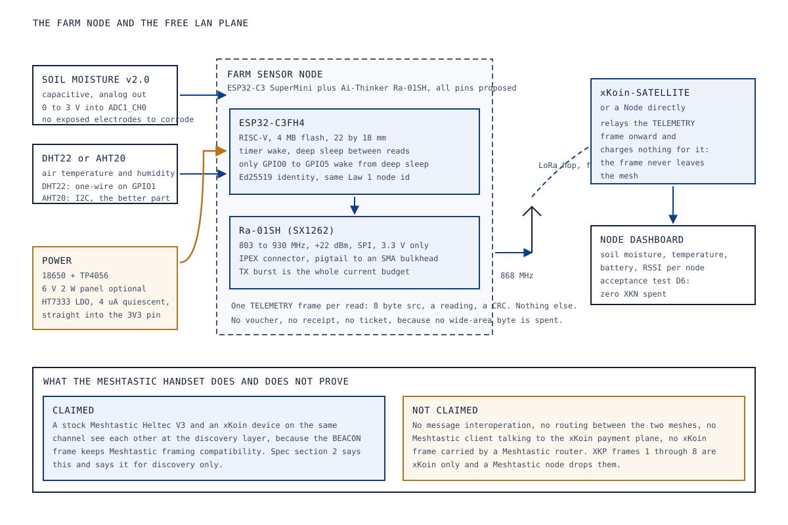
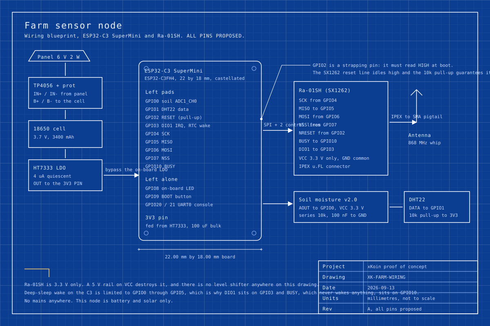

# 09. Hardware: LoRa ecosystem devices on the free LAN plane

Abstract: The devices in this paper pay nothing and are the reason the network is worth joining. Traffic that stays inside the mesh costs zero XKN and needs no voucher, so a sensor that only ever talks to a node on the same mesh is a guest that never opens a wallet. We specify three of them: a farm sensor node on an ESP32-C3 SuperMini with an Ai-Thinker Ra-01SH radio, a capacitive soil probe and a temperature and humidity part, which is the device demo D6 must carry; a water tank level node, proposed, on the same platform with an ultrasonic or pressure sensor; and a stock Meshtastic handset on a Heltec V3, present to demonstrate exactly one thing, which is that the BEACON frame keeps Meshtastic framing compatibility for discovery. We state what that interoperation claim covers and, at equal length, what it does not. The farm node's power budget puts it at about 2.4 mAh a day on a fifteen-minute reading schedule, which means the cell outlasts its own shelf life and the panel is a convenience.

Keywords: LoRa, ESP32-C3, Ra-01SH, soil moisture, free LAN plane, Meshtastic, telemetry, third-party devices

## 1. Why these devices matter to a paid network

The free LAN plane is a rule, not a feature: traffic that stays inside the mesh costs zero XKN and needs no voucher. See [00-START-HERE.md, section 3](00-START-HERE.md#3-glossary) for the definition and [03-protocol-xkp.md](03-protocol-xkp.md) for the frame that carries it.

The rule exists because the thing being sold is wide-area transit, measured at the node that terminates the backhaul. A soil probe that reports to a dashboard in the same building consumes no wide-area byte, so charging for it would be charging for nothing, and it would also be the fastest way to make sure no farmer ever deploys one. Instead the network gains density, because every sensor is another node that relays frames, and every relayed frame improves the mesh for the clients who do pay.

Three devices follow, at three levels of commitment.

| Device | Status | What it demonstrates | Who builds it |
|---|---|---|---|
| Farm sensor node | proposed, and required for demo D6 | A purpose-built device on the free plane, and the platform third parties would copy | Us, for the proof of concept |
| Water tank level node | proposed | The same platform with a different sensor, so the pattern generalises | Us later, or a third party |
| Meshtastic handset | proposed | Discovery-layer framing compatibility, and nothing beyond it | Bought and flashed with stock firmware |

The same platform carries instruments that have nothing to do with farming, and the case for geology and survey sensors on it, tiltmeters, piezometers and borehole temperature strings, with the payload sizes and duty-cycle arithmetic that decide which of them fit, is `docs/potential/09-field-geology-sensors.md`.

## 2. The parts, as bought

|  |  |  |  |  |
|---|---|---|---|---|
| ESP32-C3 SuperMini, 22 by 18 mm | Ai-Thinker Ra-01SH, SX1262, 803 to 930 MHz | IPEX u.FL to SMA female bulkhead pigtail | 868 MHz whip, 3 dBi, SMA male | Heltec V3, the Meshtastic handset |

| <!-- photo: soil-moisture-capacitive-v2 --> | <!-- photo: dht22-or-aht20 --> | <!-- photo: 18650-cell-and-holder --> | <!-- photo: tp4056-solar-charger --> | <!-- photo: hc-sr04-ultrasonic --> |
|---|---|---|---|---|
| Capacitive soil moisture sensor v2.0, photo pending scout | DHT22 or AHT20, photo pending scout | 18650 cell and holder, photo pending scout | TP4056 solar charge board, photo pending scout | HC-SR04 ultrasonic, for the tank node, photo pending scout |

The Ra-01SH is an SX1262, the same silicon as every other radio in the set, which means the driver in `firmware/xkoin-gateway/lib/sx1262/` covers it. It is 3.3 V only and it brings out an IPEX connector rather than an SMA jack, which is why a pigtail is on the list.

## 3. The farm sensor node

### 3.1 Block diagram

Figure 1 shows the node, what it reports, and the boundary of the interoperation claim made in section 5.

*Figure 1. Block diagram of the farm sensor node and its place on the free LAN plane, with the Meshtastic interoperation claim and its limits stated side by side.*

The node sends one TELEMETRY frame per reading and nothing else. No voucher is presented, because admission is only required for wide-area service. No receipt is signed, because no wide-area byte was delivered. No ticket is assembled, because there is nothing to settle. The device has an Ed25519 key and therefore a node id under Law 1, and that is the whole of its participation in the identity system.

### 3.2 Wiring

Figure 2 is the wiring blueprint. Every pin on it is proposed. The ESP32-C3 SuperMini is not in `hardware/pinmap.md` at all, so this drawing is the first allocation for it and it needs sign-off before firmware is written against it.

*Figure 2. Wiring blueprint for the farm sensor node: proposed SPI pins from the ESP32-C3 SuperMini to the Ra-01SH, the ADC pin for the soil probe, the DHT22 data pin, and the low-quiescent supply path.*

### 3.3 Pin map, all proposed

| Signal | ESP32-C3 GPIO | Bus | Provenance | Why this pin |
|---|---|---|---|---|
| Soil moisture analog out | 0 | ADC1_CH0 | proposed | ADC1 channel 0, and an RTC pin, so a future wake-on-threshold design keeps working |
| DHT22 data | 1 | one-wire | proposed | Adjacent to the soil pin, keeps the sensor lead pair together; 10k pull-up to 3V3 |
| Ra-01SH NRESET | 2 | CTRL | proposed | Strapping pin: it must read high at boot. The SX1262 reset line idles high and a 10k pull-up guarantees it |
| Ra-01SH DIO1 (IRQ) | 3 | CTRL | proposed | Deep-sleep wake on the C3 works only on GPIO0 to GPIO5, and the interrupt line is the one that may need to wake the part |
| Ra-01SH SCK | 4 | SPI | proposed | |
| Ra-01SH MISO | 5 | SPI | proposed | |
| Ra-01SH MOSI | 6 | SPI | proposed | |
| Ra-01SH NSS / CS | 7 | SPI | proposed | |
| Ra-01SH BUSY | 10 | CTRL | proposed | BUSY never needs to wake the part, so it takes the one control pin outside the RTC range |
| On-board LED | 8 | reserved | board | Left alone, and see section 4.3 |
| BOOT button | 9 | reserved | board | Strapping pin; left alone |
| UART0 console | 20 RX, 21 TX | UART | board | Bring-up log |
| 3V3 supply in | 3V3 pad | PWR | proposed | Fed from an HT7333, bypassing the board's own regulator |

Two allocations are load-bearing and the reasoning is worth keeping with the table. GPIO2 is a strapping pin, so using it as an output that idles high is safe and using it for an input that idles low would not be. And deep-sleep wake on the ESP32-C3 is limited to GPIO0 through GPIO5, which is why the interrupt line sits at GPIO3 and the BUSY line, which is polled rather than waited on, takes GPIO10.

### 3.4 BOM slice

Prices are the scouted listings in `hardware/shopping/parts/`, recorded 2026-09-12, in KES, before duty, VAT and the import levies.

| Line | Qty | Unit price KES | Note |
|---|---|---|---|
| ESP32-C3 SuperMini | 1 | 240 | The C3 is the base variant of a listing that also sells S3, C6 and H2 boards; pick the C3 at checkout |
| Ai-Thinker Ra-01SH (SX1262) | 1 | 226 | Default selected variant; the listing also shows 293 for the second build, which differs in the antenna termination |
| IPEX to SMA female bulkhead pigtail | 1 | 76 | Low end of a listing that runs KES 76 to KES 383; the KES 380 figure is the five-piece pack |
| 868 MHz antenna, 3 dBi, SMA male | 1 | 22 | Entry variant of a two-pack |
| Capacitive soil moisture sensor v2.0 | 1 | price pending scout | Capacitive, not resistive: resistive probes corrode in weeks |
| DHT22 or AHT20 | 1 | price pending scout | AHT20 is the better part and it is I2C, which changes the pin map |
| 18650 cell and holder | 1 | price pending scout | Bought in Nairobi under the UN3480 rule |
| TP4056 with protection | 1 | price pending scout | Only in the panel-fed configuration |
| Solar panel 6 V 2 W | 1 | price pending scout | Optional, see section 3.5 |
| HT7333 LDO | 1 | price pending scout | 4 uA quiescent; an AMS1117 at about 5 mA would dominate the budget on its own |

Scouted lines total KES 564 per farm node. Six lines are unpriced, so no device total is claimed.

### 3.5 Power budget

Every figure is an assumption until it is measured.

| Quantity | Value used | Source | Confidence |
|---|---|---|---|
| ESP32-C3 active, radio subsystem off | 20 mA | Espressif figure for the SoC | assumption |
| ESP32-C3 deep sleep | 5 uA | Espressif figure | assumption |
| Ra-01SH receive | 5 mA | Semtech SX1261/2 datasheet class figure | assumption, TODO: verify |
| Ra-01SH transmit at the CA 25 mW cap | 40 mA | Scaled from the same table | assumption, TODO: verify |
| Ra-01SH sleep | 1.2 uA | Same | assumption |
| Capacitive soil probe while powered | 5 mA | module class figure | assumption |
| DHT22 while measuring | 1.5 mA | datasheet class figure | assumption |
| HT7333 quiescent | 4 uA | `hardware/bom.md` | sourced |
| Cell | 3,400 mAh, 12.6 Wh | `hardware/bom.md` | sourced part |

On a fifteen-minute reading schedule, which is 96 readings a day, each reading taking 3 seconds awake with a 1.5 second sensor settle and one 60 ms transmit:

    MCU awake     3 s x 20 mA        = 60.0 mA.s
    soil probe    1.5 s x 5 mA       =  7.5 mA.s
    DHT22         0.5 s x 1.5 mA     =  0.75 mA.s
    receive ack   0.5 s x 5 mA       =  2.5 mA.s
    transmit      0.06 s x 40 mA     =  2.4 mA.s
    per reading                      = 73.2 mA.s = 0.0203 mAh
    96 readings                      =  1.95 mAh/day
    sleep, 24 h x about 0.02 mA      =  0.48 mAh/day
    total                            =  2.43 mAh/day
    average                          =  0.10 mA

At 2.43 mAh a day a 3,400 mAh cell runs for about 1,400 days. That number is not real, because a lithium cell's self-discharge and its shelf life become the limit long before the load does, but it establishes the shape of the design: the panel on this node is a convenience and a hedge, not a requirement, and the node would run for more than a year on one cell if nothing else drew current.

Something else does draw current. Most ESP32-C3 SuperMini boards carry a power indicator LED wired straight across the 3.3 V rail through a resistor, drawing roughly 1 mA continuously. That is 24 mAh a day, ten times the entire sensing budget, and it cuts the cell's life from over a year to about 130 days. Removing that LED or cutting its series resistor is the single highest-value modification on this device, and it is step 1 of the bring-up in section 6.

## 4. The water tank level node

Proposed, not built, and not required by any demo in the current matrix. It is specified here because it is the second instance of the pattern and because the sensor choice is the only interesting decision in it.

The platform is unchanged: ESP32-C3 SuperMini, Ra-01SH, the same SPI allocation, the same supply path, the same TELEMETRY frame on the free plane. Only the sensor and the mounting change.

| Sensor | How it reads level | For | Against |
|---|---|---|---|
| HC-SR04 ultrasonic, mounted in the tank lid looking down | Time of flight to the water surface, subtracted from the tank height | Cheap, no contact with the water, one part | Condensation on the transducer, foam and floating debris give false returns, and the 5 V part needs a divider on its echo pin for a 3.3 V input |
| Submersible pressure transducer at the tank floor | Head pressure converted to depth | Immune to foam, condensation and lid geometry; reads through anything | Several times the price, contact with stored water raises a potability question, and the cable gland becomes a leak path |

The recommendation for a first build is the HC-SR04, with the pressure transducer as the answer if condensation defeats it in a Nairobi tank that sits in the sun and cools overnight. Both feed the same frame. TODO: verify the reading interval a tank actually needs; a tank level changes slowly enough that a fifteen-minute schedule is probably ten times faster than it has to be, and a slower schedule makes the power budget in section 3.5 look even more comfortable.

## 5. The Meshtastic handset and the exact interoperation claim

A stock Heltec WiFi LoRa 32 V3 flashed with unmodified Meshtastic firmware sits on the bench next to the xKoin devices. It exists to demonstrate one property, and the property is narrow.

`protocol/spec.md` section 2 states it in one sentence: BEACON on LoRa keeps Meshtastic framing compatibility for discovery only, citing the original concept document. That is the claim in full.

### 5.1 What is claimed

A stock Meshtastic node and an xKoin device configured to the same radio parameters are visible to each other at the discovery layer. The xKoin BEACON, frame type 0, is framed so that a Meshtastic receiver treats it as a frame it understands well enough to report rather than as noise. The practical demonstration is that an xKoin Satellite's beacons appear on a Meshtastic handset's screen, which means a person who already owns Meshtastic hardware can find an xKoin node without owning any xKoin hardware.

### 5.2 What is not claimed

- No message interoperation. A Meshtastic text message is not an xKoin frame and is not delivered by an xKoin device to an xKoin client.
- No routing between the two meshes. A Meshtastic router does not relay xKoin traffic, and an xKoin node does not participate in Meshtastic managed flooding.
- No access to the payment plane. Frame types 1 through 8, which are JOIN_REQ, JOIN_ACK, DATA, DATA_ACK, RECEIPT, RECEIPT_ACK, TELEMETRY and SETTLE_NOTIFY, are xKoin frames. A Meshtastic node receiving one drops it.
- No claim that an xKoin device is a Meshtastic node, can join a Meshtastic channel, or can be administered by a Meshtastic client.
- No claim about encryption interoperation in either direction.

The distinction matters commercially as well as technically. Meshtastic carries messages, it has no medium but radio, and it has no economics, so nobody is paid to run a node where one is needed. Those are the three gaps xKoin fills, and overstating the interoperation would obscure the first two while making the third sound like a Meshtastic feature.

TODO: verify the discovery claim on hardware. It is asserted by the specification and by the original concept document and it has not been demonstrated between two physical radios in this repository.

## 6. Bring-up, farm node

1. **Remove the power LED**, or cut its series resistor, before anything else. Section 3.5 explains why. Measure the sleep current before and after; the difference should be about 1 mA and it is the whole battery-life argument.
2. **Board alone.** USB-C to a host, confirm the console on UART0 at the default rate, confirm the board is an ESP32-C3 and not one of the S3, C6 or H2 boards sold under the same listing.
3. **Radio wiring.** Nine wires to the Ra-01SH per section 3.3, the 10k pull-up on NRESET, a 100 uF bulk capacitor across the module's supply pins. Fit the pigtail and the antenna before power.
4. **Radio alive.** The first check is a register read over SPI that returns the SX1262's expected value. A BUSY line stuck high means the module is not getting a clean 3.3 V, which is the most common failure with a module fed through a breadboard.
5. **Sensors.** Read the soil probe in air and in a glass of water and record both ends of the range; a capacitive probe's raw counts are not calibrated and the two readings are the calibration. Read the DHT22 against a room thermometer.
6. **First frame.** The expected log is the node id derived under Law 1, the SX1262 configuration at 868.1 MHz, and one TELEMETRY frame with its airtime. A Node or Satellite within range should show the reading on its dashboard.
7. **Sleep current.** A multimeter in series with the cell, reading the deep-sleep current directly, against the 0.02 mA assumed in section 3.5.
8. **Soak.** Seven days on the cell with the panel disconnected, logging every reading, to confirm the daily consumption against the 2.43 mAh prediction.

## 7. How a third party builds one of these

Nothing in the free plane is gated. A third party needs three things.

**The frame.** `protocol/spec.md` section 2 gives the whole wire format: 29 bytes of overhead, little-endian, magic 0x4B58, a version nibble and a type nibble, an acknowledgement-request flag, a time-to-live decremented per relay, an 8-byte source node id, an 8-byte destination id with all bits set meaning broadcast, a 4-byte per-source monotonic sequence, a 2-byte payload length, the payload, and a CRC16-CCITT with polynomial 0x1021 and initial value 0xFFFF over everything before it. The node id is the first 8 bytes of the SHA-256 of an Ed25519 public key, which is Law 1: there is no registration step and nobody issues identities. A device that emits a well-formed TELEMETRY frame is on the mesh.

**The free plane rule.** Traffic that stays inside the mesh costs zero XKN and needs no voucher. A device that only sends telemetry to a node in the same mesh never touches the payment system. This is a protocol rule rather than a policy, and Law 8 is what keeps it safe to leave open: magic, length and CRC are checked below the cryptography, and the simulation recorded 0 out of 20,000 garbage frames accepted.

**The receipt rule, if they want paid transit.** A third-party device that wants its data to leave the mesh, to a cloud endpoint or an off-site dashboard, is buying wide-area transit like any other client and the rules do not bend for it. It needs an address with an escrow deposit, a kiosk-signed voucher to be admitted (Law 2), and it must sign a cumulative Ed25519 receipt every receipt interval (Law 3) or the serving node throttles it and then drops it. The node extends at most twice the receipt interval of unproven credit, so a device that cannot sign cannot run up a bill. The canonical receipt is 44 bytes of fields plus a 64-byte signature, sized at 108 bytes to fit one narrowband power-line frame, and that sizing is an invariant rather than a tuning parameter.

The consequence worth stating plainly is that a sensor vendor can ship a product onto this network without a commercial relationship with us, and pays only if their customer's data leaves the mesh. That is the same shape as the network's offer to a user and it is deliberate.

## 8. Acceptance

**D6, farm IoT on the free plane.** The hardware is a Satellite and a farm sensor node. The observable is soil moisture and temperature arriving at the Node dashboard. The acceptance condition is that zero XKN is spent to get them there.

The test passes when all of the following hold. The farm node sends TELEMETRY frames and never sends a JOIN_REQ. No voucher is presented and none is required. The Satellite relays the frames without opening a session and without collecting a receipt. The readings appear on the Node dashboard with the correct node id. The escrow deposit of every address involved is unchanged before and after, which is the check that turns "free" from a claim into a measurement, and it is read straight off the chain.

A second observable is worth capturing in the same run even though the matrix does not require it: the Meshtastic handset of section 5 sitting on the same bench and showing the Satellite's beacons. If it does, the discovery claim is demonstrated. If it does not, section 5.2 grows a line and the specification sentence needs revisiting. See [12-proof-of-concept-plan.md](12-proof-of-concept-plan.md) for the matrix.

## 9. Open items

1. Every pin in section 3.3 is proposed and none has been signed off. The ESP32-C3 SuperMini does not appear in `hardware/pinmap.md`; adding it is the first action after sign-off.
2. The Meshtastic discovery claim is specified and undemonstrated.
3. Six BOM lines for the farm node have no scouted price, and the tank node has none at all.
4. The AHT20 alternative changes the pin map, because it is I2C and the DHT22 is one-wire. Choosing it is a better engineering decision and a small rework.
5. The SX1262 current figures are datasheet class values, not measurements.
6. The tank node's reading interval is a guess. TODO: verify against a real tank.

## 10. References

1. `protocol/spec.md` section 2, the frame format, the frame type list and the sentence that BEACON on LoRa keeps Meshtastic framing compatibility for discovery only, citing Drive doc 01 section 3.2.3.
2. `protocol/spec.md` sections 3 and 4, the admission and proof phases and the canonical receipt layout.
3. `HANDOVER.md` section 3, the frame and receipt invariants including the CRC16-CCITT parameters and the 108-byte receipt sizing; and section 1, the 0 out of 20,000 garbage frames result.
4. `hardware/shopping/parts/esp32-c3-supermini.json`, `hardware/shopping/parts/ra-01sh-sx1262.json`, `hardware/shopping/parts/ipex-sma-pigtail.json` and `hardware/shopping/parts/antenna-868-sma.json`, scouted listings and prices, recorded 2026-09-12.
5. `hardware/bom.md`, the HT7333 against AMS1117 quiescent-current note, the cell and panel choices and the Kenya import rules for lithium cells.
6. `docs/_plan/revamp-plan.md`, the LoRa ecosystem device row, the parts list and demo D6.
7. `docs/_plan/research/02-landing-page-design-study.md` sections 3 and 4, Meshtastic hardware facts, the vocabulary it teaches, and the three gaps xKoin fills.
8. `docs/potential/01-large-scale-farm-iot.md`, the use case these devices serve.
9. `docs/papers/00-START-HERE.md` section 3, the glossary definitions of free LAN plane, voucher, receipt and node id.
