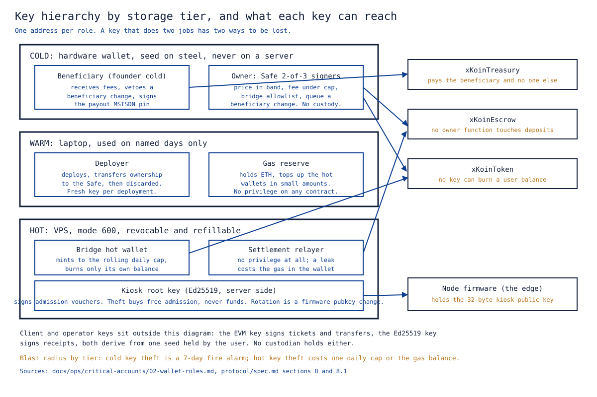

# 10. Security and Trust

Abstract: xKoin states its threat model as eight invariants, called the Laws, each carrying an enforcing mechanism and a named test rather than a policy. The peer relay layer is zero-trust in the strict sense that no peer must trust any other peer, and the fiat boundary is not: it has four named custodians, each with a bounded blast radius and a documented exit path. The founder-safety layer inverts the usual arrangement by protecting the founder's revenue from the founder's own keys: the treasury pays only a fixed beneficiary, anyone may trigger the payment, the beneficiary can only be changed after seven public days and the current beneficiary holds a veto, and no key in the system can burn a user's balance. Every attack considered here, including a stolen server key and a stolen owner key, is answered by a mechanism with a test name. Three gaps are stated as gaps: kiosk key rotation is manual pending federation, pricing is owner-set, and the owner is not yet a multisig.

Keywords: threat model, zero-trust, key management, blast radius, state channel security, Ed25519, timelock, multisig

## 1. Scope and the honest claim

"Zero-trust" in this project describes the peer relay layer and nothing else. Laws 1 to 8 mean that no peer, node, satellite or client must trust any other peer to be paid correctly or to avoid being defrauded. It is not true of the fiat boundary, which has named custodians. Anyone reviewing this project should find that stated here rather than discover it.

This paper covers the threat model, the trusted parties, the key hierarchy, the attacks considered and their cost, and what is not solved. The protocol mechanisms are specified in [03-protocol-xkp.md](03-protocol-xkp.md); the contract behaviour is in [04-settlement-and-economics.md](04-settlement-and-economics.md); the radio, electrical and licensing questions are in [11-regulatory-and-safety.md](11-regulatory-and-safety.md).

## 2. The threat model, as eight Laws

The model is stated as invariants rather than as a catalogue of attacks, because a catalogue is never finished and an invariant can be tested. Breaking a Law must cost more than honest participation earns.

| # | Law | Mechanism | Proof artifact |
|---|---|---|---|
| 1 | Identity is the key | node id = SHA-256(Ed25519 pk)[:8]; no account table anywhere | `test_receipt_roundtrip_and_tamper` |
| 2 | No admission without a fiat-backed voucher | kiosk root key signature verified offline at the edge | `test_join_voucher`, `test_voucher_roundtrip_and_tamper`, `test_voucher_expiry_enforced` |
| 3 | Only signed bytes are owed | the node extends at most 2x the receipt interval of unproven credit | scenario S1 bounds `max_unproven_bytes` |
| 4 | A forged counter is a broken signature | Ed25519 over the canonical 44-byte receipt | fuzz and tamper tests, zero forgeries accepted |
| 5 | Replay pays nothing | receiver dedupe by (src, seq); on-chain monotonic sequence and cumulative delta | `test_revert_staleSequence`, `test_revert_noNewUnits` |
| 6 | Nobody is owed more than they escrowed | settlement caps at the remaining deposit | `testFuzz_settleNeverExceedsDeposit`, 256 runs |
| 7 | The ledger cannot go insolvent | escrow balance equals deposits plus earnings; fee transfers are the exact sum of per-ticket amounts | `test_solvencyInvariant` plus the end-to-end chain assertion |
| 8 | Corruption dies at the frame | magic, length and CRC16 checked before any cryptography | scenario S5: 0 of 20,000 garbage frames accepted |

The economic summary is one sentence. An attacker must break Ed25519 or secp256k1 to mint value; everything cheaper, meaning spam, replay, corruption and Sybil beacons, earns exactly zero, because pay is strictly per verified signed byte and never for presence.

Law 8 carries a stated limit. CRC16 has a residual collision probability, so a corrupted frame can in principle pass the frame check. It cannot carry value, because the receipt inside it still has to verify under Law 4. The CRC is a cheap filter protecting an expensive check, not a security boundary of its own.

A pull request that weakens a Law's test is a design change, not a refactor. That rule is recorded in the repository invariants and is the practical mechanism that keeps the model from eroding.

## 3. Trusted parties

Four parties hold something the Laws do not cover. Each row states the power, the worst case, and the way out.

| Key | Holder | Power | Blast radius if compromised | Exit path |
|---|---|---|---|---|
| Kiosk root key (Ed25519) | Founder, server side | Signs admission vouchers | Free network admission; no fund theft, because funds move only under on-chain ECDSA | Firmware public key rotation today; threshold signing and a hardware security module at scale |
| Bridge hot wallet | gateway-api service | `bridgeMint`, self-only `bridgeBurn` | Unbacked XKN up to the on-chain rolling daily cap, 50,000 KES by default; third-party balances are unburnable by construction | Hot and cold split; the owner revokes with `setBridge(addr, false, 0)` |
| Owner key, three contracts | Founder | Fee within a 10 percent cap, price within a 1 to 50,000 micro-KES band with a one-day cooldown, bridge allowlist | Bounded griefing only: cannot halt settlement, cannot touch deposits, cannot redirect fees | Ownable2Step today; a Gnosis Safe before mainnet |
| Settlement relayer | Anyone | None | None. Signatures and monotonic counters gate everything | Already trustless |

The relayer row is the one worth dwelling on. It is listed because people expect a relayer to be trusted, and here it is not. A leaked relayer key costs the gas sitting in the wallet and nothing else, which is why it is kept separate from the bridge key even though both live on the same server.

## 4. The founder-safety layer

The requirement, stated by the founder, was that he must be paid, must not be able to take the network down even under key theft or coercion, and must bear no theft risk on the fee cut. Six mechanisms answer it, all on chain and all tested.

1. **`claim()` is anyone-callable and beneficiary-only.** The treasury sweeps its balance to the beneficiary address. There is no withdraw-to-parameter anywhere in the contract. A stolen owner key cannot redirect a single micro-KES: `test_stolenOwnerKeyCannotRedirectFees` and `test_claim_anyoneCanPayOnlyTheFounder`.
2. **A 7-day beneficiary timelock with a veto.** Changing the beneficiary is queued publicly and activates after seven days, and the current beneficiary (the founder's cold key) or the owner can cancel inside the window. Key theft becomes a seven-day fire alarm rather than a loss: `test_beneficiaryChange_happyPath`.
3. **A banded price with a cooldown.** `PRICE_MIN` to `PRICE_MAX` with one change per day means the worst case for owner abuse is expensive within the band, once a day, and never halted: `test_setPricePerUnit_bandAndCooldown`.
4. **`bridgeBurn` is self-only.** No key in the system can destroy a user's balance: `test_bridgeMintBurn_selfOnly`.
5. **`bridgeMint` is capped per rolling day per bridge.** A fully compromised bridge leaks at most one day's cap before `setBridge` revokes it: `test_mintCap_rollingDay`.
6. **Settlement, deposits, withdrawals and claims need no founder involvement.** The founder disappearing freezes governance at last-known-good values and stops nothing else.

One liveness dependency remains and is named rather than glossed: the kiosk root key is required for new admissions. Existing sessions and all settlement continue without it. Rotation is documented; federation is later work.

The fiat leg of the fee has the same shape. The beneficiary cold key transfers XKN to the bridge, the payout worker sends the shillings to the founder's mobile number, and the bridge burns the same amount. The worker fires the payout only for on-chain transfers originating from the beneficiary address, and the destination number is an EIP-191 pin signed by the beneficiary key and checked against `treasury.beneficiary()` at start. A compromised server can at worst delay the payout, never redirect it. The burn waits for the bank's result callback, so a failed payout never destroys XKN, and retries are bounded. The tests are `test_beneficiary_transfer_fires_b2c_to_pinned_msisdn_and_defers_burn`, `test_event_fields_cannot_choose_the_destination`, `test_transfers_not_from_beneficiary_or_not_to_bridge_are_ignored`, `test_confirmed_b2c_burns_exactly_the_paid_amount` and `test_failed_b2c_keeps_tokens_and_retries_up_to_cap`.

## 5. Key hierarchy

Every role has its own address. A key that does two jobs has two ways to be lost. Figure 1 groups the keys by storage tier and shows what each one can reach.

*Figure 1. Keys grouped by storage tier, with what each can reach on chain and at the edge. Cold keys govern and receive; warm keys deploy and refill; hot keys mint within a cap, relay without privilege, and sign admission vouchers.*

| Role | Holds | May do | Where the key lives | Production form |
|---|---|---|---|---|
| Kiosk root (Ed25519) | nothing on chain | signs admission vouchers | server side, gateway-api | rotation by firmware public key change; federation later |
| Deployer | ETH for one deploy | deploys, transfers ownership to the Safe, then is discarded | laptop, deploy day only | a fresh key per deployment |
| Owner | nothing | price in band, fee under cap, bridge caps, queue a beneficiary change | Safe 2-of-3 | Safe on Base, two hardware devices plus counsel |
| Beneficiary (founder cold) | XKN fees after claim | receive fees, veto a beneficiary change, sign the payout number pin | hardware wallet | hardware wallet, first address, verified on the device screen |
| Bridge (hot) | XKN in transit, ETH for gas | mint to the daily cap, burn its own balance | VPS `.env`, mode 600 | a new key on the VPS, never a test key |
| Relayer (hot) | ETH for gas only | `settleTicketBatch`, `claim` on the treasury | VPS `.env`, mode 600 | separate from the bridge key |
| Gas reserve | ETH | top up bridge and relayer when they fall below threshold | laptop or a hardware wallet second account | the address whitelisted on the exchange |

Two separations carry the weight. The relayer is split from the bridge because the relayer's key is used constantly and has no privilege, while the bridge's key is used only when fiat arrives and has a capped one. Two keys, two blast radii. The gas reserve is kept off the server because a server that can refill itself from a large pool turns any compromise into a drain of that pool; hot wallets hold days of gas, not months.

The beneficiary is the one address that must never change casually. Before mainnet it is the hardware wallet's first address, read on the device screen, confirmed by a dust transfer, and written into the register with the date and the device serial. The deploy script refuses to run on a real chain without an explicit beneficiary address, so the default-to-deployer convenience cannot leak past a local chain.

## 6. Operating rules, condensed

The full vigilance list is `docs/ops/critical-accounts/04-security-dos-and-donts.md`. The habits that change outcomes:

**Keys.** One address per role. A hardware wallet for the beneficiary, bought from the maker, initialised offline, seed on steel in two places, verified by restoring it on a second device. Read the transaction on the device's own screen, because that screen is the only display an attacker cannot change. Test every new address with a dust transfer first. Never type, photograph or paste a seed anywhere, and never enter one into a website, a sync tool or a support form. Never sign a message or a transaction you cannot read. Never approve an unlimited token allowance, which is why the escrow uses permit with an exact amount.

**Server.** SSH keys only, root login off, the firewall open on 22, 80 and 443. Secrets at mode 600, owned by the service user, read at start, never logged, masked in the health endpoint. Separate bridge and relayer keys. The bridge daily cap set to what the kiosk actually collects in a day and reviewed monthly; it is the single most important number on the server. Alerts on the bridge, relayer, treasury and beneficiary addresses, plus the runway metric. Never put the gas reserve, the beneficiary key or a Safe signer on the server. Never log callback bodies at info level, because they carry mobile numbers and references.

**Exchange.** Authenticator or passkey for two-factor, anti-phishing code set, withdrawal whitelist on with only the gas reserve address and the 24-hour hold on additions left in place. Treat the exchange as a bureau de change: money passes through, it does not live there. Support never initiates contact and never asks for a code.

**Repository.** Signed commits on the main branch, force push and deletion blocked, deploy from tags. Anvil's well-known keys are the only private keys permitted in the repository, and only in test files. Anything else that leaks into a public repository is swept by bots within seconds.

**People.** Urgency in any message about money or keys is the tell; everything in this plan can wait a day. Keep a sealed instruction with counsel saying where the devices and steel plates are and that `claim` on the treasury can be called by anyone, so the network keeps paying the beneficiary address if the founder is unavailable.

## 7. Attacks considered, and what each costs

| Attack | Cost to the attacker | Answered by | Test |
|---|---|---|---|
| Replay an old receipt or ticket | nothing gained; the delta is zero and the call reverts | monotonic sequence plus cumulative delta (Law 5) | `test_revert_staleSequence`, `test_revert_noNewUnits` |
| Forge a byte counter | must break Ed25519 | signature over the canonical 44-byte receipt (Law 4) | fuzz and tamper suites, zero forgeries |
| Forge a ticket signature | must break secp256k1 | EIP-712 recovery against the client address | `test_revert_forgedSignature` |
| Sybil beacons | airtime, with no settlement path | pay is per verified signed byte, never for presence | scenario S5 and the Law 3 bound |
| Frame spam and corruption | airtime and CPU, no revenue | magic, length and CRC filtering before verification (Law 8) | scenario S5, 0 of 20,000 accepted |
| Take service without signing receipts | at most 2x the receipt interval of bytes, then throttled and dropped | the unproven credit bound (Law 3) | scenario S1 `max_unproven_bytes` |
| Overdraw one deposit across several nodes | nothing; each settlement caps at the remaining deposit | the deposit cap (Law 6) plus the node session credit rule | `testFuzz_settleNeverExceedsDeposit`, `test_settle_partialWhenDepositShort` |
| Stolen server key (bridge) | at most one rolling day's cap of unbacked XKN; cannot burn a user balance | on-chain mint cap and self-only burn | `test_mintCap_rollingDay`, `test_bridgeMintBurn_selfOnly` |
| Stolen server key (kiosk root) | free admission to the mesh; no funds move | vouchers do not carry value; balances need on-chain ECDSA | `test_join_voucher` |
| Stolen owner key | bounded griefing: price within band once a day, fee within cap; no fee redirection, no halt | banded price, fee ceiling, destination-fixed claim | `test_stolenOwnerKeyCannotRedirectFees`, `test_setPricePerUnit_bandAndCooldown`, `test_revert_feeAboveCeiling` |
| Front-run a permit | griefs the relayer only; the deposit still lands | `depositWithPermit` wraps the permit in try and catch | `test_depositWithPermit_gasless` |
| Lost phone | nothing; the balance was never in the phone | the seed restores the same address, deposit and voucher validity | the deposit is keyed by address, `test_depositAndWithdraw` |
| Coerced beneficiary change | seven public days, vetoable by the cold key | timelock with veto | `test_beneficiaryChange_happyPath` |

The lost-phone row is the one users care about most and the one that needs no mechanism at all, because of a design choice made earlier: the identity is a key derived from a seed, and the money is on chain. Restoring twelve words on a new phone restores the same address, the same escrow deposit and the same voucher validity. There is nobody to ask.

## 8. What is not yet solved

Stated as gaps, with the shape of the fix.

**Kiosk key rotation is manual, and federation is later.** Today a rotation is a firmware public key change pushed to every node. That is workable at pilot scale and is the one remaining liveness dependency on the founder: without the kiosk root key, no new admissions are issued, although existing sessions and all settlement continue. The intended path is threshold signing across several kiosk keys so that no single key is required, with a hardware security module at scale. Neither is built.

**Pricing is owner-set.** It is centralised for the MVP, and the band plus cooldown bound the harm rather than remove it. Non-owner pricing is deferred. Nothing above the money layer changes when it lands, and no contract changes either.

**The owner is not yet a multisig.** The contracts use Ownable2Step today. A Gnosis Safe owner is a required gate before any mainnet deployment, so that one stolen signer changes nothing. Creating the Safe is estimated at about 300,000 gas, roughly 0.55 KES at the 2026-09-09 measurement, which means cost is not the reason it is pending.

Two further items are recorded elsewhere but belong in a security reading. The node session credit rule that bounds an operator's exposure across simultaneous sessions is specified and not yet in firmware ([04-settlement-and-economics.md](04-settlement-and-economics.md), section 8). The regulatory gates before mainnet fiat, which are the licensing and e-money questions, are in [11-regulatory-and-safety.md](11-regulatory-and-safety.md).

## 9. References

1. `protocol/spec.md`, section 7 (the Laws), section 8 (trusted parties) and section 8.1 (founder control without founder risk).
2. `docs/ops/critical-accounts/02-wallet-roles.md`, one address per role, key storage and the rotation procedures.
3. `docs/ops/critical-accounts/04-security-dos-and-donts.md`, the full vigilance list and the incident table.
4. `docs/ops/critical-accounts/03-budget-and-sustainability.md`, the measured gas figures and the drain-prevention summary.
5. `contracts/src/xKoinTreasury.sol` and `contracts/src/xKoinToken.sol`, the claim design, the timelock, the mint cap and the self-only burn.
6. `contracts/test/`, the 28 Foundry tests named throughout this paper, including the 256-run solvency fuzz and the stolen-owner-key drill.
7. `gateway-api/app/payout`, the payout worker and its tests.
8. `HANDOVER.md`, sections 2 and 3: the founder-safety decision and the invariants that must not drift.
9. `docs/papers/03-protocol-xkp.md` and `docs/papers/04-settlement-and-economics.md`, the mechanisms this paper treats as given.
