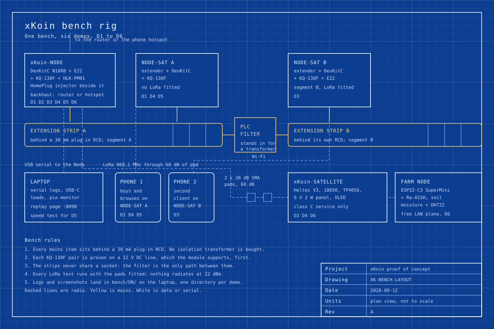

# 12. Proof-of-concept plan

Abstract: Six demos turn the xKoin design into evidence on one bench, and this
paper writes each of them out as a test rather than a demonstration: a setup, a
procedure, an observable, a numeric pass criterion where a number exists, an
artefact to record, and the risk that would make the result meaningless. D1 proves
bulk data and metering over the mains, D2 proves the radio plane through 60 dB of
deliberate path loss, D3 proves that the mesh survives the end of a mains segment,
D4 proves that a backhaul outage degrades the network instead of stopping it, D5
proves that the bulk plane carries consumer video, and D6 proves the free LAN
plane costs nothing. The build order is chosen so that each device brings the
largest number of remaining demos within reach, which puts the Node first and the
farm node last, and the whole set fits a two-week bench schedule for one person.

Keywords: acceptance testing, power-line communication, LoRa, bench plan, path
loss, settlement, proof of concept

## 1. Scope

This paper is the test plan for the demo matrix in `docs/_plan/revamp-plan.md`
section 2. The devices it exercises are specified in
[05-hardware-node.md](05-hardware-node.md),
[06-hardware-node-satellite.md](06-hardware-node-satellite.md) and the papers
that follow them. The numbers each demo must beat are stated here once and
repeated in each device paper's acceptance table, and where a number carries a
condition the condition travels with it.

Two conventions apply throughout. A pass criterion is written so that a
disinterested person could run the test and reach the same verdict, which rules
out criteria of the form "works well". And every demo records an artefact that
outlives the bench, because a demo that leaves nothing behind cannot be cited.

## 2. The bench

Figure 1 is the whole rig. One bench carries two mains segments separated by a
filter, three xKoin devices, one solar remote behind a 60 dB pad, a farm sensor,
two phones and a laptop. Nothing on it is permanent: the same hardware is
rearranged between demos, and the figure shows the union of every arrangement.

*Figure 1. Bench layout for demos D1 to D6: two extension strips separated by a
mains filter, the Node and a Node-Satellite on strip A, a second Node-Satellite on
strip B, the Satellite behind two 30 dB attenuators, the farm node, two phones and
the laptop.*

Three rules govern the bench and they are not per-demo choices. Every mains item
sits behind a 30 mA plug-in RCD; no isolation transformer is bought for the proof
of concept, so the mains side is live and referenced to earth whenever it is
plugged in. Each KQ-130F pair is proven on a 12 V DC line, which the module
supports, before it ever touches a strip. And every LoRa transmit test runs with
the attenuators fitted, so the bench never radiates at the full +22 dBm the
firmware currently configures, which also keeps the open regulatory question in
[11-regulatory-and-safety.md](11-regulatory-and-safety.md) away from the bench.

Artefacts land in one directory per demo on the laptop, `bench/D1/` through
`bench/D6/`, each holding the serial logs, the screenshots and a one-page result
note. The replay page, served at `/replay` from the same stack as the rest of the
site, is where a protocol trace is read back after the fact.

## 3. D1, local LAN over PLC

**What it proves.** Bulk data over the mains, admission at the socket, and
metering that agrees with the client.

**Setup.** Node and one Node-Satellite on extension strip A, both behind the RCD.
Backhaul from the existing router or a phone hotspot. Phone 1 with the companion
app or a browser. Laptop on USB serial to the Node.

**Steps.**

1. Power the HomePlug pair alone and confirm the link light on both units and an
   Ethernet link to the router.
2. Bring up the Node, then the Node-Satellite, watching for
   `xKoin gateway skeleton up` on each serial console.
3. Attach phone 1 to the Node-Satellite's own access point and let the captive
   portal open by itself.
4. Buy through the portal. Record the voucher and the escrow deposit before and
   after.
5. Browse for 10 minutes over the Node-Satellite's extender access point.
6. Read the receipt counter on the Node-Satellite and the counter the phone holds.

**Observable.** The portal opens without being typed into a browser, the purchase
completes, and the receipt counter on the serving device climbs while the phone
browses.

**Pass criterion.** The purchase completes and the serving device's receipt
counter for that client is monotonic and ends within two receipt intervals of the
client's own counter. Two intervals is not a tolerance chosen for convenience: it
is the bound Law 3 allows, because a node extends at most twice the receipt
interval of unproven credit.

**Recorded.** Serial logs from both devices, a screenshot of the captive portal,
a screenshot of the purchase confirmation, the before and after escrow deposit,
and the two counter values.

**Risks.** The extension strip is a poor power-line channel compared with building
wiring, and a surge-protected strip can attenuate the carrier badly enough to
fail the demo for reasons that have nothing to do with xKoin. Use a strip without
surge protection, and if the HomePlug link will not associate, test the pair on
two wall sockets first to separate the strip from the design.

## 4. D2, air-gapped LoRa over simulated distance

**What it proves.** The survival plane works at a link budget that stands in for
real distance, and offline admission works without any backhaul.

**Setup.** Node on strip A. Satellite on battery, away from the mains. Two 30 dB
SMA attenuators in series between the Satellite and its antenna, so the path
carries 60 dB more loss than the bench separation alone would give.

**Steps.**

1. With no pads fitted and the two units about 1 m apart, record the RSSI the
   Satellite reports for a beacon from the Node. This is the reference.
2. Fit both pads in series. Record the RSSI again.
3. Run class C traffic: a balance query, a chat message and a voucher check.
4. Unplug the Node's backhaul and repeat step 3.

**Observable.** RSSI falls by close to the inserted loss, and class C traffic
still completes at SF7.

**Pass criterion.** The RSSI measured in step 2 is within 6 dB of the reference
minus 60 dB, and every class C operation in step 3 and step 4 completes. The 6 dB
window covers the pads' own tolerance, the two extra SMA interfaces the pads
introduce, and the fact that a reported RSSI is a receiver estimate rather than a
calibrated measurement.

**Recorded.** The two RSSI figures and their difference, the serial log of the
class C exchanges, and a photograph of the pad chain so the link budget can be
reconstructed later.

**Risks.** RSSI reported by an SX1262 is not laboratory-grade, and a 6 dB window
can be met by accident if the reference itself was taken in a strong reflective
environment. Take the reference twice, in two positions, and use the worse of the
two.

## 5. D3, transformer node jump

**What it proves.** The mesh continues where the mains segment ends, which is the
bench form of Figure 2 in
[02-system-architecture.md, section 4](02-system-architecture.md#4-topology).

**Setup.** Node and Node-Satellite A on strip A. Node-Satellite B, with its E22
fitted, on strip B. A mains EMI or PLC blocking filter between the two strips.
Phone 2 on Node-Satellite B's access point.

**Steps.**

1. With the filter bypassed, confirm that the HomePlug pair associates across both
   strips and that narrowband frames cross.
2. Insert the filter. Wait 10 minutes.
3. Count HomePlug associations and narrowband frames received across the filter
   during that window.
4. Run class C traffic between segment A and segment B, which now has only the
   LoRa path.
5. Browse on phone 2 through Node-Satellite B and confirm that its bulk traffic
   stays inside segment B.

**Observable.** The power-line carrier stops at the filter while control traffic
keeps flowing over LoRa, and each segment keeps serving its own local bulk
traffic.

**Pass criterion.** Zero HomePlug AV associations and zero narrowband frames
received across the filter over the 10 minute window in step 3, while every class
C operation in step 4 completes over LoRa.

**Recorded.** Serial logs from all three devices covering the whole window, the
frame counters before and after, and a screenshot of phone 2 browsing.

**Risks.** A cheap EMI filter may not attenuate the 2 to 68 MHz HomePlug band and
the 120 to 135 kHz narrowband band equally, so a partial block is the likely
failure and it is worse than no block, because it produces an intermittent link
that looks like a protocol bug. If the filter leaks, measure which band leaks
before changing anything in firmware.

## 6. D4, last network standing

**What it proves.** A backhaul outage degrades the network rather than stopping
it, and nothing owed is lost while the link is down.

**Setup.** The D1 setup exactly, with the Satellite also present so the radio
plane can be observed. Backhaul unplugged partway through.

**Steps.**

1. Run the D1 flow until the phone is browsing and receipts are accumulating.
2. Note the receipt counter, the escrow deposit and the wall-clock time.
3. Unplug the backhaul at the router.
4. Confirm that free LAN traffic still works: a local page, a chat message between
   two clients on the mesh.
5. Confirm that class C service over LoRa still works.
6. Attempt a new admission with a voucher issued before the outage.
7. Let receipts accumulate for 10 minutes.
8. Reconnect the backhaul. Start a stopwatch.
9. Watch for the ticket batch to settle on chain.

**Observable.** Free LAN traffic and class C service continue through the outage,
admission still succeeds against the pre-issued voucher, receipts keep
accumulating, and settlement lands after the link returns.

**Pass criterion.** Zero receipts lost across the outage, measured as the on-chain
settled total matching the counter recorded in step 7 to the micro-KES, and the
batch settling within 5 minutes of the backhaul returning.

**Recorded.** Serial logs across the outage, the counter values at steps 2 and 7,
the settlement transaction hash and its timestamp, and the replay page showing the
trace either side of the outage.

**Risks.** The relayer's batching thresholds are marked pending in
[02-system-architecture.md, section 6](02-system-architecture.md#6-the-cloud-side),
so a batch that is not yet full may sit waiting and fail the 5 minute criterion
for a reason that is a configuration choice rather than a defect. Record the
threshold in force at the time of the run, and if the criterion fails, state which
of the two causes it was.

## 7. D5, high-speed internet

**What it proves.** Broadband power-line carries consumer video, which is the
claim an investor and a landlord both want tested.

**Setup.** The D1 setup with a real backhaul rather than a hotspot. Phone 1 on the
Node-Satellite's extender access point.

**Steps.**

1. Measure the backhaul itself at the router with a browser speed test. Record it.
   If it is at or below 6 Mbps, the demo cannot pass and the backhaul is the
   constraint, not the design.
2. Measure again at the phone, through the whole xKoin path.
3. Play 720p video for 10 minutes and note every stall.
4. Run a live streaming session for 5 minutes.
5. Read the metered byte count on the serving device and compare it with the
   phone's own data counter.

**Observable.** Video plays at 720p without stalling, the live session holds, and
the speed test at the phone is within a reasonable fraction of the speed test at
the router.

**Pass criterion.** Sustained downstream above 6 Mbps at the phone over a 60
second speed test, conditional on step 1 measuring above 6 Mbps at the router.
The 6 Mbps figure is chosen against the load: 720p streaming needs roughly 2.5 to
4 Mbps, so 6 Mbps carries it with margin for the live session alongside it.

**Recorded.** Screenshots of both speed tests with their timestamps, a screenshot
of the video playing with its quality indicator visible, the stall count, and the
two byte counters.

**Risks.** Power-line throughput depends on the wiring, the strip and what else is
plugged into it, so a single measurement is not a property of the design. Take
three measurements at different times of day and report all three. A switching
power supply on the same strip is the classic cause of a bad result; note what
else is plugged in.

## 8. D6, farm IoT on the free plane

**What it proves.** Traffic that stays inside the mesh costs nothing, and a
third-party style LoRa node interoperates without being an xKoin device.

**Setup.** Satellite and the farm node, both on battery. Node on strip A with its
dashboard visible on the laptop.

**Steps.**

1. Power the farm node and confirm it joins the free LAN plane with no voucher.
2. Record the escrow deposit for the farm node's address, which should be zero and
   should stay zero.
3. Let soil moisture and temperature readings flow for at least 20 minutes at one
   reading a minute.
4. Read the Node dashboard.
5. Record the escrow deposit again.

**Observable.** Readings arrive at the Node without any payment step, and no
balance anywhere moves.

**Pass criterion.** At least 20 consecutive readings arrive at 60 second intervals
with no gap, and the escrow deposit is unchanged to the micro-KES between step 2
and step 5.

**Recorded.** The dashboard screenshot, the reading series exported as CSV, and
the two deposit readings.

**Risks.** A gap in the series is as likely to be the sensor, the battery or the
duty cycle as the protocol. Log the transmit timestamps on the farm node itself so
a missing reading can be attributed to a transmission that never happened rather
than to one that was lost.

## 9. Build order

Each device is built in the order that brings the most remaining demos within
reach, so that a delay on any one part costs the fewest tests.

| Order | Device | Brings within reach | Why it is here |
|---|---|---|---|
| 1 | xKoin-Node | Nothing alone, but it is a precondition for all six | It is the only device with a backhaul and the only one that can be brought up and read on serial by itself; every other bring-up is diffed against its log |
| 2 | Node-Satellite A, no LoRa | D1, then D5 once a real backhaul is in place | The cheapest path to a complete end-to-end flow: portal, purchase, browse, receipts |
| 3 | xKoin-Satellite, with the pads | D2, and the radio half of D4 | Proves the survival plane on its own before it is asked to carry a failover |
| 4 | Node-Satellite B with its E22, plus the filter | D3 | Needs both of the two units above to exist, so it cannot come earlier |
| 5 | D4 as a procedure, not a build | D4 | No new hardware; it is the D1 rig plus the Satellite plus a stopwatch |
| 6 | Farm node | D6 | Independent of everything else, so it is the safest thing to leave last |

The order also matches the risk profile. The two parts most likely to disappoint
are the KQ-130F pair on an extension strip and the mains filter, and both of them
are exercised early enough that a substitution can still be ordered inside the
two-week window.

## 10. Two-week bench schedule

Ten working days for one person, assuming the kit has landed and the ESP-IDF
toolchain is installed. Days are units of work, not commitments; the first
`pio run` on a dev machine is the gate on day 1 because the ESP-IDF glue is
compile-untested.

| Day | Work | Ends with |
|---|---|---|
| 1 | First `pio run -e esp32-s3` on a dev machine; fix compile errors; flash one DevKitC bare | `xKoin gateway skeleton up` on a serial console |
| 2 | SX1262 bring-up on the doc 02 pins; confirm the VERIFY register values with a logic analyser | `SX1262 up: LoRa SF7 868.1 MHz` and a beacon received on a second board |
| 3 | KQ-130F pair on a 12 V DC line; UART loopback through the CH340 adapter | Frames crossing on DC, with the frame counter moving |
| 4 | Node assembly: HLK-PM01, coupling, enclosure, RCD; move the KQ pair to strip A | A Node on mains, drawing what the energy meter says it should |
| 5 | HomePlug pair and the extender; Node-Satellite A assembly | Link lights and an extender access point a phone can join |
| 6 | D1 end to end | `bench/D1/` complete |
| 7 | Satellite assembly, pads, D2 | `bench/D2/` complete |
| 8 | Node-Satellite B, filter, D3 | `bench/D3/` complete |
| 9 | D4 and D5 back to back on the D1 rig with a real backhaul | `bench/D4/` and `bench/D5/` complete |
| 10 | Farm node, D6, and the write-up of all six results | `bench/D6/` complete and one results page |

Two slots have no slack in them and should be watched. Day 1 is a gate: if the
ESP-IDF build does not come up, every later day slides, so it is worth attempting
on the day the kit is ordered rather than the day it lands. Day 8 depends on a
filter whose behaviour across two very different frequency bands is unknown until
it is tried.

## 11. Kit checklist

The parts, their specifications and the scouted listings live in
`hardware/shopping/parts/`, one JSON file per line, with the chosen candidate, the
price in KES as AliExpress displayed it to a Kenyan visitor on 2026-09-12, and the
reason each runner-up lost. The shopping page in the web app compiles those files,
and it is the thing to order from rather than this table.

| Line | Qty | Scouted | Demos it gates |
|---|---|---|---|
| ESP32-S3-DevKitC-1 N16R8 | 2 | yes | all |
| E22-900M22S SX1262 module, 868 MHz | 2 | yes | D2, D3, D4 |
| Heltec WiFi LoRa 32 V3, 868 MHz | 3 | yes | D2, D6, and the Client dongle |
| 868 MHz SMA antenna | 3 | yes | D2, D3, D6 |
| IPEX to SMA pigtail | 3 | yes | D2, D3, D6 |
| SMA fixed attenuator, 30 dB | 2 | yes | D2 |
| Ai-Thinker Ra-01SH, SX1262 | 1 | yes | D6 |
| ESP32-C3 SuperMini | 1 | yes | D6 |
| USB-C OTG adapter | 1 | yes | the Client dongle |
| USB to TTL CH340 adapter | 1 | yes | day 3 of the schedule |
| KQ-130F narrowband PLC module | 3 | yes, 2026-09-13 | D1, D3, D4 |
| HomePlug AV kit with Wi-Fi extender | 1 kit | pending scout | D1, D4, D5 |
| HomePlug AV plain pair | 1 pair | pending scout | D3 segment B |
| Mains EMI or PLC blocking filter | 1 | pending scout | D3 |
| HLK-PM01 5 V mains module | 2 | pending scout | D1, D4, D5 |
| Plug-in RCD, 30 mA | 2 | pending scout | every mains demo |
| TP4056 solar charge board, 18650 cell and holder, 6 V 2 W panel | 1 each | pending scout | D2, D6 |
| Capacitive soil moisture sensor v2.0, DHT22 or AHT20 | 1 each | pending scout | D6 |
| Extension strips without surge protection | 2 | pending scout | D1, D3, D5 |
| Breadboard, jumpers, plug-in energy meter | as needed | pending scout | bring-up and the power budget |

Five lines still carry no scouted price, and two of them gate the mains demos, so
the sourcing work on the HomePlug kit and the mains filter is the critical path
into day 4 of the schedule rather than a tidying task. The KQ-130F was scouted on
2026-09-13 at KES 1,029, with the caveat that the listing mixes KQ-130F and
KQ-330 variants and the per-variant price is unverified.

## 12. References

1. `docs/_plan/revamp-plan.md` section 2, the demo matrix D1 to D6, and section 3,
   the parts list and the bench safety rule.
2. [05-hardware-node.md](05-hardware-node.md) and
   [06-hardware-node-satellite.md](06-hardware-node-satellite.md), the devices and
   their bring-up procedures.
3. [02-system-architecture.md](02-system-architecture.md), sections 3, 4, 6 and 7,
   the medium table, the topology figures, the relayer status and the failure
   modes.
4. `firmware/xkoin-gateway/README.md`, the host proof and the compile-untested
   ESP-IDF glue that makes day 1 a gate.
5. `firmware/xkoin-gateway/lib/sx1262/sx1262.h`, the VERIFY register flags
   confirmed on day 2.
6. `hardware/shopping/README.md` and `hardware/shopping/parts/*.json`, the scouted
   listings and the schema behind the kit checklist.
7. `demo/README.md`, the replay page and the one-stack build that serves it.
8. [00-START-HERE.md, section 6](00-START-HERE.md#6-status-legend), the status
   legend these results move claims along.
