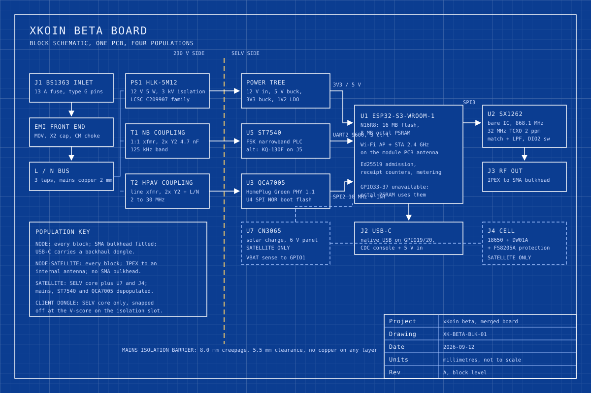

# 01. Merged schematic: the blocks, the parts and the buses

Abstract: The xKoin beta board merges five proof of concept modules into one schematic organised around an ESP32-S3-WROOM-1 N16R8 and split by a mains isolation barrier. On the SELV side sit a bare SX1262 with a 32 MHz TCXO and a pi match, a Qualcomm QCA7005 HomePlug Green PHY modem on SPI, an ST7540 narrowband FSK transceiver on UART2, a USB-C port on the ESP32-S3 native USB pins, and a CN3065 solar charger fitted only on the Satellite population. On the mains side sit a BS 1363 inlet, an EMI front end, a Hi-Link HLK-5M12 supply and two coupling transformers whose Y2 capacitors are the only components that cross the barrier. Auditing the pin allocation against the ESP32-S3-WROOM-1 datasheet found a defect in the existing repo pin map: the W5500 pins proposed on GPIO35, GPIO36 and GPIO37 are consumed by the octal PSRAM on any R8 module and cannot be used. The QCA7005 takes GPIO38 to GPIO42 and GPIO47 instead.

Keywords: block schematic, SX1262, QCA7005, ST7540, ESP32-S3 pin map, octal PSRAM, mains isolation

## 1. The drawing

Figure 1 is the block schematic. Blocks drawn with a solid outline are fitted on every population; blocks drawn with a dashed outline are Satellite only. The yellow dashed vertical is the mains isolation barrier, and everything left of it sits at 230 V.

*Figure 1. Block schematic of the xKoin beta board, showing the mains isolation barrier, the four populations and the buses between blocks.*

## 2. Compute: ESP32-S3-WROOM-1 N16R8

The proof of concept runs on ESP32-S3-DevKitC-1 N16R8 boards and the firmware pin map in `hardware/pinmap.md` is written against them. The beta board carries the same ESP32-S3-WROOM-1 N16R8 module that sits on that dev kit, so the firmware pin map moves across unchanged wherever it does not collide with something else. LCSC prices the module at USD 3.56 at 100 and USD 3.34 at 1,300 [1].

**Tradeoff it won:** the module costs about USD 1.20 more than the bare ESP32-S3 chip plus its own flash, PSRAM and 40 MHz crystal would, and buys a pre-tuned PCB antenna and an existing radio certification for the 2.4 GHz part, which removes the hardest RF layout problem on the board.

**The defect this audit found.** `hardware/pinmap.md` proposes GPIO35, GPIO36 and GPIO37 for the W5500 Ethernet bridge, marked `proposed`. On modules with octal SPI PSRAM, which is every R8 part including the N16R8, GPIO33 to GPIO37 are wired to SPIIO4 through SPIIO7 and SPIDQS and are not available for anything else [2]. Those three assignments would not work on the hardware the repo has already bought. The W5500 does not appear on the beta board at all, so the fix is a reallocation rather than a rework, but the same three pins must not be reused on any future DevKitC wiring either.

## 3. Radio: bare SX1262 with a TCXO

The board carries a bare SX1262IMLTRT in QFN-24, a 32 MHz TCXO at 2 ppm, a pi matching network and a low-pass filter into an IPEX connector. LCSC lists the SX1262IMLTRT from USD 1.71 with 7,723 in stock [3]. The alternative considered was the Ebyte E22-900M22S module, which the repo's sourcing scout found at KES 556 landed, about USD 4.28, carrying FCC ID 2ALPH-E22900M22S on its own label [4].

**Tradeoff it won:** the bare IC saves about USD 2.57 per board and frees two GPIO, because the SX1262's own DIO2 pin drives the antenna switch directly while the E22 module wants separate RXEN and TXEN lines from the host. The module's pre-existing radio certification is the thing given up, and it is worth less here than it looks: the finished product carries a mains section and an enclosure, so it needs its own CE RED assessment as a whole product regardless, and a certified module inside an uncertified product does not shorten that path.

**The risk this accepts:** the matching network and the TCXO layout become the board designer's problem, and a first spin that misses the match by a few dB costs a respin. The mitigation is in paper 02: the RF section is laid out as a self-contained 50 ohm island with its own ground pour, and the first pre-production run is measured on a vector network analyser before the enclosure tooling is cut.

## 4. Narrowband PLC: ST7540 discrete, KQ-130F as the alternate

The primary narrowband path is a discrete ST7540 half-duplex FSK transceiver in TSSOP-28, a 1:1 coupling transformer T1 and a pair of Y2 capacitors bridging the isolation slot. The ST7540 runs from 7.5 V to 13.5 V and integrates its own line driver and 5 V and 3.3 V regulators [5], which is why the mains supply on this board is a 12 V HLK part rather than the 5 V one the proof of concept uses.

**Tradeoff it won:** at volume the discrete route is cheaper and puts the isolation barrier under our own control rather than inside a third-party module whose creepage we would have to take on trust during a safety review. Paper 04 prices the block at USD 7.42 at 1,000 units against USD 11.00 for a KQ-130F module.

**The tradeoff it loses at low volume.** LCSC lists the ST7540 at USD 15.19 at quantity one, USD 14.68 at ten, and out of stock [6]. At 100 units the KQ-130F module at the Nairobi price of KES 1,800, about USD 13.85 [7], wins outright, and the firmware already speaks to it at 9600 baud over UART2. So the board carries a nine-pin single-row header J5 in the mains section as an alternate footprint. The KQ-130F mounts there as a daughterboard when the ST7540 block is depopulated, sharing GPIO17 and GPIO18. The three ST7540 control lines sit unused in that build. Cost of carrying both: nine plated holes and about 3 by 23 mm of board area.

## 5. Broadband PLC: QCA7005 on SPI

The bulk plane uses a Qualcomm QCA7005, a HomePlug Green PHY 1.1 single-chip modem with SPI and UART host interfaces, a dedicated flash port, PHY rates from 4 to 10 Mbps, and a single 3.3 V rail, in QFN-68 [8][9]. It is the part family used in EV charging boards, where the host is a microcontroller rather than a router SoC. On this board it hangs off an ESP32-S3 SPI bus with a boot flash beside it and couples to the line through transformer T2 and a second pair of Y2 capacitors.

**Tradeoff it won:** it is the only route that puts a HomePlug modem inside a plug-top enclosure under an ESP32-S3. The ESP32-S3 has no MII or RGMII, and every HomePlug AV2 chipset presents exactly that. The QCA7420, for example, delivers a 500 Mbps PHY rate over 2 to 68 MHz but expects an MII or RMII host and a companion AR1540 analog front end [10], and the cheapest way to use one is to buy a finished adapter such as the RAK WisLink LX200V30 EVB at USD 46.09 [10] or a consumer TP-Link pair.

**What it costs:** Green PHY caps the PHY rate at 10 Mbps, roughly one fiftieth of AV2. The protocol specification already assumes about 10 Mbps of HomePlug goodput for bulk data [11, section 1], so this is consistent with the design on paper. Whether it is enough for demo D5, a 720p stream and a live session over the building wiring, is exactly what the proof of concept must measure, and it is question P2 in [00-compact-board-concept.md](00-compact-board-concept.md#5-what-the-proof-of-concept-must-prove-first).

**The alternative, stated fairly.** Bridging a commodity HomePlug adapter keeps the AV2 data rate and needs no PLC design work at all: the adapter does the modem, the ESP32-S3 does admission and metering, and the two meet over Wi-Fi or Ethernet. That is precisely what the proof of concept does, and it is why the proof of concept works. It fails as a product because it is two boxes, two mains plugs and two power supplies, the second of which is not ours and cannot be metered at the physical layer. The QCA7005 route is the SPI-friendly one and it is the one that fits the enclosure.

## 6. Power: HLK-5M12 into a buck tree

Mains enters through the BS 1363 pins at J1, a 13 A fuse, a metal oxide varistor, an X2 capacitor and a common-mode choke, and reaches a Hi-Link HLK-5M12. The 5M05 variant of that family is specified at 100 to 240 VAC in, 5 W out, 3 kV isolation, 38 by 23 by 18 mm, and LCSC prices it from USD 1.61 [12]; the 12 V member of the same series is the one fitted here, because the ST7540 needs a rail above 7.5 V. From 12 V the board bucks to 5 V, then to 3.3 V, with a small LDO for the QCA7005 core rail.

**Tradeoff it won:** the HLK module is a certified, potted, isolated AC-DC converter that costs less than its own bill of materials would if we designed the flyback ourselves, and it moves the mains-side safety argument onto a part with an existing approval. What it costs is 5 W of headroom and nothing more: a Node that ever needs to power an LTE modem's 2 A peak, as `hardware/bom.md` warns for the proof of concept gateway, needs a larger supply and a larger enclosure.

The Satellite population replaces this entire branch with a CN3065 solar charge controller, an 18650 connector and a DW01A plus FS8205A protection pair. The CN3065 is a linear single-cell charger built for solar input, with an internal 8-bit ADC that backs the charge current off when the panel cannot hold the input voltage, and it is priced from USD 0.47 at LCSC [13].

**Tradeoff it won over the TP4056:** the TP4056 is cheaper, from USD 0.089 at LCSC [14], and the proof of concept uses it. It has no input-voltage regulation loop, so on a 6 V panel in weak light it drags the panel off its maximum power point and stalls. The CN3065 costs USD 0.38 more and holds the panel up. Against the under-40 mA average budget in `hardware/pinmap.md` doc03, that difference is the one that decides whether two overcast days are survivable.

## 7. USB-C and antennas

USB-C at J2 lands on the ESP32-S3 native USB pins, GPIO19 for D- and GPIO20 for D+, giving the Client dongle a CDC console and a firmware path with no USB-serial bridge chip on the board. The same port supplies 5 V when the dongle is plugged into a phone through an OTG lead.

Two antenna paths leave the board. The 2.4 GHz Wi-Fi path is the PCB antenna printed on the ESP32-S3-WROOM-1 module itself, which requires the 15 mm no-copper keep-out drawn in paper 02. The 868 MHz path runs from the SX1262 match to an IPEX connector at J3 and then, on the Node population, by pigtail to an SMA bulkhead in the enclosure wall. The Node-Satellite population terminates the IPEX on an internal antenna instead, because a wall-socket relay with a whip sticking out of it will be snapped off within a week.

## 8. Signal table

Provenance `doc02` marks a pin fixed by the MVP plan and carried across unchanged. `doc03` marks a satellite pin from the same source. `beta` marks an allocation first made in this paper.

| ESP32-S3 pin | Block | Signal | Bus | Provenance |
|---|---|---|---|---|
| GPIO12 | U2 SX1262 | SCK | SPI3 | doc02 |
| GPIO13 | U2 SX1262 | MISO | SPI3 | doc02 |
| GPIO11 | U2 SX1262 | MOSI | SPI3 | doc02 |
| GPIO10 | U2 SX1262 | NSS | SPI3 | doc02 |
| GPIO14 | U2 SX1262 | DIO1 interrupt | CTRL | doc02 |
| GPIO21 | U2 SX1262 | BUSY | CTRL | doc02 |
| GPIO9 | U2 SX1262 | NRESET | CTRL | drive doc 03, section 2.1 |
| (none) | U2 SX1262 | DIO2 drives the RF switch on chip | CTRL | beta |
| GPIO17 | U5 ST7540 or J5 KQ-130F | RXD at the modem, TX2 at the host | UART2 | doc02 |
| GPIO18 | U5 ST7540 or J5 KQ-130F | TXD at the modem, RX2 at the host | UART2 | doc02 |
| GPIO15 | U5 ST7540 | RxTx direction select | CTRL | beta |
| GPIO16 | U5 ST7540 | CD_PD carrier detect and power down | CTRL | beta |
| GPIO7 | U5 ST7540 | MCLK recovered clock in | CTRL | beta |
| GPIO39 | U3 QCA7005 | SCK | SPI2 | beta, replaces the unusable GPIO36 |
| GPIO41 | U3 QCA7005 | MISO | SPI2 | beta, replaces the unusable GPIO37 |
| GPIO40 | U3 QCA7005 | MOSI | SPI2 | beta, replaces the unusable GPIO35 |
| GPIO42 | U3 QCA7005 | nCS | SPI2 | beta |
| GPIO38 | U3 QCA7005 | nINT | CTRL | beta, carried from the proposed W5500 INT |
| GPIO47 | U3 QCA7005 | nRESET | CTRL | beta |
| GPIO6 | U3 QCA7005 | 3V3 rail enable, lets the host power the modem down | CTRL | beta |
| GPIO19 | J2 USB-C | USB D- | USB | fixed by silicon |
| GPIO20 | J2 USB-C | USB D+ | USB | fixed by silicon |
| GPIO43 | Console header | UART0 TXD | UART0 | fixed by silicon |
| GPIO44 | Console header | UART0 RXD | UART0 | fixed by silicon |
| GPIO0 | Button SW1 | BOOT and user button | CTRL | strapping pin |
| GPIO48 | LED D1 | addressable status LED | CTRL | beta |
| GPIO1 | U7 CN3065 | VBAT divider, ADC1_CH0 | CTRL | doc03 |
| GPIO4 | U7 CN3065 | charge status | CTRL | beta |
| GPIO5 | U7 CN3065 | panel present sense | CTRL | beta |
| GPIO2 | TP5 | spare, brought to a test pad | none | beta |
| GPIO8 | TP6 | spare, brought to a test pad | none | beta |

Pins deliberately not used: GPIO3, GPIO45 and GPIO46 are strapping pins and stay free; GPIO26 to GPIO32 carry the module's internal SPI flash; GPIO33 to GPIO37 carry the octal PSRAM on the R8 part [2]. That leaves two spare GPIO on the fully populated Node, both routed to test pads so a field problem can be instrumented without a respin.

## 9. Bus budget

| Bus | Peak rate | Blocks | Note |
|---|---|---|---|
| SPI2 | 10 MHz | QCA7005 | 10 Mbps of PHY traffic plus framing fits with margin; the ESP32-S3 SPI master will run faster if the QCA7005 signal integrity allows it |
| SPI3 | 8 MHz | SX1262 | Register access and FIFO reads only, the radio's own air rate is 5.4 kbps at SF7 |
| UART2 | 9600 baud | ST7540 or KQ-130F | About 960 B/s, matching the 128 B narrowband frame payload in the protocol spec [11, section 1] |
| USB | full speed | J2 | CDC console, firmware flashing, dongle host link |

## 10. References

1. LCSC Electronics, ESP32-S3-WROOM-1-N16R8, part C2913202, price breaks and stock. https://www.lcsc.com/product-detail/C2913202.html
2. Espressif, ESP32-S3 GPIO and RTC GPIO, ESP-IDF Programming Guide, note on GPIO33 to GPIO37 with octal SPI flash or PSRAM. https://docs.espressif.com/projects/esp-idf/en/stable/esp32s3/api-reference/peripherals/gpio.html
3. LCSC Electronics, SX1262IMLTRT, Semtech, part C191341. https://www.lcsc.com/product-detail/C191341.html
4. xKoin repo, `hardware/shopping/parts/sx1262-module-868.json`, chosen listing at KES 556 landed. https://www.aliexpress.com/item/1005007265763652.html
5. STMicroelectronics, ST7540 FSK power line transceiver product page. https://www.st.com/en/interfaces-and-transceivers/st7540.html
6. LCSC Electronics, ST7540, part C472599, USD 15.19 at one and USD 14.68 at ten, out of stock at the time of writing. https://www.lcsc.com/product-detail/C472599.html
7. Pixel Electric, Nairobi, KQ-130F power cable carrier module, KES 1,800. https://www.pixelelectric.com/sensors/biometric-rotation-current/current-voltage/kq-130f-power-cable-carrier-module/
8. Qualcomm, QCA7005 Powerline and HomePlug chipset product page. https://www.qualcomm.com/products/networking/qca7005
9. Arrow Electronics, QCA7005-AL33-R, Qualcomm, HomePlug Green PHY 1.1, SPI and UART host interfaces, 4 to 10 Mbps PHY, single 3.3 V rail, QFN-68. https://www.arrow.com/en/products/qca7005-al33-r/qualcomm.html
10. RAK Wireless, WisLink PLC LX200V30 EVB, Qualcomm QCA7420, 500 Mbps PHY rate, USD 46.09. https://store.rakwireless.com/products/wisplc-pro-development-board-plc-module-power-line-twisted-pair-ethernet-interface-500mbps-support-network-adapter
11. xKoin repo, `protocol/spec.md`, section 1 mediums.
12. LCSC Electronics, HI-LINK HLK-5M05, part C209907, AC-DC module, from USD 1.61. https://www.lcsc.com/product-detail/C209907.html
13. LCSC Electronics, CN3065, Consonance, solar lithium charger, part C45284, from USD 0.469. https://www.lcsc.com/product-detail/C45284.html
14. LCSC Electronics, TP4056-42-ESOP8, part C16581, from USD 0.0888. https://www.lcsc.com/product-detail/PMIC-Battery-Management_TOPPOWER_TP4056_TP4056_C16581.html
15. xKoin repo, `hardware/pinmap.md`, doc02 and doc03 pin provenance.
