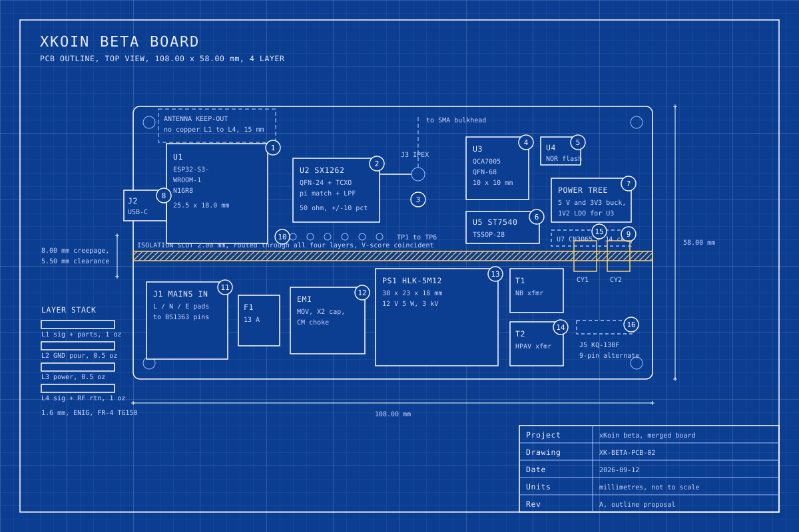

# 02. PCB blueprint: outline, stack, keep-outs and DFM

Abstract: The xKoin beta board is 108.00 by 58.00 mm on four layers at 1.6 mm, sized to drop into an OKW BS 1363 plug case of 120 by 65 by 55 mm in flame-retardant PC/ABS to UL 94 V-0. A 2.00 mm slot routed through all four layers runs the full width of the board 30 mm from one end, carrying 8.00 mm of creepage between the 230 V section and everything else, and a V-score coincident with that slot lets the SELV half snap off as the Client dongle. Two Y2 capacitors and two coupling transformers are the only components that cross the barrier. The layer stack puts an uninterrupted ground pour on layer 2 so the 868 MHz path can run as a 50 ohm microstrip on layer 1. The board falls below JLCPCB's 70 by 70 mm minimum for Standard PCBA in one dimension, so it is panelised two-up on 5 mm rails, which is also the cheaper way to buy it.

Keywords: PCB outline, four-layer stack, creepage, isolation slot, antenna keep-out, DFM, panelisation

## 1. The drawing

Figure 2 is the outline with numbered callouts. The callout table in section 7 names each one. Nothing on the drawing is to scale; the dimension strings carry the real values.

*Figure 2. PCB outline of the xKoin beta board, top view, with the mains isolation slot, the antenna keep-out and sixteen numbered callouts.*

## 2. Why 108.00 by 58.00 mm

Kenya uses BS 1363 type G sockets, so the plug-top enclosure is a British plug case. OKW makes a family of them approved to BS 1363, DIN 49440, DIN 49441 R2 and DIN VDE 0620 part 101, moulded in flame-retardant PC/ABS to UL 94 V-0 and rated IP40, in three sizes: 100 by 50 by 40 mm, 120 by 65 by 55 mm and 120 by 65 by 65 mm [1][2][3].

The 120 by 65 by 55 mm case is the smallest of the three that the board fits. Working inwards from its 120 mm length: about 4 mm of wall at each end and about 4 mm of moulded rib and screw boss leaves roughly 110 mm of usable length, so the board is 108.00 mm with 1 mm of clearance at each end. Across the 65 mm width, the BS 1363 pin block, its earth pin and the fuse carrier stand proud of the socket face and eat about 5 mm of depth, leaving about 60 mm, so the board is 58.00 mm. The board stands parallel to the socket face with the mains section at the pin end.

The 100 by 50 by 40 mm case was tried first and fails on two counts. The HLK-5M12 alone is 38 by 23 by 18 mm [4], and with the two coupling transformers beside it the mains section needs about 26 mm of board width, which leaves too little for the QCA7005 and its coupling on a 50 mm board. The 40 mm depth also does not clear the HLK module standing on a 1.6 mm board next to a 9 mm transformer.

The Satellite population does not go in this case at all. It needs an outdoor box with a cable gland for the panel and no BS 1363 pins, so it shares the PCB and uses a different enclosure. Paper 04 prices that separately.

## 3. The isolation barrier

| Property | Value | Basis |
|---|---|---|
| Slot width | 2.00 mm, routed through all four layers | Manufacturable at JLCPCB's 0.15 mm minimum hole and standard routing [5] |
| Creepage across the barrier | 8.00 mm minimum | Reinforced insulation at 250 V RMS working, pollution degree 2, material group IIIa; the exact figure is confirmed against IEC 62368-1 tables at the test house, not asserted here |
| Clearance across the barrier | 5.50 mm minimum | Same condition and the same caveat |
| Copper inside the barrier | None, on any of the four layers | Ground pours on L2 and power pours on L3 are cut back to the 8.00 mm line |
| Components crossing | T1, T2, PS1 and CY1, CY2 only | Transformers and the potted HLK module carry their own isolation; the Y2 capacitors are the only discrete crossing |
| Mains-side trace spacing | 2.50 mm minimum between L and N, 2.00 mm copper width for the mains bus | Same IEC 62368-1 confirmation caveat |
| V-score | Coincident with the slot centreline | Snapping yields the Client dongle from the SELV half |

The Y2 capacitors are the part a safety reviewer reads first. CY1 and CY2 are class Y2 rated 300 VAC, one pair feeding T1 for the ST7540 narrowband path and one pair feeding T2 for the QCA7005 broadband path, and their pads are laid out so the shortest surface path between a mains-side pad and a SELV-side pad is the same 8.00 mm the slot enforces everywhere else. Nothing else bridges. No mounting hardware, no ground stitch, no test point.

The two lower mounting holes sit inside the mains section and are therefore non-plated, with an 8.00 mm copper keep-out ring, and they take nylon screws. The two upper holes are plated M2.5 and tie to SELV ground.

## 4. Layer stack

| Layer | Copper | Function | Dielectric below |
|---|---|---|---|
| L1 | 1 oz | Signals, all components, the 50 ohm RF microstrip | 0.2 mm prepreg |
| L2 | 0.5 oz | Continuous ground pour, cut only at the isolation barrier | 1.065 mm core |
| L3 | 0.5 oz | Power pours: 12 V, 5 V, 3V3, 1V2 | 0.2 mm prepreg |
| L4 | 1 oz | Signals and RF return stitching | Solder mask |

Total thickness 1.60 mm, FR-4 with TG150, ENIG finish. ENIG rather than HASL is not optional here: the QCA7005 in QFN-68 and the SX1262 in QFN-24 both need a flat pad for reliable paste release.

The single-ended 50 ohm microstrip on L1 over the L2 pour at 0.2 mm prepreg comes out near 0.35 mm wide. That figure is a starting point for the fab's own impedance calculator, not a specification, and it goes into the manufacturing package as an impedance control note rather than a hard trace width. JLCPCB states impedance control to plus or minus 10 percent on 4-layer and above [5].

## 5. Keep-outs

**Wi-Fi antenna.** The ESP32-S3-WROOM-1 module carries its own PCB antenna at one end. That end faces the board edge, and a 15.00 mm keep-out extends from the antenna to and past that edge with no copper on L1, L2, L3 or L4, no ground stitch, no via and no component. The enclosure wall within that zone stays free of any metal insert.

**868 MHz path.** The SX1262, its TCXO, its pi match and its low-pass filter sit on a self-contained island on L1 with a continuous L2 ground beneath and via stitching every 3 mm around the island edge. No copper pour comes within 1.00 mm of the RF trace. The trace runs from the match to the IPEX connector at J3 in a straight line with no via and no stub.

**Mains section.** No SELV copper enters the mains section on any layer. No test point, no fiducial and no silkscreen that could be mistaken for a probe target sits there.

**QFN thermal.** The QCA7005 exposed pad takes a four by four array of 0.3 mm vias down to the L2 pour.

## 6. Test points

Six test pads sit in a row on the SELV side, 1.5 mm diameter, tin finish, on a 2.54 mm pitch so a bed of nails or a pogo fixture can reach all six.

| Pad | Net | Purpose at test |
|---|---|---|
| TP1 | 3V3 | Rail present and in tolerance before any other test |
| TP2 | 5V | Intermediate buck output |
| TP3 | 12V | HLK output, present only on mains populations |
| TP4 | GND | Fixture reference |
| TP5 | GPIO2 | Spare, driven by the test firmware as a pass or fail flag |
| TP6 | GPIO8 | Spare, second flag or a scope trigger |

The UART0 console on GPIO43 and GPIO44 lands on a TC2030 Tag-Connect footprint rather than a header, so the test fixture reaches it with a spring-pin cable and no connector is fitted on shipped units.

## 7. Callout table

| # | Reference | Part or feature | Note |
|---|---|---|---|
| 1 | U1 | ESP32-S3-WROOM-1 N16R8, 25.5 by 18.0 mm | Antenna end faces the board edge under the keep-out |
| 2 | U2 | SX1262 QFN-24 with a 32 MHz TCXO, pi match and LPF | On its own 50 ohm island |
| 3 | J3 | IPEX connector, pigtail to the SMA bulkhead | Node fits the bulkhead, Node-Satellite terminates internally |
| 4 | U3 | QCA7005 QFN-68, 10 by 10 mm | Exposed pad on a 4 by 4 via array |
| 5 | U4 | SPI NOR boot flash for U3 | Loads the QCA7005 firmware at power-up |
| 6 | U5 | ST7540 TSSOP-28 | Depopulated when J5 carries a KQ-130F |
| 7 | Power tree | 5 V buck, 3V3 buck, 1V2 LDO | Fed from PS1 on mains populations, from J2 or the cell otherwise |
| 8 | J2 | USB-C, on the board edge | Native USB on GPIO19 and GPIO20 |
| 9 | U7, J4 | CN3065 solar charger and 18650 connector | Satellite population only, dashed on the drawing |
| 10 | TP1 to TP6 | Test pad row, 2.54 mm pitch | See section 6 |
| 11 | J1 | Mains inlet pads, L, N and E to the BS 1363 pin block | Inside the mains section |
| 12 | EMI | MOV, X2 capacitor, common-mode choke | First components after the fuse |
| 13 | PS1 | Hi-Link HLK-5M12, 38 by 23 by 18 mm | Potted, 3 kV isolation |
| 14 | T1, T2 | Narrowband and broadband coupling transformers | Straddle the barrier magnetically |
| 15 | CY1, CY2 | Class Y2 capacitors, 300 VAC | The only discrete components crossing the slot |
| 16 | J5 | Nine-pin single-row alternate footprint for a KQ-130F | Shares GPIO17 and GPIO18 with U5 |

## 8. DFM notes

1. **Panelise two-up.** JLCPCB states a 70 by 70 mm minimum single-board size for Standard PCBA and 10 by 10 mm for Economic PCBA, with panelised boards accepted from 70 by 70 mm to 250 by 250 mm on the Standard line [6]. At 108.00 by 58.00 mm the board clears 70 mm in one dimension and not the other, so it goes to the factory as a two-up panel on 5 mm rails, roughly 121 by 108 mm, with tooling holes and three global fiducials on the rail.
2. **Design to 0.127 mm, not to the limit.** JLCPCB publishes 0.09 by 0.09 mm minimum trace and space for multilayer at 1 oz and a 0.15 to 6.3 mm hole range [5]. Designing at the published minimum buys nothing and costs yield. Only the QFN-68 escape routing goes below 0.127 mm, and it is called out as such in the fab notes.
3. **Mains clearance is checked by a rule, not by eye.** The design rule check carries a dedicated mains net class with 2.50 mm clearance to itself and 8.00 mm to every SELV net, so a routing mistake fails the check rather than reaching a safety reviewer.
4. **Y2 capacitor placement.** CY1 and CY2 sit with their body centred on the slot and their pads symmetric about it. A Y2 part fitted 1 mm off centre shortens creepage on one side by 1 mm, so the pick and place tolerance for those two positions is tightened and the assembly drawing says so.
5. **Conformal coating.** The board is coated after test, with the USB-C receptacle, the IPEX connector, the test pad row, the Tag-Connect pads and the whole Wi-Fi keep-out masked. Coating the mains section is what earns the IP40 case a working life in a Nairobi building; coating the antenna zone detunes it.
6. **RF keep-outs are on the assembly drawing as well as the Gerbers.** The 15.00 mm Wi-Fi keep-out and the SX1262 island boundary are drawn in the fabrication layer and repeated in the assembly notes, because the failure mode is a label, a screw boss or a coating overspray, none of which appear in the copper layers.
7. **Thermal reliefs on the HLK pads.** PS1 has four large through-hole pins into the L3 pour. They take thermal spokes, not solid connections, or the wave or hand solder step will not wet.
8. **Silkscreen carries the safety text.** The mains section is outlined in silkscreen with the working voltage and the word CAUTION on the top side, and the isolation slot is labelled on both sides, so an operator reworking a board sees the barrier without the drawing.

## 9. References

1. RS Components, OKW grey ABS plug case, 100 by 50 by 40 mm, BS 1363 and DIN approvals, flame-retardant ABS UL 94 V-0, IP40. https://uk.rs-online.com/web/p/power-supply-cases/0583404
2. RS Components, OKW grey and white ABS plug case, 120 by 65 by 55 mm, flame-retardant PC/ABS UL 94 V-0. https://uk.rs-online.com/web/p/power-supply-cases/0583432
3. RS Components, OKW white ABS plug case, 120 by 65 by 65 mm, supplied with an assembly kit of four screws for PCB fixing. https://uk.rs-online.com/web/p/power-supply-cases/2809584
4. LCSC Electronics, HI-LINK HLK-5M05, part C209907, 38 by 23 by 18 mm, 3 kV isolation. https://www.lcsc.com/product-detail/C209907.html
5. JLCPCB, PCB capabilities: 0.09 by 0.09 mm minimum trace and space on multilayer at 1 oz, 0.15 to 6.3 mm hole range, impedance control to plus or minus 10 percent, HASL, ENIG and OSP finishes. https://jlcpcb.com/capabilities/pcb-capabilities
6. JLCPCB, PCB assembly capabilities: Economic PCBA 2 to 50 pcs and 10 by 10 mm to 470 by 500 mm, Standard PCBA 2 to 80000 pcs and 70 by 70 mm to 460 by 500 mm, panelised 70 by 70 mm to 250 by 250 mm. https://jlcpcb.com/capabilities/pcb-assembly-capabilities
7. xKoin repo, `docs/x-koin-beta/01-merged-schematic.md`, section 8 signal table.
